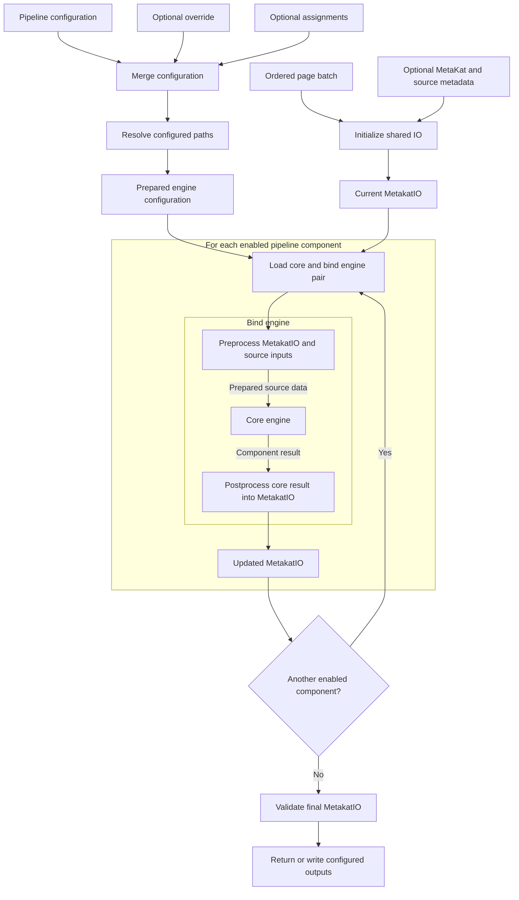

# MetaKat

MetaKat enriches an ordered batch of document pages with structured metadata.
It initializes a shared `MetakatIO` object from the batch and any supplied
metadata, then passes that object through each enabled pipeline component in
pipeline order. Every pipeline component has a core engine, which produces
component-specific results, and a bind engine, which integrates those results
into `MetakatIO`. The bind engine envelopes the core engine: it may preprocess
the current `MetakatIO` and other inputs, invokes the core with the prepared
source data, and postprocesses the core result into an updated `MetakatIO`.
That updated object becomes the input to the next component.

The engine pipeline is configured independently of the document input and
output. Configuration files and command-line overrides are combined first;
all configured paths are then resolved centrally before any engine is loaded.



## Pipeline components

Components run in the order shown below. The hierarchy mirrors their pipeline
configuration: each top-level component selects one `core` and one `bind`
implementation. An omitted component is skipped. Links lead to the detailed
documentation for each available implementation.

1. [`page_number`](page_number/README.md#purpose)
   - [`core`](page_number/README.md#page-number-core-engine-contract)
     - [`page_number_core_engine_yolo`](page_number/README.md#engine-yolo--alto-page_number_core_engine_yolo)
   - [`bind`](page_number/README.md#available-bind-implementation)
     - [`page_number_bind_engine_base`](page_number/README.md#engine-base-page_number_bind_engine_base)
2. [`page_type`](page_type/README.md#purpose)
   - [`core`](page_type/README.md#available-core-implementation)
     - [`page_type_core_engine_vit`](page_type/README.md#engine-vit-page_type_core_engine_vit)
   - [`bind`](page_type/README.md#available-bind-implementation)
     - [`page_type_bind_engine_base`](page_type/README.md#engine-base-page_type_bind_engine_base)
3. [`biblio`](biblio/README.md#purpose)
   - [`core`](biblio/README.md#available-core-implementation)
     - [`biblio_core_engine_yolo`](biblio/README.md#engine-yolo--alto-biblio_core_engine_yolo)
   - [`bind`](biblio/README.md#available-bind-implementation)
     - [`biblio_bind_engine_base`](biblio/README.md#engine-base-biblio_bind_engine_base)
4. [`chapter`](chapter/README.md#purpose)
   - [`core`](chapter/README.md#chapter-core-engine-contract)
     - [`chapter_core_engine_pipeline`](chapter/README.md#replaceable-three-stage-pipeline-processing)
       - [`page_analysis`](chapter/README.md#stage-1-contract-chapter-page-analysis)
         - [`chapter_page_analysis_engine_yolo_alto`](chapter/README.md#engine-yolo--alto-chapter_page_analysis_engine_yolo_alto)
       - [`extraction`](chapter/README.md#stage-2-contract-chapter-extraction)
         - [`chapter_extraction_engine_yolo_alto`](chapter/README.md#engine-yolo--alto-chapter_extraction_engine_yolo_alto)
       - [`alignment`](chapter/README.md#stage-3-contract-chapter-alignment)
         - [`chapter_alignment_engine_fuzzy`](chapter/README.md#engine-fuzzy-alignment-chapter_alignment_engine_fuzzy)
   - [`bind`](chapter/README.md#available-bind-implementation)
     - [`chapter_bind_engine_base`](chapter/README.md#engine-base-chapter_bind_engine_base)

## Pipeline invocation

`process_batch.py` is configured by one complete YAML or JSON engine pipeline.
Input/output paths remain separate command-line arguments.

```bash
python -m metakat.process_batch \
  --batch-dir /data/batch \
  --engine-config /engines/pipeline.yaml \
  --engine-config-override /jobs/override.json \
  --set component:core:option 0.5 \
  --output-metakat-json /data/result/metakat.json
```

`--engine-config` is required. `--engine-config-override` is optional and
`--set PATH VALUE` may be repeated. A `--set` path uses colons between mapping
keys. Its value is interpreted as JSON when possible (`0.5`, `10`, `true`,
`null`, lists, and objects); otherwise it remains a string.

Configuration precedence, from lowest to highest, is:

1. the main engine configuration;
2. the override file;
3. repeated `--set` assignments in command-line order.

Mappings are merged recursively. A leaf replaces the corresponding leaf,
lists are replaced as complete values, and new keys are allowed. Replacing a
mapping with a non-mapping or the reverse is an error.

## Pipeline configuration

The pipeline configuration is a mapping of pipeline components. Each enabled
component contains both a `core` and `bind` mapping, and each of those mappings
selects an engine through `name`. Omitting a component disables it; providing
only one half is an error.

Engine-specific options belong beside `name` in the relevant mapping. Their
meaning and accepted values are defined by that engine and are documented in
the corresponding package, not in this pipeline-level overview.

```yaml
<component>:
  core:
    name: <core-engine-name>
    <core-option>: <value>
  bind:
    name: <bind-engine-name>
    <bind-option>: <value>
```

After all overrides are applied, fields ending in `_path`, `_dir`, `_paths`,
or `_dirs` are resolved centrally. Relative paths use the directory containing
the main pipeline configuration; absolute paths remain absolute. Engines
receive only their nested, prepared mapping and never resolve paths or load a
separate configuration file themselves.

The Python `process_batch()` boundary similarly accepts only the final
prepared `engine_config`, plus decoded `metakat_data` and `proarc_data`
objects. YAML/JSON loading, merging, assignments, and path resolution belong
outside that function.

Before IO initialization and engine loading, `process_batch()` logs the
complete final pipeline configuration at `INFO`. The logged value is a
separate recursively sanitized view; the configuration passed to engines is
not modified. Values under potential secret keys are replaced with
`<redacted>`. Detection is case-insensitive, recognizes snake case, kebab
case, and camel case, and covers passwords, passphrases, secrets, credentials,
authorization, cookies, connection strings, DSNs, tokens, and API, access,
private, signing, encryption, or SSH keys.

## Interactive PDF metadata

When `output_metakat_pdf` or `--output-metakat-pdf` is provided, the generated
PDF uses compact chapter outline labels in this order:

```text
part number | TOC title | page number
```

Missing values are omitted. The destination title replaces the TOC title only
when the TOC title is unavailable. Document-level outline entries use
`monograph | title`, or `monograph` when the title is unavailable.

The clickable rectangle over a detected TOC entry carries the complete chapter
description and opens the resolved destination page. When destination-title
geometry is available on that page, the title rectangle carries the same
description, links back to the TOC entry, and has a visible sticky note.

The PDF also adds visible sticky notes for:

- a detected physical page number, beside its detection geometry;
- every bibliographic detection, beside its detection geometry;
- the complete bibliographic information for each issue or volume, in the
  upper-left corner of the first page classified as `TitlePage`;
- each page type, in the upper-right corner of the page.

Geometry-specific annotations are omitted when their detection-to-page or
bounding-box mapping is unavailable. Sticky-note contents are standard PDF
text annotations; their popup presentation depends on the PDF viewer.

## Worker metadata envelope

The DocAPI worker treats `job.engine_definition` as the base pipeline mapping.
When `meta_file` is present, it must be a JSON object containing only these
optional object-or-null values:

```json
{
  "metakat_json": null,
  "proarc_json": null,
  "engine_config_override": null
}
```

The worker merges `engine_config_override` into `job.engine_definition`, then
resolves paths against the downloaded engine directory. Any relative path,
absolute path, or symlink that resolves outside that directory raises
`ValueError`, causing the job to finish in the error state. The worker does
not support command-line-style `--set` assignments.
