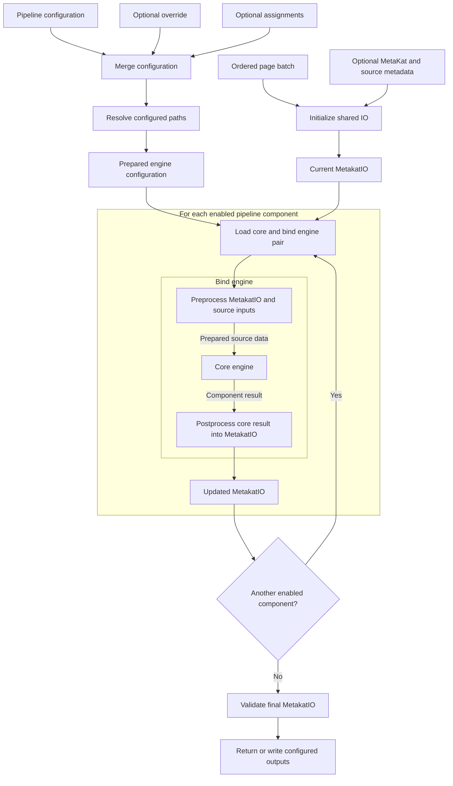

# MetaKat

MetaKat enriches an ordered batch of document pages with structured metadata.
It initializes a shared `MetakatIO` object from the batch and any supplied
metadata, then passes that object through each enabled pipeline component in
pipeline order. Every pipeline component has a core engine, which produces
component-specific results, and a bind engine, which integrates those results
into `MetakatIO`. The bind engine envelopes the core engine: it may preprocess
the current `MetakatIO` and other inputs, invokes the core with the prepared
source data, and postprocesses the core result into an updated `MetakatIO`.
That updated object becomes the input to the next component.

The engine pipeline is configured independently of the document input and
output. Configuration files and command-line overrides are combined first;
all configured paths are then resolved centrally before any engine is loaded.



## Installation

MetaKat requires Python 3.12 or newer, and installs in modes rather than as one
package. The base install carries the schemas, the pipeline configuration
handling and the IO layer, but no engine; each extra adds one capability on top
of it, so an environment installs only the tiers it uses.

| Extra | Adds | Use for |
| --- | --- | --- |
| *(none)* | pydantic, PyYAML, Pillow, natsort | consumers that only read or write `MetakatIO` |
| `pdf` | PyMuPDF | rendering an interactive PDF, with no engine present |
| `inference` | ultralytics, text-geometry-aligner, numpy, OpenCV, OR-Tools, and the torch runtime | running the pipeline through `process_batch` |
| `worker` | `inference`, `pdf`, and the DocAPI client layer | running `metakat/worker/docapi` |
| `train` | accelerate, scikit-learn, safe-gpu, numpy, OpenCV, and the torch runtime | training and evaluation in `metakat/page_type/nets` |
| `dev` | pytest, pytest-cov | running the test suite |
| `all` | `worker`, `train`, `dev` | a full development machine |

Engine implementations are imported only when a pipeline selects them, so a
tier left uninstalled costs nothing at run time. A component whose dependencies
are absent is reported before any page is read, naming the missing module and
the extra that provides it.

`inference` is one tier for the whole pipeline rather than one per engine. What
it carries beyond the detector — array handling, image decoding, OCR geometry
alignment, constraint solving — are general-purpose building blocks that any
engine may reach for, so selecting a pipeline does not mean tracking which
engine needs which library. Every engine reports `inference` as the extra to
install, so a missing dependency never sends someone to a narrower install that
the next configured engine would immediately outgrow.

The torch runtime — torch, torchvision and transformers — comes with
`inference` and with `train`, both of which need it. `pyproject.toml` groups it
separately so the two share one declaration; that grouping is an implementation
detail of the tiers above and is not meant to be installed on its own.

`pdf` is the base install plus the renderer and nothing else: the exporter
reaches only the schemas and the document grouping helper, so a processed batch
can be rendered where no engine and no model runtime are installed. `train`
names numpy and OpenCV itself, because the dataset builders under
`metakat/page_type` read page images directly rather than through an engine.

The `worker` extra is the complete set needed to process a job: every engine a
job may select, plus the PDF exporter the worker writes when
`STORE_METAKAT_PDF` is set. `doc-api` is requested through its own `worker`
extra, which keeps the API service's database and ASGI stack out of the
installation.

Each command below installs into an active virtual environment on Python 3.12:

```bash
python3.12 -m venv .venv
source .venv/bin/activate
```

Two of the declared dependencies are git submodules rather than published
packages: `text-geometry-aligner`, which `inference` needs, and `doc-api`,
which `worker` needs. A tier naming either one has to find it in the checkout
rather than on an index, so `inference`, `worker` and `all` need this first:

```bash
git submodule update --init --recursive

pip install -e libs/text-geometry-aligner \
            -e libs/DocAPI
```

The base install and `pdf` name neither submodule and work from a plain
checkout. With any prerequisite in place, install the tier itself:

```bash
pip install -e "."             # read or write MetakatIO, nothing else
pip install -e ".[pdf]"        # render an interactive PDF, no engine present
pip install -e ".[inference]"  # the pipeline through process_batch
pip install -e ".[worker]"     # the DocAPI worker in metakat/worker/docapi
pip install -e ".[train]"      # training and evaluation in metakat/page_type/nets
pip install -e ".[dev]"        # the test suite
pip install -e ".[all]"        # a full development machine
```

### Developing MetaKat

Runtime versions are pinned to a known-good set rather than left to the
resolver, so upgrading them is a deliberate, wholesale change rather than
something that happens on a fresh install.

Working on MetaKat itself means the full tier and an editable install of the
package under development:

```bash
pip install -e ".[all]"
```

An editable install places a pointer to the checkout rather than a copy, so
edits take effect without reinstalling, and no `PYTHONPATH` is needed. The two
submodules above are installed the same way for the same reason.

## Tests

Tests live beside the code they exercise, in a `tests` directory within each
package, so a path selects a subset and no separate mapping has to be
remembered. `testpaths` is configured, so an invocation without arguments runs
everything:

```bash
pytest                                                  # the whole suite
pytest metakat/chapter                                  # one component
pytest metakat/chapter/engines/core/chapter_alignment   # one pipeline stage
pytest metakat/page_number/engines/core                 # parsers, resolver, loaders
pytest metakat/worker/docapi/tests                      # the DocAPI worker
```

Single files, single tests and keyword selection work as usual, the last being
the simplest way to reach the cases of a parametrized test:

```bash
pytest metakat/chapter/engines/core/chapter_alignment/tests/test_engine_fuzzy.py
pytest metakat/tests/test_engine_config.py::test_deep_merge_replaces_only_leaves_and_lists
pytest -k "anchor"
```

Which tests can run depends on the installed tier, and the directory layout is
what separates them. Most of the suite needs only the base install and `dev`;
the tests that exercise a model runtime, the PDF exporter or the DocAPI worker
fail to collect without the corresponding extra. `metakat[all]` runs all of
them.

The tests directories carry no `__init__.py`, which keeps them out of an
installed distribution. Because several test modules share a file name across
different packages, pytest is configured with `--import-mode=importlib`, which
imports each file under a name derived from its path.

## Pipeline components

Components run in the order shown below. The hierarchy mirrors their pipeline
configuration: each top-level component selects one `core` and one `bind`
implementation. An omitted component is skipped. Links lead to the detailed
documentation for each available implementation.

1. [`page_number`](page_number/README.md#purpose)
   - [`core`](page_number/README.md#page-number-core-engine-contract)
     - [`page_number_core_engine_yolo`](page_number/README.md#engine-yolo--alto-page_number_core_engine_yolo)
   - [`bind`](page_number/README.md#available-bind-implementation)
     - [`page_number_bind_engine_base`](page_number/README.md#engine-base-page_number_bind_engine_base)
2. [`page_type`](page_type/README.md#purpose)
   - [`core`](page_type/README.md#available-core-implementation)
     - [`page_type_core_engine_vit`](page_type/README.md#engine-vit-page_type_core_engine_vit)
   - [`bind`](page_type/README.md#available-bind-implementation)
     - [`page_type_bind_engine_base`](page_type/README.md#engine-base-page_type_bind_engine_base)
3. [`biblio`](biblio/README.md#purpose)
   - [`core`](biblio/README.md#available-core-implementation)
     - [`biblio_core_engine_yolo`](biblio/README.md#engine-yolo--alto-biblio_core_engine_yolo)
   - [`bind`](biblio/README.md#available-bind-implementation)
     - [`biblio_bind_engine_base`](biblio/README.md#engine-base-biblio_bind_engine_base)
4. [`chapter`](chapter/README.md#purpose)
   - [`core`](chapter/README.md#chapter-core-engine-contract)
     - [`chapter_core_engine_pipeline`](chapter/README.md#replaceable-three-stage-pipeline-processing)
       - [`page_analysis`](chapter/README.md#stage-1-contract-chapter-page-analysis)
         - [`chapter_page_analysis_engine_yolo_alto`](chapter/README.md#engine-yolo--alto-chapter_page_analysis_engine_yolo_alto)
       - [`extraction`](chapter/README.md#stage-2-contract-chapter-extraction)
         - [`chapter_extraction_engine_yolo_alto`](chapter/README.md#engine-yolo--alto-chapter_extraction_engine_yolo_alto)
       - [`alignment`](chapter/README.md#stage-3-contract-chapter-alignment)
         - [`chapter_alignment_engine_fuzzy`](chapter/README.md#engine-fuzzy-alignment-chapter_alignment_engine_fuzzy)
   - [`bind`](chapter/README.md#available-bind-implementation)
     - [`chapter_bind_engine_base`](chapter/README.md#engine-base-chapter_bind_engine_base)

## Pipeline invocation

`process_batch.py` is configured by one complete YAML or JSON engine pipeline.
Input/output paths remain separate command-line arguments.

```bash
python -m metakat.process_batch \
  --batch-dir /data/batch \
  --engine-config /engines/pipeline.yaml \
  --engine-config-override /jobs/override.json \
  --set component:core:option 0.5 \
  --output-metakat-json /data/result/metakat.json
```

`--engine-config` is required. `--engine-config-override` is optional and
`--set PATH VALUE` may be repeated. A `--set` path uses colons between mapping
keys. Its value is interpreted as JSON when possible (`0.5`, `10`, `true`,
`null`, lists, and objects); otherwise it remains a string.

Configuration precedence, from lowest to highest, is:

1. the main engine configuration;
2. the override file;
3. repeated `--set` assignments in command-line order.

Mappings are merged recursively. A leaf replaces the corresponding leaf,
lists are replaced as complete values, and new keys are allowed. Replacing a
mapping with a non-mapping or the reverse is an error.

## Pipeline configuration

The pipeline configuration is a mapping of pipeline components. Each enabled
component contains both a `core` and `bind` mapping, and each of those mappings
selects an engine through `name`. Omitting a component disables it; providing
only one half is an error.

Engine-specific options belong beside `name` in the relevant mapping. Their
meaning and accepted values are defined by that engine and are documented in
the corresponding package, not in this pipeline-level overview.

```yaml
<component>:
  core:
    name: <core-engine-name>
    <core-option>: <value>
  bind:
    name: <bind-engine-name>
    <bind-option>: <value>
```

After all overrides are applied, fields ending in `_path`, `_dir`, `_paths`,
or `_dirs` are resolved centrally. Relative paths use the directory containing
the main pipeline configuration; absolute paths remain absolute. Engines
receive only their nested, prepared mapping and never resolve paths or load a
separate configuration file themselves.

The Python `process_batch()` boundary similarly accepts only the final
prepared `engine_config`, plus decoded `metakat_data` and `proarc_data`
objects. YAML/JSON loading, merging, assignments, and path resolution belong
outside that function.

Before IO initialization and engine loading, `process_batch()` logs the
complete final pipeline configuration at `INFO`. The logged value is a
separate recursively sanitized view; the configuration passed to engines is
not modified. Values under potential secret keys are replaced with
`<redacted>`. Detection is case-insensitive, recognizes snake case, kebab
case, and camel case, and covers passwords, passphrases, secrets, credentials,
authorization, cookies, connection strings, DSNs, tokens, and API, access,
private, signing, encryption, or SSH keys.

## Interactive PDF metadata

The interactive PDF is a visual, clickable view of what the pipeline found: the
batch images themselves, with the metadata drawn on top of the page it was read
from. It is produced in two interchangeable ways.

During processing, when `output_metakat_pdf` or `--output-metakat-pdf` is given
to `process_batch`, the PDF is written alongside the resulting MetaKat JSON.

Afterwards, `metakat/tools/create_interactive_pdf.py` renders an already
processed batch on its own, without running any engine. It takes the same three
input/output arguments, under the same names `process_batch` uses for them, so a
finished batch directory and the MetaKat JSON that batch produced are all that
is needed:

```bash
python -m metakat.tools.create_interactive_pdf \
  --batch-dir /data/batch \
  --metakat-json /data/result/metakat.json \
  --output-metakat-pdf /data/result/metakat.pdf
```

`--batch-dir` is the same page batch the pipeline read, and `--metakat-json` is
a MetaKat JSON describing it — typically the `--output-metakat-json` of an
earlier `process_batch` run. All three are required here, because there is
nothing to render without them. Both paths call the same exporter, so rendering
a processed batch produces the PDF that processing would have written.

Rendering needs only the `pdf` extra. The exporter reaches the schemas and the
document grouping helper and nothing else, so an install that carries no engine
and no model runtime can still render a batch another machine processed.

### What the render offers

- one PDF page per MetaKat page, in batch order, built from the batch image, so
  every annotation sits over the page region it was detected in;
- a PDF outline of the documents and their chapters, for navigation;
- clickable rectangles that move between a TOC entry and the chapter it points
  to, in both directions;
- sticky notes carrying the recognized page number, page type, and
  bibliographic values;
- a bounding box drawn over every detection the pipeline recorded.

The PDF is written atomically, through a temporary file in the destination
directory, so an interrupted render leaves no partial output in place.

### Outline

The chapter outline uses compact labels in this order:

```text
part number | TOC title | page number
```

Missing values are omitted. The destination title replaces the TOC title only
when the TOC title is unavailable. Document-level outline entries use
`monograph | title`, or `monograph` when the title is unavailable.

### Links

The clickable rectangle over a detected TOC entry carries the complete chapter
description and opens the resolved destination page. When destination-title
geometry is available on that page, the title rectangle carries the same
description, links back to the TOC entry, and has a visible sticky note.

### Annotations

The PDF also adds visible sticky notes for:

- a detected physical page number, beside its detection geometry;
- every bibliographic detection, beside its detection geometry;
- the complete bibliographic information for each issue or volume, in the
  upper-left corner of the first page classified as `TitlePage`;
- each page type, in the upper-right corner of the page.

Every detection with a resolvable page and bounding box is additionally outlined
by a translucent red rectangle, which shows the geometry the values were read
from even where no note is attached.

Geometry-specific annotations are omitted when their detection-to-page or
bounding-box mapping is unavailable. Sticky-note contents are standard PDF
text annotations; their popup presentation depends on the PDF viewer.

## DocAPI worker

`metakat/worker/docapi/metakat_worker.py` runs MetaKat as a long-lived worker
against a DocAPI server. It polls for a job, downloads the engine files the job
names, runs the pipeline over the job's pages, and uploads the result. It then
polls again; it does not exit after a job.

Running it needs the `worker` installation tier and a worker key issued by the
DocAPI server:

```bash
pip install -e ".[worker]"
```

That tier is the complete set: every engine a job may select, the interactive
PDF exporter, and the DocAPI client layer. A base installation is not enough —
a worker would accept a job and then fail to process it. Should a job select an
engine whose dependencies are missing anyway, the pipeline reports it before
reading any page, naming the missing module and the extra that supplies it.

A job must carry ALTO files alongside its images; the worker fails the job
otherwise. Images whose extension is outside `ALLOWED_IMAGE_EXTENSIONS` are
rejected in the same way.

### Configuration

Every setting is read from an environment variable and can also be given on the
command line, in which case the command line wins. Directories and logging
handlers are set up after the arguments are applied, so an option changes what
is actually created and installed rather than only what is recorded.

| Variable | Flag | Default | Meaning |
| --- | --- | --- | --- |
| `API_URL` | `--api-url` | `https://metakat.smart.lib.cas.cz` | DocAPI server to poll |
| `WORKER_KEY` | `--api-key` | a placeholder that will not authenticate | key issued by the server |
| `BASE_DIR` | `--base-dir` | `./metakat_worker_data` | parent of the directories below |
| `JOBS_DIR` | `--jobs-dir` | `$BASE_DIR/jobs` | per-job working data |
| `ENGINES_DIR` | `--engines-dir` | `$BASE_DIR/engines` | downloaded engine files |
| `LOGGING_DIR` | `--logging-dir` | `$BASE_DIR/logs` | `worker.log`, rotated at UTC midnight |
| `POLLING_INTERVAL` | `--polling-interval` | `5` | seconds between job requests |
| `STORE_METAKAT_PDF` | `--store-metakat-pdf` | `false` | also write the interactive PDF |
| `CLEANUP_JOB_DIR` | `--cleanup-job-dir` | `false` | delete the job directory once uploaded |
| `CLEANUP_OLD_ENGINES` | `--cleanup-old-engines` | `false` | delete superseded engine versions |
| `ALLOWED_IMAGE_EXTENSIONS` | `--allowed-image-extensions` | `.jpg,.jpeg,.png,.tif,.tiff` | comma-separated |
| `LOGGING_CONSOLE_LEVEL` | `--log-level` | `INFO` | console verbosity |
| `LOGGING_FILE_LEVEL` | `--log-file-level` | `INFO` | `worker.log` verbosity |

`WORKER_KEY` has a placeholder default that will not authenticate, so it must be
supplied. Either `BASE_DIR`, or both `JOBS_DIR` and `ENGINES_DIR`, must resolve;
the worker exits with a usage error otherwise. The three directories are created
at startup if missing.

Each of the three boolean settings has both forms, so the environment sets the
baseline and the command line overrides it in either direction:
`--store-metakat-pdf` and `--no-store-metakat-pdf`, `--cleanup-job-dir` and
`--no-cleanup-job-dir`, `--cleanup-old-engines` and `--no-cleanup-old-engines`.
An option that is not given leaves the environment value alone, which for the
non-boolean settings means a legitimate `0` is honoured rather than mistaken for
an absent argument.

### Running it

`run_worker.sh` beside the worker is the reference invocation. It reads the
worker key from `.docapi_worker_key` in the same directory, exports the rest of
the settings, activates the environment and starts the worker:

```bash
cd metakat/worker/docapi
printf '%s' 'metakat.<the key issued to you>' > .docapi_worker_key
chmod 600 .docapi_worker_key
./run_worker.sh
```

The key file is gitignored and never appears in the script, so rotating the key
does not touch a tracked file. A missing or unreadable key file stops the script
before the worker starts. The script sets no `PYTHONPATH`: MetaKat and its two
submodule dependencies are expected to be installed into the environment.

The equivalent without the script:

```bash
WORKER_KEY=... BASE_DIR=/data/metakat_worker STORE_METAKAT_PDF=true \
  python -m metakat.worker.docapi.metakat_worker
```

### Results

For each job the worker writes `metakat.json` into the job's result directory,
which is uploaded as `result.zip`. With `STORE_METAKAT_PDF` enabled it also
writes `result.pdf` beside that archive, built as described in
[Interactive PDF metadata](#interactive-pdf-metadata).

Enabling `CLEANUP_JOB_DIR` together with `STORE_METAKAT_PDF` is contradictory:
the PDF is written into the directory that is then deleted after upload. The
worker logs a warning at startup rather than refusing to run.

### Worker metadata envelope

The DocAPI worker treats `job.engine_definition` as the base pipeline mapping.
When `meta_file` is present, it must be a JSON object. Each of these three keys
is optional and either an object or null:

```json
{
  "metakat_json": null,
  "proarc_json": null,
  "engine_config_override": null
}
```

An absent key and an explicitly null one mean the same thing: nothing is passed
to the pipeline for it. Every key that is present and non-null is passed on. A
key outside the three is an error.

A meta file carrying **none** of the three keys is read as a plain ProArc JSON
and used as `proarc_json`, which is how the file was supplied before the
envelope existed. The two shapes are unambiguous: a ProArc JSON identifies
itself with its own required `type` and `objects` keys and never has an
envelope key. The one exception is an empty object, which stays an empty
envelope — a ProArc JSON always carries its required keys, so `{}` cannot be
one. The fallback only chooses the container; what the document then has to be
is covered by [Reading ProArc input](#reading-proarc-input).

The worker merges `engine_config_override` into `job.engine_definition`, then
resolves paths against the downloaded engine directory. Any relative path,
absolute path, or symlink that resolves outside that directory raises
`ValueError`, causing the job to finish in the error state. The worker does
not support command-line-style `--set` assignments.

## Reading ProArc input

`parse_proarc_json` in `metakat/io_parsers/parser_proarc_json.py` is the single
gate for every ProArc document entering the pipeline, whether it arrives through
the worker meta file or the `--proarc-json` argument. Nothing validates a ProArc
document into the `ProarcIO` model directly: that would skip the two steps every
consumer of `ProarcIO` expects to have happened already — deriving each object's
`id` from its `pid`, and parsing its MODS `metadata` into the catalog fields.
An object that skipped them has a null `id` and no catalog values, which fails
later and further away, inside whichever engine first tries to use it.

The document is assembled first — each object's `id` derived and its MODS
parsed — and validated **once, as a whole**. Validating first and filling the
fields in afterwards would leave the model guarding nothing, because pydantic
does not check assignment: whatever the MODS parser produced would reach the
engines unchecked. Because the finished document is what gets validated,
`ObjectItem` describes what the parser actually emits, which is why the twelve
index-aligned fields are `List[Optional[str]]` — see
[the aligned groups](#index-aligned-catalog-fields).

Reading is best effort and never raises. A ProArc document that cannot be read
must not stop a batch: processing always runs, at worst without ProArc support.
The parser returns either a package with something in it or `None` — never an
empty package, so no engine is handed a record that offers nothing.

Identity is all-or-nothing. Every object's `pid` must yield a valid `UUID`,
because that identity is what places a record in the hierarchy — and a
hierarchy with one record missing still looks complete further down the
pipeline, where it would be read as a different structure than the catalog
describes. So one unidentifiable object discards the whole document rather than
just itself. Catalog fields are not all-or-nothing: an unparseable MODS costs
that one record its fields and nothing more.

| Input | Outcome |
|---|---|
| Any object's `pid` carries no valid UUID | Warning naming the pid; the whole document is discarded, `None` |
| The document fails `ProarcIO` validation | Warning that reading cannot be attempted; `None` |
| An object's MODS cannot be parsed | Warning naming the object; it is kept with its identity and no catalog fields |
| The document has no objects | Warning that nothing could be read; `None` |

### Index-aligned catalog fields

`title`/`subTitle`/`partName`/`partNumber` carry one entry per `titleInfo`
block and stay aligned with each other; `publisher`/`placeTerm`/`dateIssued`/
`edition` do the same over publication-era `originInfo` blocks,
`manufacturePublisher`/`manufacturePlaceTerm` over manufacture ones, and
`seriesName`/`seriesNumber` over series `relatedItem`s.

Keeping a group aligned means a block with no value for one of its fields still
occupies that index, as `null`. A record whose first `titleInfo` has only a
title and whose second has only a part number reads as:

```json
{ "title": ["Kytice", null], "partNumber": [null, "2"] }
```

The six role-derived name fields — `author`, `illustrator`, `photographer`,
`translator`, `editor`, `redaktor` — are a set of names rather than a column of
an aligned group, so they never hold a placeholder and stay `List[str]`.

The same function backs the standalone parser, which writes the parsed package
as JSON and exits non-zero when nothing usable could be read:

```bash
python -m metakat.io_parsers.parser_proarc_json \
  --package-info-file /data/packageInfo.json \
  --output-file /data/proarc.json
```
