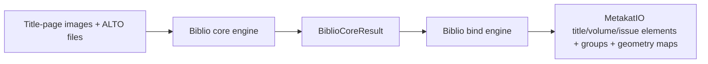
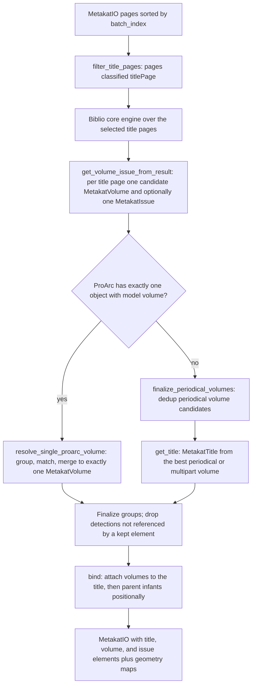
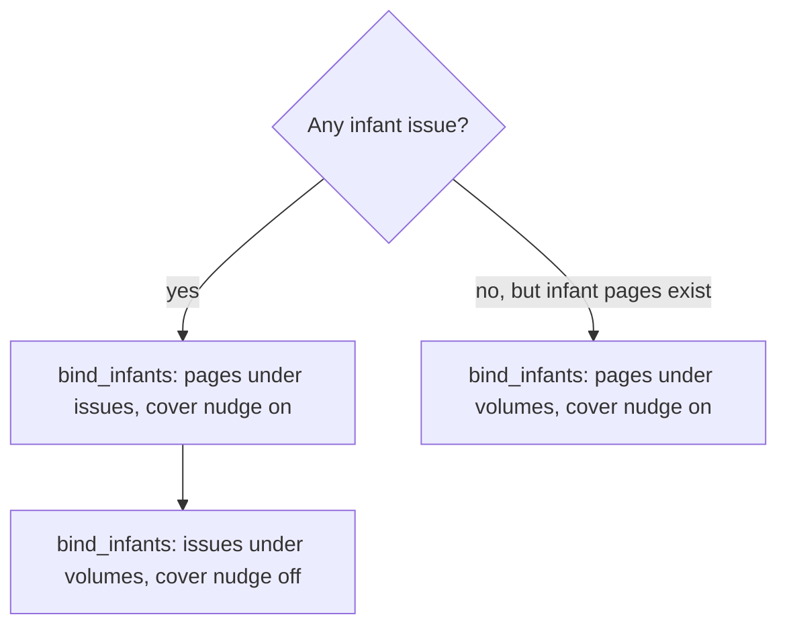

# Bibliographic processing

## Navigation

- [Purpose](#purpose)
- [Biblio core engine contract](#biblio-core-engine-contract)
  - [Result model](#result-model)
  - [Grouping](#grouping)
  - [Implementing another core engine](#implementing-another-core-engine)
- [Core and bind orchestration](#core-and-bind-orchestration)
  - [Pipeline configuration](#pipeline-configuration)
  - [Processing handoff](#processing-handoff)
- [Available core implementation](#available-core-implementation)
  - [YOLO + ALTO](#engine-yolo--alto-biblio_core_engine_yolo)
    - [Label configuration](#label-configuration)
    - [Reading a page](#reading-a-page)
- [Available bind implementation](#available-bind-implementation)
  - [Base](#engine-base-biblio_bind_engine_base)
  - [Binding flow](#binding-flow)
  - [Title-page selection and core invocation](#title-page-selection-and-core-invocation)
  - [Candidate element construction](#candidate-element-construction)
  - [Proarc single-volume resolution](#proarc-single-volume-resolution)
  - [Periodical volume consolidation](#periodical-volume-consolidation)
  - [Title creation](#title-creation)
  - [Anchor pages](#anchor-pages)
  - [Groups](#groups)
  - [Hierarchy binding](#hierarchy-binding)
  - [Detection geometry retention](#detection-geometry-retention)
- [Known limitations](#known-limitations)
- [Observability and revision](#observability-and-revision)

## Purpose

The `metakat.biblio` package reads bibliographic evidence from a document's
title pages and builds the container part of the MetaKat document hierarchy:
`MetakatTitle`, `MetakatVolume`, and `MetakatIssue` elements, each carrying
bibliographic fields and groups, plus the `parent_id` relations that attach
every page to a container.

Bibliographic processing has two boundaries:

1. The **[core engine](#biblio-core-engine-contract)** reads what is printed
   on a set of pages. It returns, per page, the bibliographic values it could
   read there - one reading per field where the field holds one - already
   grouped into MODS statements: a title, an imprint, a series, a name.
2. The **[bind engine](#available-bind-implementation)** decides what those
   readings describe: it selects the title pages, turns each page's readings
   into candidate volumes and issues, reconciles them across pages and
   against an optional ProArc catalog record, creates the title element,
   parents every page, issue, and volume, and creates the detection UUIDs.

The core owns detection, OCR alignment, label interpretation, the choice
between several detections of one field on a page, and grouping. The binder
owns the hierarchy and does not repeat or alter those decisions - the same
split as in the [`page_number`](../page_number/README.md) and
[`chapter`](../chapter/README.md) packages.



## Biblio core engine contract

Every biblio core engine subclasses `BiblioCoreEngine` and exposes:

```python
process(
    images: List[str],
    alto_files: List[str],
) -> BiblioCoreResult
```

The two sequences represent the same pages in the same order. Only the pages
the binder selected as title pages are passed in, not the complete document.
An image filename stem is the page key used in the result.

| Argument | Contract |
|---|---|
| `images` | Ordered image paths. Each filename stem identifies the page in core output. |
| `alto_files` | Ordered ALTO paths corresponding position by position to `images`. |

The method returns:

```python
BiblioCoreResult(
    pages: Mapping[str, BiblioPageResult],
)
```

`pages` is sparse: a page on which nothing was read is absent. Page keys must
be unique and must identify one of the input pages; the binder rejects any
other key. The result carries no MetaKat UUIDs and no hierarchy - creating
those belongs to the [bind engine](#available-bind-implementation).

The classes are defined in `metakat/biblio/engines/core/models.py` and built
on the common `DetectionEvidence` (`text`, `confidence`, `bbox`, `page_key`),
as the other core results are.

### Result model

```python
@dataclass(frozen=True)
class BiblioPageResult:
    page_key: str
    reading: BiblioReading = BiblioReading()
    periodical_volume: BiblioReading | None = None
    periodical_issue: BiblioReading | None = None


@dataclass(frozen=True)
class BiblioReading:
    title_infos: tuple[BiblioTitleInfo, ...] = ()
    publications: tuple[BiblioPublication, ...] = ()
    manufactures: tuple[BiblioManufacture, ...] = ()
    series: tuple[BiblioSeries, ...] = ()
    agents: tuple[BiblioAgent, ...] = ()
```

A page's readings are split by what the core can tell about the record they
describe, never by a hierarchy decision:

| Reading | Holds |
|---|---|
| `reading` | Everything whose level the core cannot state - on a title page, most of it. The binder decides which record each value goes to. |
| `periodical_volume` | What the core read as explicitly describing a periodical volume, such as a printed volume number or year. |
| `periodical_issue` | What the core read as explicitly describing a periodical issue, such as an issue number or date. |

A `BiblioReading` holds **containers**. Each container class is one MODS
container, so one `MetakatGroup` type:

| Container | MODS container / `GroupType` | Fields → MetaKat field |
|---|---|---|
| `BiblioTitleInfo` | `<titleInfo>` / `titleInfo` | `title` → `title`, `sub_title` → `subTitle`, `part_number` → `partNumber`, `part_name` → `partName` |
| `BiblioPublication` | `<originInfo eventType="publication">` / `originInfoPublication` | `places` → `placeTerm`, `publishers` → `publisher`, `date_issued` → `dateIssued`, `edition` → `edition`, `frequency` → `frequency` |
| `BiblioManufacture` | `<originInfo eventType="manufacture">` / `originInfoManufacture` | `places` → `manufacturePlaceTerm`, `manufacturers` → `manufacturePublisher`, `date` → `manufactureDate` |
| `BiblioSeries` | `<relatedItem type="series">` / `series` | `name` → `seriesName`, `part_number` → `seriesPartNumber`, `part_name` → `seriesPartName` |
| `BiblioAgent` | `<name>` / `agent` | `name` → the field named by `role` (`AgentRole`: `author`, `illustrator`, `photographer`, `translator`, `editor`, `redaktor`), `affiliations` → `affiliation`, `emails` → `email` |

A field typed `DetectionEvidence | None` holds one reading; a tuple field holds
any number, in reading order. The mapping is declared on the dataclass fields
themselves (`metadata={"metakat": ...}`), and `container_values(container)`
yields `(MetaKat field, evidence)` for every reading in a container, in field
order. The tests hold the mapping to the schema: every mapped name must be a
`MetakatBibliographic` field in the container's MODS section, and every
grouped bibliographic field must be covered by a container.

### Grouping

A container is one statement read on the page - one title, one imprint, one
series, one person. The values inside it were read together; the container
does not claim which of them pairs with which. That is what the DMF asks of
`<originInfo>`: one element per imprint statement, with parallel places or
publishers of one statement either repeated inside it or split into repeated
elements so that known pairings are kept.

A core therefore:

- puts the values of one statement into one container, even when it does not
  know their pairings;
- splits a statement into several containers only where it knows the
  pairings, or where the page carries several separate statements;
- puts values it cannot place in a common statement into containers of their
  own.

The binder turns each container holding at least two values into one
`MetakatGroup`; a value alone in its container stays ungrouped.

### Implementing another core engine

Every core engine receives its configuration mapping directly. To add one:

1. subclass `BiblioCoreEngine` and call its constructor with the core
   configuration mapping;
2. implement `process()` while preserving the complete
   [core contract](#biblio-core-engine-contract); the base class does not
   prescribe detection, label vocabularies, or how several detections of one
   field are resolved;
3. return only the result classes above, with valid input page keys, grouped
   as [Grouping](#grouping) describes;
4. register the config `name` in `biblio_core_engines` in core
   `definitions.py`, together with its import requirements;
5. test engine loading, reading, grouping, and page key validation.

[`BiblioBindEngineBase`](#engine-base-biblio_bind_engine_base) can bind any
implementation satisfying this contract.

## Core and bind orchestration

### Pipeline configuration

The complete MetaKat pipeline configuration nests the biblio core and bind
mappings under `biblio`:

```json
{
  "biblio": {
    "core": {
      "name": "biblio_core_engine_yolo",
      "model_path": "biblio/core/model.pt",
      "labels": {
        "Title": "titulek",
        "Subtitle": "podtitulek",
        "Author": "autor",
        "Publisher": "nakladatel",
        "PlaceTerm": "misto vydani",
        "DateIssued": "rok vydani"
      }
    },
    "bind": {
      "name": "biblio_bind_engine_base"
    }
  }
}
```

The central pipeline loader resolves relative `*_path` and `*_dir` values
against the directory containing the main pipeline configuration before any
engine is constructed. Core and bind loaders receive these prepared mappings,
read `name`, and resolve it through their registries. An unknown name is an
error; placing an implementation in the package does not register it. Omitting
the whole `biblio` section, or both `core` and `bind` within it, skips the
component; supplying only one of the two is a configuration error.

The bind configuration takes no settings of its own beyond `name`.

### Processing handoff

`process_batch()` runs the components in a fixed order: `page_number`,
`page_type`, `biblio`, `chapter`. Biblio's position is load-bearing in both
directions.

- It runs **after** `page_type`, because
  [title-page selection](#title-page-selection-and-core-invocation) reads
  `MetakatPage.pageType`. Without page-type processing no page is classified as
  a title page, the core is invoked with empty inputs, and no bibliographic
  element is created.
- It runs **before** `chapter`, because the chapter binder groups pages by their
  lowest document container — the volumes and issues this component creates.

The bind engine owns the complete handoff:

1. deep-copy the supplied `MetakatIO`;
2. select title pages and resolve their image and ALTO paths against
   `batch_dir`;
3. invoke the core once with the ordered inputs;
4. map returned page keys back to `MetakatPage` objects through the image-stem
   mapping, rejecting a key that is not one of the input pages;
5. construct, reconcile, and bind the bibliographic elements.

`ProarcIO` is passed through from `process_batch()` and is consulted only by
[proarc single-volume resolution](#proarc-single-volume-resolution).

## Available core implementation

The registered core implementation is:

| Config `name` | Implementation |
|---|---|
| `biblio_core_engine_yolo` | YOLO geometry aligned with ALTO text. |

### Engine: YOLO + ALTO (`biblio_core_engine_yolo`)

This engine detects bibliographic regions with YOLO, aligns their geometry
with ALTO words, and reads each page's aligned regions into a
`BiblioPageResult` by their labels.

#### Configuration

```json
{
  "name": "biblio_core_engine_yolo",
  "model_path": "biblio/core/model.pt",
  "labels": {
    "Title": "titulek",
    "Subtitle": "podtitulek"
  }
}
```

`model_path` must identify the YOLO `.pt` model explicitly. The `labels`
mapping is required and is validated as described under
[Label configuration](#label-configuration); its values must match the raw YOLO
model labels.

#### Label configuration

`parse_biblio_labels` validates the configuration when the engine is
constructed. It requires:

- a non-empty `labels` object;
- every `labels` key to be a valid [`BiblioType`](#reading-a-page) value;
- every `labels` value to be a non-empty string;
- every model label to be assigned at most once.

`id2label` is explicitly rejected: numeric model class IDs are not part of the
pipeline configuration. The engine keeps the mapping as `labels`
(`dict[BiblioType, str]`) and its inverse, `biblio_type_by_label`, which it
reads every region's label through. Both are the engine's own: the binder
never sees a model label.

#### Geometry and text loading

For every input page, the shared `EngineYOLOALTO`:

1. runs YOLO on the image;
2. reads the corresponding ALTO document;
3. aligns ALTO words to detected geometry using bidirectional containment and
   greatest-coverage word assignment;
4. returns the resulting `AlignmentPage` objects, including unmatched regions.

Optional shared settings are `yolo_batch_size` (default `32`),
`yolo_confidence_threshold` (`0.25`), `yolo_image_size` (`640`),
`yolo_device` (`0`), `minimum_overlap_coverage` (`0.65`), and
`label_deduplication_groups`. Configuration values override the corresponding
constructor defaults.

`label_deduplication_groups` is handled by the shared `YOLOReader` before ALTO
word assignment. Each group lists at least two raw YOLO model labels — not
`BiblioType` keys — and a `minimum_coverage` in `(0, 1]`. For differently
labelled detections in the same group, the lower-confidence box is removed when
the intersection covers at least that fraction of both boxes; confidence ties
retain the detection produced first by YOLO. Same-class detections are
unaffected, each label may occur in only one group, and an omitted or empty
setting disables the deduplication.

This engine requires the `ultralytics` package, supplied by the `inference`
installation extra. The requirement is checked before any page is read.

#### Reading a page

`read_page` turns one `AlignmentPage` into a `BiblioPageResult`. A region is
skipped when it is unmatched, when `input_geometry`,
`input_geometry_confidence`, or `alto_text` is missing, or when its
`label_for_export` is not a configured label; the last two are logged as
warnings. Every other region becomes one `DetectionEvidence`: `alto_text`,
`input_geometry_confidence`, the `input_geometry.bounds` as a `BoundingBox`,
and the page key. A page on which nothing is read is left out of the result,
and a page key returned twice by the aligner is an error.

Each `BiblioType` has one place in the result:

| `BiblioType` | Reading | Result field | Several detections on a page |
|---|---|---|---|
| `Title` | `reading` | `BiblioTitleInfo.title` | highest confidence |
| `Subtitle` | `reading` | `BiblioTitleInfo.sub_title` | highest confidence |
| `PartNumber` | `reading` | `BiblioTitleInfo.part_number` | highest confidence |
| `PartName` | `reading` | `BiblioTitleInfo.part_name` | highest confidence |
| `PlaceTerm` | `reading` | `BiblioPublication.places` | highest confidence |
| `Publisher` | `reading` | `BiblioPublication.publishers` | all |
| `DateIssued` | `reading` | `BiblioPublication.date_issued` | highest confidence |
| `Edition` | `reading` | `BiblioPublication.edition` | highest confidence |
| `ManufacturePlaceTerm` | `reading` | `BiblioManufacture.places` | all |
| `ManufacturePublisher` | `reading` | `BiblioManufacture.manufacturers` | all |
| `SeriesName` | `reading` | `BiblioSeries.name` | all |
| `SeriesNumber` | `reading` | `BiblioSeries.part_number` | all |
| `Author`, `Illustrator`, `Photographer`, `Translator`, `Editor`, `Redaktor` | `reading` | one `BiblioAgent` each, with the matching `AgentRole` | all |
| `PeriodicalVolumePartNumber` | `periodical_volume` | `BiblioTitleInfo.part_number` | highest confidence |
| `PeriodicalVolumeDateIssued` | `periodical_volume` | `BiblioPublication.date_issued` | highest confidence |
| `PeriodicalIssuePartNumber` | `periodical_issue` | `BiblioTitleInfo.part_number` | highest confidence |
| `PeriodicalIssueDateIssued` | `periodical_issue` | `BiblioPublication.date_issued` | highest confidence |

"Highest confidence" means a later detection replaces the kept one only when
its confidence is strictly greater, so the first of equally confident ones
stays. "All" keeps every detection in region order.

The detector does not say which values belong together, so the engine groups
by the one thing a page tells it - that it was printed together:

- each reading gets at most one `BiblioTitleInfo`, one `BiblioPublication`
  and one `BiblioManufacture`, holding everything of that kind read on the
  page;
- a series name with at most one series number is one `BiblioSeries`; with
  several names or several numbers, which number belongs to which name is
  unknown, and a series holds one title, so each gets a `BiblioSeries` of its
  own;
- every name is its own `BiblioAgent`.

Configuring a label is what makes a type reachable. A `BiblioType` absent from
`labels` is never read, so the hierarchy and issue behaviour it drives stays
inactive for that engine.

## Available bind implementation

The registered bind implementation is:

| Config `name` | Implementation |
|---|---|
| `biblio_bind_engine_base` | Invoke any compatible biblio core engine, build volumes and issues from its page readings, and bind the resulting hierarchy into `MetakatIO`. |

### Engine: Base (`biblio_bind_engine_base`)

The Base bind engine deep-copies the supplied `MetakatIO`, invokes its
configured core engine over the batch's title pages, and returns the modified
copy.

#### Configuration

```json
{
  "name": "biblio_bind_engine_base"
}
```

The binder has no configurable thresholds. Every decision rule described below
is fixed in the implementation.

### Binding flow



The two branches are mutually exclusive by design. When ProArc reports a single
catalogued volume object, it is treated as ground truth on volume *count* and
on the absence of title-level structure, so `finalize_periodical_volumes` and
`get_title` are skipped outright rather than run as a no-op. Every other input —
periodicals, multipart works, plain monographs without a ProArc record, and any
ProArc record with a different object count or model — takes the vision-only
branch.

### Title-page selection and core invocation

`filter_title_pages(pages, min_distance)` receives all `MetakatPage` elements
sorted by `batch_index` and returns the pages to process:

1. candidates are the pages whose `pageType` is set and whose
   `pageType[0]` is `PageType.TITLE_PAGE`;
2. consecutive candidates closer together than `min_distance` form one group;
3. each group contributes only its highest-`pageType[1]` page.

`process()` calls it with `min_distance=1`. Two distinct pages always differ by
at least one `batch_index`, so no group ever grows beyond a single page and
every classified title page is retained. The grouping only becomes active at
`min_distance` of `2` or more, which no caller currently uses.

Image and ALTO paths are then resolved against `batch_dir` from
`page_to_image_mapping` and `page_to_alto_mapping`, and each list is sorted with
`natsorted`. The two lists are filtered and sorted independently, so they pair
position by position only while every selected title page has both mappings.

The core's page results are taken in `natsorted` `page_key` order and mapped
back to `MetakatPage` objects through a stem-keyed index built from **all** of
the batch's `page_to_image_mapping` entries. Image filename stems must
therefore be unique across the batch, and a page key that does not appear in
that index raises `ValueError`.

### Candidate element construction

`get_volume_issue_from_page` turns one page's `BiblioPageResult` into one
`MetakatVolume` and one `MetakatIssue`. `get_volume_issue_from_result` then
records the source page as each candidate's anchor - see
[Anchor pages](#anchor-pages).

Every piece of evidence becomes one `Value`, created once and shared by every
record it reaches:

```text
Value(text=evidence.text, confidence=evidence.confidence, id=uuid4())
```

and its `(x, y, width, height)` bbox is recorded against the new UUID.

Which record a value goes to is the binder's decision, made per reading:

| Reading | `MetakatVolume` takes | `MetakatIssue` takes |
|---|---|---|
| `reading` | everything except `redaktor` | `title`, `subTitle`, `publisher`, `placeTerm`, `manufacturePublisher`, `manufacturePlaceTerm`, `redaktor` - what an issue repeats from its title page, and its redaktor |
| `periodical_volume` | all of it | — |
| `periodical_issue` | — | all of it |

Each container becomes one group on each record it reaches, holding the
values of it that reached that record. When two readings of one page give a
record the same statement - a title from `reading` and a volume number from
`periodical_volume` are one `<titleInfo>` of the volume - their groups are
united as described under [Groups](#groups). A single-valued field that two
readings both fill, such as a part number read both as `PartNumber` and as
`PeriodicalVolumePartNumber`, keeps the more confident reading; the first on
a tie.

The `hierarchy` of the candidate volume follows from what its page says:

| The page's result | `MetakatVolume.hierarchy` |
|---|---|
| has a `periodical_volume` reading | `periodical` |
| otherwise, a `title_info` of `reading` has a `part_number` or `part_name` | `multipart` |
| otherwise | `monograph` |

Both elements are candidates; emission is conditional:

| Element | Emitted when |
|---|---|
| `MetakatVolume` | `title` is set. |
| `MetakatIssue` | the volume was emitted, `title` is set, and at least one of `partNumber` or `dateIssued` is set. |

A title page without a title therefore contributes nothing, and all of its
evidence becomes unreferenced. `MetakatIssue.parent_id` is deliberately left
unset at creation: an issue's parent is decided later by position in
[hierarchy binding](#hierarchy-binding), not by the volume candidate from its
own page, which may not survive consolidation.

### Proarc single-volume resolution

`_single_proarc_volume` returns the catalog record only when `proarc_io` is
present, `objects` holds exactly one entry, and that entry's `model` is
`volume`. Every other shape — a record with several objects, or a single object
with the `title` or `unit` model — returns `None` and takes the vision-only
branch.

When the record is present, `resolve_single_proarc_volume` forces the batch to
exactly one `MetakatVolume`:

1. **Group by page adjacency.** Candidate volumes are sorted by their anchor
   page's `batch_index`; a gap larger than one page starts a new group. A normal
   book yields one title-page detection, sometimes a couple of adjacent ones
   such as a half-title plus a title page, and this keeps unrelated detections
   elsewhere in the batch from pooling with them.
2. **Merge each group independently** into one volume, using every candidate in
   it. The record does not select which detections take part.
3. **Score each group against the record** by counting how many comparable
   fields any of its candidates corroborates, and whether the catalog
   recognises a title the group detected.
4. **Pick the winning group** by comparing the tuple
   `(title_recognised, proarc_match_count, has_title, detection_count)`,
   lexicographically:

   | Rank | Key | Meaning |
   |---:|---|---|
   | 1 | `title_recognised` | The record recognises a title this group detected, at `0.6` similarity |
   | 2 | `proarc_match_count` | How many comparable fields the group corroborates, at `0.7` each |
   | 3 | `has_title` | The merge produced a title, whatever the record thinks of it |
   | 4 | `detection_count` | Field-level detections gathered across the group |

   A recognised title leads because it is the strongest single sign that a
   group is the book; overall corroboration resolves conflicts behind it,
   which is why the title bar can afford to be the loosest of the three
   similarity thresholds. Keys 3 and 4 carry no ProArc input and decide alone
   when the record corroborates nothing.
5. **Assign the anchor page** and return `[merged volume] + elements that are
   neither a volume nor an issue`. Every candidate issue is dropped, since a
   lone volume object implies no issue-level structure.

When there are no candidate volumes at all, an empty group is still processed,
so the batch always ends with exactly one volume — carrying the record's
identity but no evidence.

#### What ProArc decides, and what it does not

The record's only job is judging **which group** describes the book. Everything
else is MetaKat's.

| Decided by the ProArc record | Decided by the detections |
|---|---|
| That the batch holds exactly one volume | Which text, confidence, and geometry every field carries |
| Which group of neighbouring title pages wins | Whether a field is present at all |
| Which of several detections of one single-kept field is kept | Which detection wins when the record corroborates none of them |
| The volume's `id`, taken from the record's `pid` | Everything in a list-valued field |

No catalog value is ever written to `MetakatIO`. The record's values are read
only to be compared against detections and are then discarded; every value in
the merged volume is a detected `Value` from the winning group, with its own
text, confidence, detection UUID, and geometry. The record also does not gate
which detections may be written: a whole group is merged, not the subset that
happened to match, so a field the record disagrees with is still written when
the detector saw it.

#### Choosing between detections of one field

A group can detect the same field more than once — several title pages, or
several readings on one page. For a single-kept field the binder writes one
of them, so that competition has to be settled, and this is the only place
the record influences content.

A detection whose text reaches `0.8` similarity to one of the record's values
for that field wins outright, **without its confidence being consulted**. The
catalog is better placed than the detector's confidence to say which of two
readings is the real title, and a confident misreading is exactly what it can
see through. Confidence decides only among equally corroborated detections, and
among all of them when the record corroborates none — which is also what
happens when the record has no value for that field at all.

The `0.8` bar is deliberately stricter than the `0.7` used for
[scoring a group](#text-matching): resembling the record closely enough to help
identify the book is a weaker claim than being the reading that should be
written. A detection at, say, `0.75` therefore counts towards its group's score
while leaving the confident reading in place.

None of this applies to list-valued fields. They keep every detection, so there
is no competition to settle and the record has no say.

This also means a record that corroborates nothing costs the batch nothing.
That state is ordinary rather than exotic:
[Reading ProArc input](../README.md#reading-proarc-input) keeps an object whose
MODS could not be parsed, with its identity and no catalog fields at all; an
index-aligned column can consist entirely of `null` placeholders; and a record
may simply describe a different book than the detector read. In each case the
score is zero for every group, the ranking falls through to title precedence
and detection count, and the result is what the vision-only branch would have
produced — plus the record's `id`.

The engine tolerates every ProArc state the IO guards permit, and never fails
because of ProArc content.

#### Comparable fields

Matching and merging use the fields shared by `MetakatVolume` and the ProArc
`ObjectItem`:

| Kind | Fields |
|---|---|
| Single-kept | `dateIssued`, `title`, `subTitle`, `edition`, `placeTerm` |
| Keep-all | `publisher`, `manufacturePublisher`, `manufacturePlaceTerm`, `author`, `illustrator`, `photographer`, `translator`, `editor`, `seriesName`, `seriesPartNumber` |

Both kinds are lists of `Value`s; a single-kept field holds one. Record values
are looked up by the MetaKat field name except where the ProArc parser names
the field differently: `seriesPartNumber` is compared against
`ObjectItem.seriesNumber` (`_PROARC_FIELD_NAMES`).

`partNumber` and `partName` are excluded from scoring, merging, and detection
counting. A candidate can only carry them from `PartNumber`, `PartName`, or
`PeriodicalVolume*` detections, all of which imply a `multipart` or `periodical`
volume. A single ProArc volume object is neither, so such a value reflects a
stray detection rather than evidence about this volume.

Together with the merged volume's `hierarchy` always being `monograph`, this is
the one place where the record's structural verdict — one plain volume — removes
something a detection would otherwise have written. It follows from the volume
count rather than from any catalog value, so no ProArc *content* is involved,
but it is worth knowing about when reading the rule that the record never gates
which detections are written.

#### Text matching

`_field_matches_proarc` compares each candidate text against each of the
record's strings for one field and accepts on the first pair whose similarity
reaches `0.7`. Fields empty on either side are skipped. A record's catalog
field is a column of an index-aligned group, so it holds `None` wherever that
source block carried no value for it; those placeholders keep the columns lined
up and are skipped rather than compared.

`_count_proarc_matches` applies that to a whole group, counting the comparable
fields at least one of its candidates agrees with. That count is the group's
score in the ranking above, and is the entirety of the record's influence.

Similarity is computed on normalized text: NFKD decomposition, lower-casing,
removal of combining marks, punctuation replaced by spaces, and whitespace
collapsed. It is then **asymmetric**, because a detection and a catalog value
are not alike, and which of the two is longer means something:

| Case | Comparison |
|---|---|
| The record value is **shorter** than the detection | It is looked for anywhere inside the detection: `1 - substring_levenshtein_distance(record, detected) / len(record)` |
| The record value is **longer or equal** | The two are compared whole: `1 - levenshtein_distance(detected, record) / len(record)` |

The first case is the one worth allowing. A detector routinely reads more of a
title page than the catalog holds — a subtitle, a statement of responsibility,
an imprint line — so finding the record's whole value somewhere inside that
reading is genuine agreement, and the surrounding text should not count against
it. `"Kytice"` in the record matches a detected
`"Kytice z povesti narodnich, vydal Storch, Praha 1853"` exactly.

The second case gets no such licence, and that is what keeps short OCR out.
Locating whichever value happened to be shorter inside the other meant a
one-character fragment scored a perfect `1.0` against an entire catalog title —
almost any value contains almost any single character — which cleared all three
bars at once and could take a field from a correctly read title. Compared
whole, `"K"` against that title scores `0.04`.

An exact match still scores `1.0` at any length, so a year or an edition number
matches its own counterpart, and a record `"1853"` still matches a detected
`"Praha 1853 Storch"` by the first rule. What a detection can no longer do is
claim a longer record value by being a fragment of it: a bare detected
`"Kytice"` against a catalog `"Kytice z pověstí národních"` scores `0.23`, not
`1.0`.

The resulting score is read against three different bars, loosest to strictest:

| Bar | Used for | Why this strictness |
|---:|---|---|
| `0.6` | Does the catalog recognise a title this group detected — ranking key 1 | Only decides which group is looked at first, and conflicts behind it are resolved by overall corroboration, so a rough OCR reading costs nothing |
| `0.7` | Does a field corroborate the record — ranking key 2 | Enough agreement to help identify the book |
| `0.8` | Which detection of a single-kept field is written | A stronger claim than helping identify the book: this one decides output |

#### Merging

`_merge_volumes` builds one `MetakatVolume` from every candidate in the winning
group:

| Property | Rule |
|---|---|
| `id` | The ProArc record's own `pid`, as the `UUID` that `parse_proarc_json` puts on `ObjectItem.id`. This element *is* that catalogued object, so it does not get a fresh UUID. |
| `hierarchy` | Always `monograph`. No candidate's own hierarchy is consulted, because the only signals that would suggest otherwise are the excluded part fields. |
| Single-kept fields | A one-element list holding the candidate value the record corroborates at `0.8` or better; otherwise the highest-confidence one. See [Choosing between detections of one field](#choosing-between-detections-of-one-field). |
| Keep-all fields | Union in candidate order, skipping `Value`s already present. Since every detection carries its own UUID, identical text detected on two pages is kept twice. |
| `groups` | The candidates' groups, combined as described under [Groups](#groups): one `titleInfo` and one imprint per event, every series and name as read. |

The merged volume's anchor is recorded separately, by `_pick_anchor_page_id`,
in this order: the group member with the highest-confidence title; otherwise
the first member of the group; otherwise the first title page; otherwise the
first page; otherwise none.

### Periodical volume consolidation

On the vision-only branch, `finalize_periodical_volumes` collapses the
`periodical` volume candidates that repeat across pages. It considers only
volumes whose `hierarchy` is `periodical`; `monograph` and `multipart` volumes
are passed through untouched.

Candidates are offered to a list of bags in two passes:

1. volumes carrying **both** `partNumber` and `dateIssued`;
2. volumes carrying **exactly one** of the two.

Each candidate is offered to the existing bags in order and joins the first that
accepts it; otherwise it seeds a new bag. A `periodical` volume carrying neither
field is never offered and is dropped from the output.

`PeriodicalMetakatVolumeBag` holds the `root_volume` whose fields represent the
bag, the `root_page_id` anchor, and the volumes it absorbed. `add_volume` first
rejects a candidate that is not `periodical` or that carries neither field, then
applies a cheap pre-filter: at least one of `partNumber` or `dateIssued` must
match the root's. Matching compares the **normalized text** of the kept
readings, not whole `Value`s: two genuine detections of the same volume never
share a detection UUID and rarely share a confidence, so `Value` equality
could only ever match a value against itself. `None` matches only
`None`, so two candidates that both lack a field satisfy the pre-filter on that
field alone.

The binding decision itself is made by the case table below; a candidate that
passes the pre-filter but matches no case is still rejected. Once a case
applies, the richer or more confident evidence becomes the new root:

| Root state | Candidate state | Outcome |
|---|---|---|
| both fields | both fields | the higher sum of the two confidences becomes root; the other is absorbed |
| both fields | one field matching the root's | absorbed |
| `partNumber` only | `partNumber` only, matching | the higher `partNumber` confidence becomes root |
| `dateIssued` only | `dateIssued` only, matching | the higher `dateIssued` confidence becomes root |

After every accepted candidate, `root_page_id` moves to the earlier of the two
anchor pages. The anchor therefore reflects the bag's full page range rather
than whichever candidate currently supplies the fields — which matters because
[hierarchy binding](#hierarchy-binding) orders parents by that anchor.

The output is one deep-copied root volume per bag, whose id is re-anchored to
`root_page_id`, followed by every issue, followed by every element that is
neither a `periodical` volume nor an issue, in their original order.

### Title creation

`get_title` scans the elements for the volume with the highest-confidence
`title` among those whose `hierarchy` is `periodical` or `multipart`, and
builds:

```python
MetakatTitle(
    id=uuid4(),
    hierarchy=volume.hierarchy,
    title=volume.title,
    subTitle=volume.subTitle,
    groups=volume.groups,
)
```

The `Value`s are shared with the source volume, so the title reuses that
volume's detection UUIDs rather than creating new ones; of the volume's
groups, finalizing keeps what holds the title's own values - its `titleInfo`.
`MetakatTitle.hierarchy`
rejects `monograph` at the schema level, which is why only the two other
hierarchies are eligible. When no such volume exists, no title element is
created. A created title is prepended to the element list, ahead of the volumes
and issues.

### Anchor pages

Every candidate volume and issue has an anchor page: the page its detections
were read from. The anchor orders candidates, groups neighbouring ones, and is
what [hierarchy binding](#hierarchy-binding) switches parents on. It is
binder-internal - the output schema has no anchor field - and lives in an
`Anchors` dict mapping element id to page id, built by
`get_volume_issue_from_result` and passed explicitly to every step that
needs it. A merged ProArc volume and a consolidated periodical volume each get
their own entry.

The anchor is also the page that represents a unit: the page its title was
read from. Right after pages are attached, `bind()` sets
`MetakatPage.representative` on the anchor page of each issue and of each
volume without issues - the units that hold pages - and clears it on their
other pages. A volume with issues holds no pages and marks none; the untitled
monograph has no anchor and marks none either.

### Groups

The groups come from the core: each container it returned becomes a group on
the records its values reach. The binder adds no pairing of its own; it only
carries the groups through its decisions about records.

- **Combining readings of one record** - two readings of one page, or the
  candidates [merged into one ProArc volume](#merging): groups of
  `titleInfo`, `originInfoPublication` and `originInfoManufacture` are united
  when every reading has at most one of that type, because a record has one
  title and one imprint per event. A reading that split such a statement into
  several groups did so on purpose, so then they stay as read. `series` and
  `agent` groups always stay as read: a record can have several series and
  several names.
- **Choosing between records** - a periodical volume bag keeps its root
  volume, groups included; a title takes its volume's groups.
- **Finalizing** - before the elements are written, `_finalize_groups` drops
  from each group the values its record no longer holds - the less confident
  of two readings, a field a merge does not keep - and drops groups left with
  fewer than two members.

A volume or issue that arrived in the input `MetakatIO` has no anchor. Its
position is not guessed: `bind()` leaves it out of positional parenting and
logs a warning naming it.

### Hierarchy binding

`bind()` runs last and works on `MetakatIO.elements` in place. It collects the
*infants* — pages, issues, and volumes whose `parent_id` is still `None` — and
the title element, then applies two rules.

**Title attachment.** When a title exists and there are infant volumes, every
infant volume is attached to it. Only one title per batch is assumed; if several
were present, the last one encountered would win.

**Positional parenting.** Which sweeps run depends on whether any issue exists:



When issues exist, pages are parented to issues only; volumes then receive their
pages indirectly, through the issues.

`bind_infants(pages, infants, parents, apply_cover_nudge, anchors)` walks the ordered
page list once, tracking which parent currently owns the pages being walked:

1. it returns immediately when any of the three sequences is empty;
2. each infant is placed at a batch index — a page uses its own `batch_index`,
   any other infant uses the `batch_index` of its [anchor page](#anchor-pages);
3. parents are sorted by their anchor page's `batch_index`, and the walk starts
   at the first of them;
4. for each page, the walk advances to the next parent exactly when that
   parent's anchor page is reached;
5. whenever the walked page is the anchor of an infant, that infant is attached
   to the current parent.

Parenting therefore depends only on position, never on which page's detections
produced which element. This is what lets a consolidated periodical volume, or a
merged ProArc volume, take ownership of pages whose own candidates were dropped.

Infants are indexed by batch index in a plain mapping, so when two infants are
anchored on the same page only the last one is bound and the other stays
unparented.

#### The cover nudge

A parent is anchored on its title page, but a volume or issue is scanned as
front cover → … → title page → … → back cover. The pages around a boundary
therefore lie outside the anchor range of the parent they belong to: the front
cover of the next volume is walked while the previous volume is still current.
`apply_cover_nudge` moves the boundary onto the covers themselves. It is a
page-only heuristic and is switched off for the issue-to-volume sweep.

The two cover types are opposites, so they act at opposite moments in the walk:

| Page type | Switches | Effect |
|---|---|---|
| `frontCover` | before the page is attached | the cover opens the next parent and is bound to it |
| `backCover` | after the page is attached | the cover closes the current parent and stays with it |

A nudge is applied only while the current parent's own anchor page is strictly
behind the walked page. After a nudge that anchor lies ahead, which is what
keeps the common boundary — a back cover immediately followed by the next
volume's front cover — from switching twice and skipping a parent entirely. The
same guard leaves a parent anchored on a cover page in possession of it. A nudge
at the last parent is a no-op.

The walk also assumes `MetakatIO.elements` lists pages in ascending
`batch_index`; unlike `process()`, `bind()` filters that list without re-sorting
it.

#### Pages without a detected unit

This binder is the only place in the pipeline that attaches pages to issues and
volumes; later stages read those units and never create one. The walk attaches
every page as soon as any issue or volume exists, so a page is left over only
when the batch produced none at all. After the walk, any page still without a
parent is attached to one new `monograph` volume with no title, appended to
`MetakatIO.elements`, and a warning is logged. Later stages can therefore rely
on every page having a unit.

#### Page indices

Right after pages are attached, `bind()` calls `assign_page_indices()` from
`metakat/common/aux/document_groups.py`. It numbers the pages of every
bottom-level unit - each issue, and each volume without issues - 1…n in
`batch_index` order, which is the meaning of MODS `<part type="pageIndex">`:
position within the unit, not within the batch. `batch_index` stays the
0-based position in the batch. A page attached to a volume that has issues sits
above the bottom level and gets `pageIndex=None`, with a warning. Pages are
created without a `pageIndex`, so no page carries a position before it has a
unit.

### Detection geometry retention

Candidate construction records geometry for every piece of evidence, but
consolidation, ProArc resolution, and the emission conditions can all drop the
element a detection was gathered for. Before writing the geometry maps, the
binder therefore collects the detection UUIDs still referenced as evidence.

`_referenced_detection_ids` walks every kept element's model fields and collects
the `id` of every `Value`, whether it stands alone or sits in a list.
Detections outside that set are removed from both maps and the count is
logged. Recognising `Value`s is what keeps the geometry at all: a check that
missed them would drop every biblio bbox and page mapping, with only that
count logged.

The surviving entries are merged into the existing maps:

| MetaKat destination | Source |
|---|---|
| `MetakatIO.detection_to_bbox[detection_uuid]` | `(x, y, width, height)` of the evidence's `bbox` |
| `MetakatIO.detection_to_page_mapping[detection_uuid]` | `MetakatPage.id` of the title page the evidence was read on |

Existing entries written by earlier components are preserved. The new
bibliographic elements are prepended to `MetakatIO.elements`, with the title
first when one was created; pre-existing elements keep their relative order.

## Known limitations

These are properties of the current implementation rather than of the
contracts, and are documented so a change can be scoped against them.

| Area | Limitation |
|---|---|
| Title attachment | `bind()` attaches **every** infant volume to the one title, regardless of that volume's own hierarchy. In a batch of unrelated monographs, a single spurious part-number detection creates a title that then adopts every other monograph as well. |
| ProArc integration | Only a record with exactly one `volume`-model object is used. Multi-object records, `title` and `unit` objects, and any issue-level guidance are ignored, and such a batch silently takes the vision-only branch. |
| Periodical path | No production label configuration in this repository maps a detector label to `PeriodicalVolumePartNumber` or `PeriodicalVolumeDateIssued`, so the `periodical` hierarchy and the consolidation it drives are reachable but not exercised by a real run. |
| Monograph batches | Without a ProArc record, nothing consolidates `monograph` volumes: every title page carrying a `Title` detection yields its own volume. |
| Cover nudge | The heuristic depends on `page_type` having classified the covers, and recognises only `frontCover` and `backCover` — not `cover`, `jacket`, or `frontJacket`. A run of consecutive back covers switches at the first of them, so the rest are attributed to the next parent; a run of front covers is handled correctly. |
| Title-page grouping | `filter_title_pages` is called with `min_distance=1`, at which its grouping can never merge two distinct pages. |
| Anchor collisions | `bind_infants` keeps one infant per batch index, so two infants anchored on the same page leave one unparented. |
| Input pairing | Image and ALTO path lists are filtered and sorted independently; a selected title page that has only one of the two mappings shifts the pairing for the rest of the batch. |

## Observability and revision

The core engine logs its label count and how many of the pages it was given
it read something on; regions it skips for missing YOLO metadata or an
unconfigured model label are logged as warnings. The bind engine logs the page
and title-page counts, the number of images sent to the core, the number of
pages it returned, the number of candidate elements created, which branch was
taken, and the final element count at `INFO`. ProArc resolution additionally
logs the candidate and group counts and the winning group's relevant-candidate
count, detection count, and whether it produced a title. Dropped unreferenced
detections are logged as a count.

Changes to label handling, per-page precedence or grouping belong to the core
engine: update it, its tests in `metakat/biblio/engines/core/tests`, and
[Reading a page](#reading-a-page) together. Changes to record routing, the
ProArc matching threshold, the group-selection tuple, or the consolidation
rules belong to the binder: update it, its tests in
`metakat/biblio/engines/bind/tests`, and the corresponding tables here
together.
