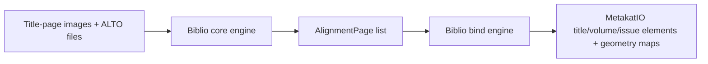
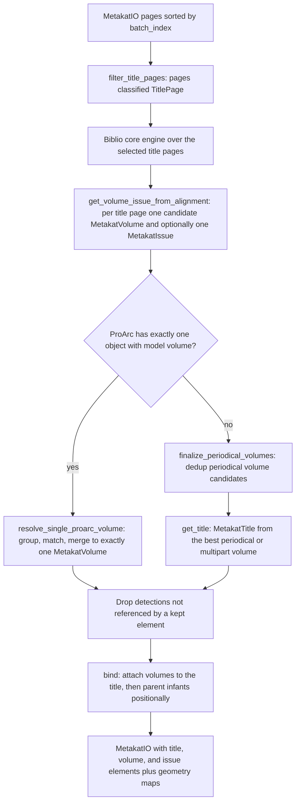
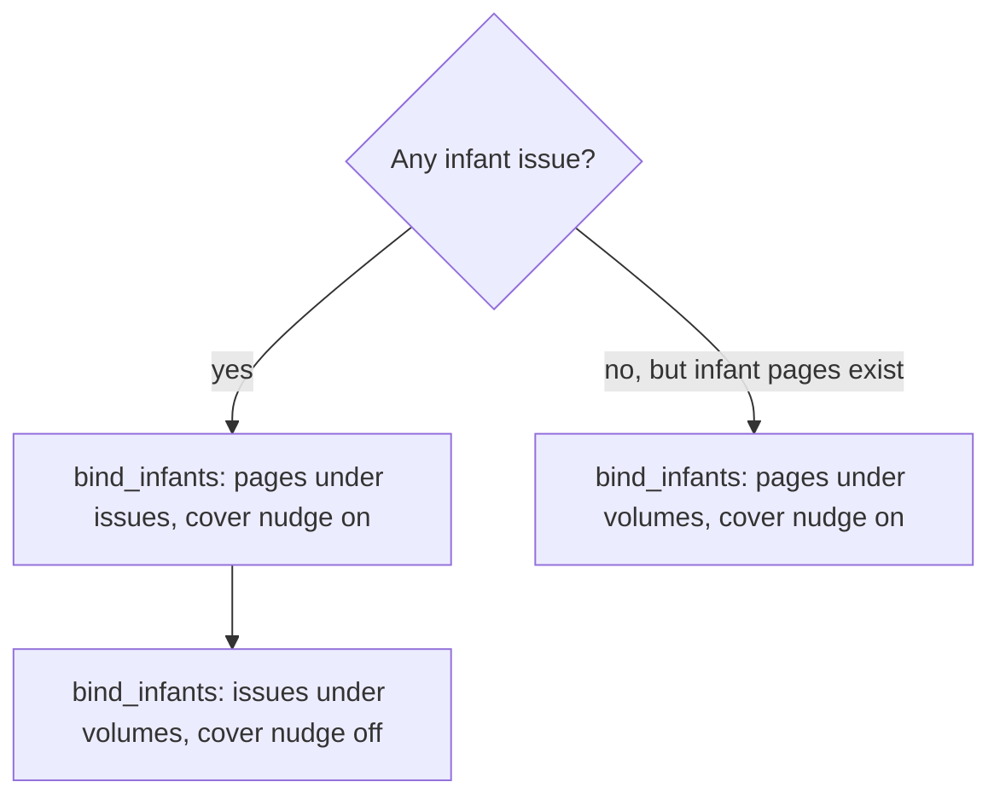

# Bibliographic processing

## Navigation

- [Purpose](#purpose)
- [Biblio core engine contract](#biblio-core-engine-contract)
  - [Label configuration](#label-configuration)
  - [Bibliographic label types](#bibliographic-label-types)
  - [Implementing another core engine](#implementing-another-core-engine)
- [Core and bind orchestration](#core-and-bind-orchestration)
  - [Pipeline configuration](#pipeline-configuration)
  - [Processing handoff](#processing-handoff)
- [Available core implementation](#available-core-implementation)
  - [YOLO + ALTO](#engine-yolo--alto-biblio_core_engine_yolo)
- [Available bind implementation](#available-bind-implementation)
  - [Base](#engine-base-biblio_bind_engine_base)
  - [Binding flow](#binding-flow)
  - [Title-page selection and core invocation](#title-page-selection-and-core-invocation)
  - [Candidate element construction](#candidate-element-construction)
  - [Proarc single-volume resolution](#proarc-single-volume-resolution)
  - [Periodical volume consolidation](#periodical-volume-consolidation)
  - [Title creation](#title-creation)
  - [Hierarchy binding](#hierarchy-binding)
  - [Detection geometry retention](#detection-geometry-retention)
- [Known limitations](#known-limitations)
- [Observability and revision](#observability-and-revision)

## Purpose

The `metakat.biblio` package reads bibliographic evidence from a document's
title pages and builds the container part of the MetaKat document hierarchy:
`MetakatTitle`, `MetakatVolume`, and `MetakatIssue` elements, each carrying
bibliographic fields, plus the `parent_id` relations that attach every page to
a container.

Bibliographic processing has two boundaries:

1. The **[core engine](#biblio-core-engine-contract)** performs detection and
   OCR alignment. It returns aligned page regions with geometry, confidence,
   ALTO text, and a model label.
2. The **[bind engine](#available-bind-implementation)** owns everything
   semantic: it selects title pages, resolves model labels to
   [`BiblioType`](#bibliographic-label-types) values, constructs candidate
   volumes and issues, reconciles them against an optional ProArc catalog
   record, creates the title element, and parents every page, issue, and volume.



This split is placed lower than in the
[`page_number`](../page_number/README.md) and [`chapter`](../chapter/README.md)
packages. Those cores return a MetaKat-owned result model and hand the binder a
finished interpretation. The biblio core returns the aligner's own
`AlignmentPage` objects, so label interpretation, field precedence, hierarchy
inference, and detection-UUID creation all live in the binder. A replacement
core therefore changes *how* regions are found, never *what they mean*.

## Biblio core engine contract

Every biblio core engine subclasses `BiblioCoreEngine` and implements:

```python
process(
    images: List[str],
    alto_files: List[str],
) -> List[AlignmentPage]
```

The two sequences represent the same pages in the same order. Only the pages
the binder selected as title pages are passed in, not the complete document.

| Argument | Contract |
|---|---|
| `images` | Ordered image paths. Each filename stem becomes the `AlignmentPage.page_key` used by the binder to map results back to a `MetakatPage`. |
| `alto_files` | Ordered ALTO paths corresponding position by position to `images`. |

`AlignmentPage` and `AlignmentRegion` are defined by the external
`text_geometry_aligner` package. Unlike the other MetaKat components, the biblio
contract does not copy them into a MetaKat-owned result model. The binder reads
these attributes and no others:

| Attribute | Used for |
|---|---|
| `AlignmentPage.page_key` | Image filename stem; identifies the source `MetakatPage`. |
| `AlignmentPage.regions` | The detections to interpret. |
| `AlignmentPage.matched_count` | Logging only. |
| `AlignmentRegion.matched` | An unmatched region is skipped. |
| `AlignmentRegion.label_for_export` | The model label resolved through `biblio_type_by_label`. It is `label_export` when set, otherwise the raw `label`. |
| `AlignmentRegion.input_geometry` | Detection geometry; its `bounds` become the stored bounding box. |
| `AlignmentRegion.input_geometry_confidence` | The confidence stored in the MetaKat evidence tuple and used for every field precedence decision. |
| `AlignmentRegion.alto_text` | The text stored in the MetaKat evidence tuple. |
| `AlignmentRegion.region_id`, `label`, `label_export` | Warning messages only. |

A region missing `input_geometry`, `input_geometry_confidence`, or `alto_text`
is skipped with a warning, so the core may return partially aligned regions
without breaking binding.

### Label configuration

`BiblioCoreEngine.__init__` validates the configuration and builds the label
mappings that the binder depends on. It requires:

- a configuration mapping containing a registered engine `name`;
- a non-empty `labels` object;
- every `labels` key to be a valid [`BiblioType`](#bibliographic-label-types)
  value;
- every `labels` value to be a non-empty string;
- every model label to be assigned at most once.

`id2label` is explicitly rejected: numeric model class IDs are not part of the
pipeline configuration.

Validation produces two attributes:

| Attribute | Content |
|---|---|
| `labels` | `dict[BiblioType, str]`, the configured semantic type to model label mapping. |
| `biblio_type_by_label` | The inverse `dict[str, BiblioType]`. |

`biblio_type_by_label` is part of the core contract, not an implementation
detail: the bind engine reads it directly off `self.core_engine` to resolve
every detection. A model label present in the results but absent from the
mapping is skipped with a warning rather than raising.

### Bibliographic label types

`BiblioType` enumerates every semantic type the binder understands. The
`Volume` and `Issue` columns name the destination field on the candidate
`MetakatVolume` and `MetakatIssue` built for the detection's page. A dash means
the type never contributes to that element.

| `BiblioType` | Volume field | Issue field | Several detections | Hierarchy effect |
|---|---|---|---|---|
| `Title` | `title` | `title` | highest confidence | — |
| `Subtitle` | `subTitle` | `subTitle` | highest confidence | — |
| `PartNumber` | `partNumber` | — | highest confidence | `monograph` → `multipart` |
| `PartName` | `partName` | — | highest confidence | `monograph` → `multipart` |
| `SeriesName` | `seriesName` | — | appended | — |
| `SeriesNumber` | `seriesNumber` | — | appended | — |
| `Edition` | `edition` | — | highest confidence | — |
| `Publisher` | `publisher` | `publisher` | appended | — |
| `PlaceTerm` | `placeTerm` | `placeTerm` | highest confidence | — |
| `DateIssued` | `dateIssued` | — | highest confidence | — |
| `ManufacturePublisher` | `manufacturePublisher` | `manufacturePublisher` | appended | — |
| `ManufacturePlaceTerm` | `manufacturePlaceTerm` | `manufacturePlaceTerm` | appended | — |
| `Author` | `author` | — | appended | — |
| `Illustrator` | `illustrator` | — | appended | — |
| `Photographer` | `photographer` | — | appended | — |
| `Translator` | `translator` | — | appended | — |
| `Editor` | `editor` | — | appended | — |
| `Redaktor` | — | `redaktor` | appended | — |
| `PeriodicalVolumePartNumber` | `partNumber` | — | highest confidence | forces `periodical` |
| `PeriodicalVolumeDateIssued` | `dateIssued` | — | highest confidence | forces `periodical` |
| `PeriodicalIssuePartNumber` | — | `partNumber` | highest confidence | — |
| `PeriodicalIssueDateIssued` | — | `dateIssued` | highest confidence | — |

"Highest confidence" means a later detection replaces the stored one only when
its `input_geometry_confidence` is strictly greater. "Appended" means every
detection is kept, in region order, with no deduplication.

`DateIssued` and `PeriodicalVolumeDateIssued` write the same
`MetakatVolume.dateIssued` field and compete on confidence like any other pair
of detections for it. The hierarchy that `PeriodicalVolumeDateIssued` forces is
set independently, so losing the field does not revert it.

Configuring a label is what makes a type reachable. A `BiblioType` absent from
`labels` can never be produced, so the hierarchy and issue behavior it drives
stays inactive for that engine.

### Implementing another core engine

Every core engine receives its configuration mapping directly. To add one:

1. subclass `BiblioCoreEngine` and call its constructor with the core
   configuration mapping, so label validation and `biblio_type_by_label` are
   built consistently;
2. implement `process()` returning one `AlignmentPage` per input page, with
   `page_key` equal to the image filename stem;
3. label every region with a string that the configured `labels` mapping
   resolves, and populate `input_geometry`, `input_geometry_confidence`, and
   `alto_text` on every region that should become evidence;
4. register the config `name` in `biblio_core_engines` in core
   `definitions.py`, together with its import requirements;
5. test engine loading, label validation, and region output.

[`BiblioBindEngineBase`](#engine-base-biblio_bind_engine_base) can bind any
implementation satisfying this contract. A core returning a different result
model requires its own `BiblioBindEngine` subclass and bind-engine
registration in bind `definitions.py`.

## Core and bind orchestration

### Pipeline configuration

The complete MetaKat pipeline configuration nests the biblio core and bind
mappings under `biblio`:

```json
{
  "biblio": {
    "core": {
      "name": "biblio_core_engine_yolo",
      "model_path": "biblio/core/model.pt",
      "labels": {
        "Title": "titulek",
        "Subtitle": "podtitulek",
        "Author": "autor",
        "Publisher": "nakladatel",
        "PlaceTerm": "misto vydani",
        "DateIssued": "rok vydani"
      }
    },
    "bind": {
      "name": "biblio_bind_engine_base"
    }
  }
}
```

The central pipeline loader resolves relative `*_path` and `*_dir` values
against the directory containing the main pipeline configuration before any
engine is constructed. Core and bind loaders receive these prepared mappings,
read `name`, and resolve it through their registries. An unknown name is an
error; placing an implementation in the package does not register it. Omitting
the whole `biblio` section, or both `core` and `bind` within it, skips the
component; supplying only one of the two is a configuration error.

The bind configuration takes no settings of its own beyond `name`.

### Processing handoff

`process_batch()` runs the components in a fixed order: `page_number`,
`page_type`, `biblio`, `chapter`. Biblio's position is load-bearing in both
directions.

- It runs **after** `page_type`, because
  [title-page selection](#title-page-selection-and-core-invocation) reads
  `MetakatPage.pageType`. Without page-type processing no page is classified as
  a title page, the core is invoked with empty inputs, and no bibliographic
  element is created.
- It runs **before** `chapter`, because the chapter binder groups pages by their
  lowest document container — the volumes and issues this component creates.

The bind engine owns the complete handoff:

1. deep-copy the supplied `MetakatIO`;
2. select title pages and resolve their image and ALTO paths against
   `batch_dir`;
3. invoke the core once with the ordered inputs;
4. map returned page keys back to `MetakatPage` objects through the image-stem
   mapping;
5. construct, reconcile, and bind the bibliographic elements.

`ProarcIO` is passed through from `process_batch()` and is consulted only by
[proarc single-volume resolution](#proarc-single-volume-resolution).

## Available core implementation

The registered core implementation is:

| Config `name` | Implementation |
|---|---|
| `biblio_core_engine_yolo` | YOLO geometry aligned with ALTO text. |

### Engine: YOLO + ALTO (`biblio_core_engine_yolo`)

This engine detects bibliographic regions with YOLO and aligns their geometry
with ALTO words, returning the aligned pages unchanged. It performs no
selection, parsing, or filtering of its own — `process()` delegates entirely to
the shared `EngineYOLOALTO` and returns `document.pages`.

#### Configuration

```json
{
  "name": "biblio_core_engine_yolo",
  "model_path": "biblio/core/model.pt",
  "labels": {
    "Title": "titulek",
    "Subtitle": "podtitulek"
  }
}
```

`model_path` must identify the YOLO `.pt` model explicitly. The `labels`
mapping is required and is validated as described under
[Label configuration](#label-configuration); its values must match the raw YOLO
model labels.

#### Geometry and text loading

For every input page, the shared `EngineYOLOALTO`:

1. runs YOLO on the image;
2. reads the corresponding ALTO document;
3. aligns ALTO words to detected geometry using bidirectional containment and
   greatest-coverage word assignment;
4. returns the resulting `AlignmentPage` objects, including unmatched regions.

Optional shared settings are `yolo_batch_size` (default `32`),
`yolo_confidence_threshold` (`0.25`), `yolo_image_size` (`640`),
`yolo_device` (`0`), `minimum_overlap_coverage` (`0.65`), and
`label_deduplication_groups`. Configuration values override the corresponding
constructor defaults.

`label_deduplication_groups` is handled by the shared `YOLOReader` before ALTO
word assignment. Each group lists at least two raw YOLO model labels — not
`BiblioType` keys — and a `minimum_coverage` in `(0, 1]`. For differently
labelled detections in the same group, the lower-confidence box is removed when
the intersection covers at least that fraction of both boxes; confidence ties
retain the detection produced first by YOLO. Same-class detections are
unaffected, each label may occur in only one group, and an omitted or empty
setting disables the deduplication.

This engine requires the `ultralytics` package, supplied by the `yolo`
installation extra. The requirement is checked before any page is read.

## Available bind implementation

The registered bind implementation is:

| Config `name` | Implementation |
|---|---|
| `biblio_bind_engine_base` | Invoke any compatible biblio core engine, interpret its aligned detections, and bind the resulting hierarchy into `MetakatIO`. |

### Engine: Base (`biblio_bind_engine_base`)

The Base bind engine deep-copies the supplied `MetakatIO`, invokes its
configured core engine over the batch's title pages, and returns the modified
copy.

#### Configuration

```json
{
  "name": "biblio_bind_engine_base"
}
```

The binder has no configurable thresholds. Every decision rule described below
is fixed in the implementation.

### Binding flow



The two branches are mutually exclusive by design. When ProArc reports a single
catalogued volume object, it is treated as ground truth on volume *count* and
on the absence of title-level structure, so `finalize_periodical_volumes` and
`get_title` are skipped outright rather than run as a no-op. Every other input —
periodicals, multipart works, plain monographs without a ProArc record, and any
ProArc record with a different object count or model — takes the vision-only
branch.

### Title-page selection and core invocation

`filter_title_pages(pages, min_distance)` receives all `MetakatPage` elements
sorted by `batch_index` and returns the pages to process:

1. candidates are the pages whose `pageType` is set and whose
   `pageType[0]` is `PageType.TITLE_PAGE`;
2. consecutive candidates closer together than `min_distance` form one group;
3. each group contributes only its highest-`pageType[1]` page.

`process()` calls it with `min_distance=1`. Two distinct pages always differ by
at least one `batch_index`, so no group ever grows beyond a single page and
every classified title page is retained. The grouping only becomes active at
`min_distance` of `2` or more, which no caller currently uses.

Image and ALTO paths are then resolved against `batch_dir` from
`page_to_image_mapping` and `page_to_alto_mapping`, and each list is sorted with
`natsorted`. The two lists are filtered and sorted independently, so they pair
position by position only while every selected title page has both mappings.

The returned alignment pages are re-sorted by `page_key` with `natsorted` and
mapped back to `MetakatPage` objects through a stem-keyed index built from
**all** of the batch's `page_to_image_mapping` entries. Image filename stems
must therefore be unique across the batch, and a page key that does not appear
in that index raises `KeyError`.

### Candidate element construction

`get_volume_issue_from_page` processes one alignment page at a time. It creates
one `MetakatVolume` with `hierarchy=monograph` and one `MetakatIssue`, both
anchored on the source page through `page_id`, and then fills them from the
page's regions.

A region is skipped when it is unmatched, when `input_geometry`,
`input_geometry_confidence`, or `alto_text` is missing, or when its
`label_for_export` is not in the core engine's `biblio_type_by_label`. The last
two cases are logged as warnings.

Every retained region produces one evidence tuple:

```text
(region.alto_text, region.input_geometry_confidence, uuid4())
```

The destination field, precedence rule, and hierarchy effect for each resolved
type are listed in [Bibliographic label types](#bibliographic-label-types). The
detection's `(x, y, width, height)` bounds are recorded against its new UUID
only when the type was actually handled.

The `hierarchy` of the candidate volume is decided entirely by detections on its
own page:

| Detected type | Effect on `MetakatVolume.hierarchy` |
|---|---|
| none of the below | stays `monograph` |
| `PartNumber` or `PartName` | `monograph` → `multipart`; an existing `periodical` is left alone |
| `PeriodicalVolumePartNumber` or `PeriodicalVolumeDateIssued` | set to `periodical` unconditionally |

Both elements are candidates; emission is conditional:

| Element | Emitted when |
|---|---|
| `MetakatVolume` | `title` is set. |
| `MetakatIssue` | the volume was emitted, `title` is set, and at least one of `partNumber` or `dateIssued` is set. |

A title page with no `Title` detection therefore contributes nothing, and all of
its detections become unreferenced. `MetakatIssue.parent_id` is deliberately
left unset at creation: an issue's parent is decided later by position in
[hierarchy binding](#hierarchy-binding), not by the volume candidate from its
own page, which may not survive consolidation.

### Proarc single-volume resolution

`_single_proarc_volume` returns the catalog record only when `proarc_io` is
present, `objects` holds exactly one entry, and that entry's `model` is
`volume`. Every other shape — a record with several objects, or a single object
with the `title` or `unit` model — returns `None` and takes the vision-only
branch.

When the record is present, `resolve_single_proarc_volume` forces the batch to
exactly one `MetakatVolume`:

1. **Group by page adjacency.** Candidate volumes are sorted by their anchor
   page's `batch_index`; a gap larger than one page starts a new group. A normal
   book yields one title-page detection, sometimes a couple of adjacent ones
   such as a half-title plus a title page, and this keeps unrelated detections
   elsewhere in the batch from pooling with them.
2. **Merge each group independently** into one volume, using every candidate in
   it. The record does not select which detections take part.
3. **Score each group against the record** by counting how many comparable
   fields any of its candidates corroborates.
4. **Pick the winning group** by comparing the tuple
   `(has_title, proarc_match_count, detection_count)`. Tuple comparison is
   lexicographic, so a group whose merge produced a title always beats a
   titleless one; among those, the group corroborating more of the record wins;
   and if the record cannot separate them, the larger field-level detection
   count does.
5. **Assign the anchor page** and return `[merged volume] + elements that are
   neither a volume nor an issue`. Every candidate issue is dropped, since a
   lone volume object implies no issue-level structure.

When there are no candidate volumes at all, an empty group is still processed,
so the batch always ends with exactly one volume — carrying the record's
identity but no evidence.

#### What ProArc decides, and what it does not

The record's only job is judging **which group** describes the book. Everything
else is MetaKat's.

| Decided by the ProArc record | Decided by the detections |
|---|---|
| That the batch holds exactly one volume | Which text, confidence, and geometry every field carries |
| Which group of neighbouring title pages wins | Which candidate wins a contested field, by confidence |
| The volume's `id`, taken from the record's `pid` | Whether a field is present at all |

No catalog value is ever written to `MetakatIO`. The record's values are read
only to be compared against detections and are then discarded; every value in
the merged volume is a detection tuple from the winning group, with its own
detection UUID and geometry. The record also does not gate which detections may
be written: a whole group is merged, not the subset that happened to match, so
a field the record disagrees with is still written when the detector saw it.
Within a group, a contested field goes to the highest-confidence detection —
the record gets no vote.

This also means a record that corroborates nothing costs the batch nothing.
That state is ordinary rather than exotic:
[Reading ProArc input](../README.md#reading-proarc-input) keeps an object whose
MODS could not be parsed, with its identity and no catalog fields at all; an
index-aligned column can consist entirely of `null` placeholders; and a record
may simply describe a different book than the detector read. In each case the
score is zero for every group, the ranking falls through to title precedence
and detection count, and the result is what the vision-only branch would have
produced — plus the record's `id`.

The engine tolerates every ProArc state the IO guards permit, and never fails
because of ProArc content.

#### Comparable fields

Matching and merging use the fields shared by `MetakatVolume` and the ProArc
`ObjectItem`:

| Kind | Fields |
|---|---|
| Single-value | `dateIssued`, `title`, `subTitle`, `edition`, `placeTerm` |
| List-valued | `publisher`, `manufacturePublisher`, `manufacturePlaceTerm`, `author`, `illustrator`, `photographer`, `translator`, `editor`, `seriesName`, `seriesNumber` |

`partNumber` and `partName` are excluded from scoring, merging, and detection
counting. A candidate can only carry them from `PartNumber`, `PartName`, or
`PeriodicalVolume*` detections, all of which imply a `multipart` or `periodical`
volume. A single ProArc volume object is neither, so such a value reflects a
stray detection rather than evidence about this volume.

Together with the merged volume's `hierarchy` always being `monograph`, this is
the one place where the record's structural verdict — one plain volume — removes
something a detection would otherwise have written. It follows from the volume
count rather than from any catalog value, so no ProArc *content* is involved,
but it is worth knowing about when reading the rule that the record never gates
which detections are written.

#### Text matching

`_field_matches_proarc` compares each candidate text against each of the
record's strings for one field and accepts on the first pair whose similarity
reaches `0.7`. Fields empty on either side are skipped. A record's catalog
field is a column of an index-aligned group, so it holds `None` wherever that
source block carried no value for it; those placeholders keep the columns lined
up and are skipped rather than compared.

`_count_proarc_matches` applies that to a whole group, counting the comparable
fields at least one of its candidates agrees with. That count is the group's
score in the ranking above, and is the entirety of the record's influence.

Similarity is computed on normalized text: NFKD decomposition, lower-casing,
removal of combining marks, punctuation replaced by spaces, and whitespace
collapsed. The shorter normalized string is then matched against any substring
of the longer one:

```text
similarity = 1 - substring_levenshtein_distance(shorter, longer) / len(shorter)
```

Matching a substring rather than the whole string lets a detected title match a
catalog title that carries extra subtitle or statement-of-responsibility text.

#### Merging

`_merge_volumes` builds one `MetakatVolume` from the relevant candidates:

| Property | Rule |
|---|---|
| `id` | The ProArc record's own `pid`, as the `UUID` that `parse_proarc_json` puts on `ObjectItem.id`. This element *is* that catalogued object, so it does not get a fresh UUID. |
| `hierarchy` | Always `monograph`. No candidate's own hierarchy is consulted, because the only signals that would suggest otherwise are the excluded part fields. |
| Single-value fields | The candidate value with the highest confidence. |
| List-valued fields | Union in candidate order, skipping tuples already present. Since every detection carries its own UUID, identical text detected on two pages is kept twice. |
| `page_id` | Assigned separately, see below. |

The anchor page is chosen by `_pick_anchor_page_id` in this order: the relevant
candidate with the highest-confidence title; otherwise the first relevant
candidate; otherwise the first member of the winning group; otherwise the first
title page; otherwise the first page; otherwise `None`.

### Periodical volume consolidation

On the vision-only branch, `finalize_periodical_volumes` collapses the
`periodical` volume candidates that repeat across pages. It considers only
volumes whose `hierarchy` is `periodical`; `monograph` and `multipart` volumes
are passed through untouched.

Candidates are offered to a list of bags in two passes:

1. volumes carrying **both** `partNumber` and `dateIssued`;
2. volumes carrying **exactly one** of the two.

Each candidate is offered to the existing bags in order and joins the first that
accepts it; otherwise it seeds a new bag. A `periodical` volume carrying neither
field is never offered and is dropped from the output.

`PeriodicalMetakatVolumeBag` holds the `root_volume` whose fields represent the
bag, the `root_page_id` anchor, and the volumes it absorbed. `add_volume` first
rejects a candidate that is not `periodical` or that carries neither field, then
applies a cheap pre-filter: at least one of `partNumber` or `dateIssued` must
match the root's. Matching compares **normalized text**, not the raw
`(text, confidence, detection_id)` tuples: two genuine detections of the same
volume never share a detection UUID and rarely share a confidence, so tuple
equality could only ever match a tuple against itself. `None` matches only
`None`, so two candidates that both lack a field satisfy the pre-filter on that
field alone.

The binding decision itself is made by the case table below; a candidate that
passes the pre-filter but matches no case is still rejected. Once a case
applies, the richer or more confident evidence becomes the new root:

| Root state | Candidate state | Outcome |
|---|---|---|
| both fields | both fields | the higher sum of the two confidences becomes root; the other is absorbed |
| both fields | one field matching the root's | absorbed |
| `partNumber` only | `partNumber` only, matching | the higher `partNumber` confidence becomes root |
| `dateIssued` only | `dateIssued` only, matching | the higher `dateIssued` confidence becomes root |

After every accepted candidate, `root_page_id` moves to the earlier of the two
anchor pages. The anchor therefore reflects the bag's full page range rather
than whichever candidate currently supplies the fields — which matters because
[hierarchy binding](#hierarchy-binding) orders parents by that anchor.

The output is one deep-copied root volume per bag, re-anchored to
`root_page_id`, followed by every issue, followed by every element that is
neither a `periodical` volume nor an issue, in their original order.

### Title creation

`get_title` scans the elements for the volume with the highest-confidence
`title` among those whose `hierarchy` is `periodical` or `multipart`, and
builds:

```python
MetakatTitle(
    id=uuid4(),
    hierarchy=volume.hierarchy,
    title=volume.title,
    subTitle=volume.subTitle,
)
```

The evidence tuples are shared with the source volume, so the title reuses that
volume's detection UUIDs rather than creating new ones. `MetakatTitle.hierarchy`
rejects `monograph` at the schema level, which is why only the two other
hierarchies are eligible. When no such volume exists, no title element is
created. A created title is prepended to the element list, ahead of the volumes
and issues.

### Hierarchy binding

`bind()` runs last and works on `MetakatIO.elements` in place. It collects the
*infants* — pages, issues, and volumes whose `parent_id` is still `None` — and
the title element, then applies two rules.

**Title attachment.** When a title exists and there are infant volumes, every
infant volume is attached to it. Only one title per batch is assumed; if several
were present, the last one encountered would win.

**Positional parenting.** Which sweeps run depends on whether any issue exists:



When issues exist, pages are parented to issues only; volumes then receive their
pages indirectly, through the issues.

`bind_infants(pages, infants, parents, apply_cover_nudge)` walks the ordered
page list once, tracking which parent currently owns the pages being walked:

1. it returns immediately when any of the three sequences is empty;
2. each infant is placed at a batch index — a page uses its own `batch_index`,
   any other infant uses the `batch_index` of its anchor `page_id`;
3. parents are sorted by their anchor page's `batch_index`, and the walk starts
   at the first of them;
4. for each page, the walk advances to the next parent exactly when that
   parent's anchor page is reached;
5. whenever the walked page is the anchor of an infant, that infant is attached
   to the current parent.

Parenting therefore depends only on position, never on which page's detections
produced which element. This is what lets a consolidated periodical volume, or a
merged ProArc volume, take ownership of pages whose own candidates were dropped.

Infants are indexed by batch index in a plain mapping, so when two infants are
anchored on the same page only the last one is bound and the other stays
unparented.

#### The cover nudge

A parent is anchored on its title page, but a volume or issue is scanned as
front cover → … → title page → … → back cover. The pages around a boundary
therefore lie outside the anchor range of the parent they belong to: the front
cover of the next volume is walked while the previous volume is still current.
`apply_cover_nudge` moves the boundary onto the covers themselves. It is a
page-only heuristic and is switched off for the issue-to-volume sweep.

The two cover types are opposites, so they act at opposite moments in the walk:

| Page type | Switches | Effect |
|---|---|---|
| `FrontCover` | before the page is attached | the cover opens the next parent and is bound to it |
| `BackCover` | after the page is attached | the cover closes the current parent and stays with it |

A nudge is applied only while the current parent's own anchor page is strictly
behind the walked page. After a nudge that anchor lies ahead, which is what
keeps the common boundary — a back cover immediately followed by the next
volume's front cover — from switching twice and skipping a parent entirely. The
same guard leaves a parent anchored on a cover page in possession of it. A nudge
at the last parent is a no-op.

The walk also assumes `MetakatIO.elements` lists pages in ascending
`batch_index`; unlike `process()`, `bind()` filters that list without re-sorting
it.

### Detection geometry retention

Candidate construction records geometry for every handled detection, but
consolidation, ProArc resolution, and the emission conditions can all drop the
element a detection was gathered for. Before writing the geometry maps, the
binder therefore collects the detection UUIDs still referenced as evidence.

`_referenced_detection_ids` walks every kept element's model fields and collects
the third item of each three-element tuple, whether the tuple stands alone or
sits in a list. Detections outside that set are removed from both maps and the
count is logged.

The surviving entries are merged into the existing maps:

| MetaKat destination | Source |
|---|---|
| `MetakatIO.detection_to_bbox[detection_uuid]` | `(x, y, width, height)` of the region's `input_geometry.bounds` |
| `MetakatIO.detection_to_page_mapping[detection_uuid]` | `MetakatPage.id` of the title page whose alignment page produced the region |

Existing entries written by earlier components are preserved. The new
bibliographic elements are prepended to `MetakatIO.elements`, with the title
first when one was created; pre-existing elements keep their relative order.

## Known limitations

These are properties of the current implementation rather than of the
contracts, and are documented so a change can be scoped against them.

| Area | Limitation |
|---|---|
| Title attachment | `bind()` attaches **every** infant volume to the one title, regardless of that volume's own hierarchy. In a batch of unrelated monographs, a single spurious part-number detection creates a title that then adopts every other monograph as well. |
| ProArc integration | Only a record with exactly one `volume`-model object is used. Multi-object records, `title` and `unit` objects, and any issue-level guidance are ignored, and such a batch silently takes the vision-only branch. |
| Periodical path | No production label configuration in this repository maps a detector label to `PeriodicalVolumePartNumber` or `PeriodicalVolumeDateIssued`, so the `periodical` hierarchy and the consolidation it drives are reachable but not exercised by a real run. |
| Monograph batches | Without a ProArc record, nothing consolidates `monograph` volumes: every title page carrying a `Title` detection yields its own volume. |
| Cover nudge | The heuristic depends on `page_type` having classified the covers, and recognises only `FrontCover` and `BackCover` — not `Cover`, `Jacket`, or `FrontJacket`. A run of consecutive back covers switches at the first of them, so the rest are attributed to the next parent; a run of front covers is handled correctly. |
| Title-page grouping | `filter_title_pages` is called with `min_distance=1`, at which its grouping can never merge two distinct pages. |
| Anchor collisions | `bind_infants` keeps one infant per batch index, so two infants anchored on the same page leave one unparented. |
| Input pairing | Image and ALTO path lists are filtered and sorted independently; a selected title page that has only one of the two mappings shifts the pairing for the rest of the batch. |

## Observability and revision

The bind engine logs the page and title-page counts, the number of images sent
to the core, the total detections returned, the number of candidate elements
created, which branch was taken, and the final element count at `INFO`. ProArc
resolution additionally logs the candidate and group counts and the winning
group's relevant-candidate count, detection count, and whether it produced a
title. Skipped regions — unmatched, missing YOLO metadata, or an unconfigured
model label — and dropped unreferenced detections are logged as warnings or
counts.

Because the binder owns every semantic decision, these logs are the primary
record of why a volume, issue, or title exists. Changes to label precedence,
the ProArc matching threshold, the group-selection tuple, or the consolidation
rules should update the implementation, its focused tests in
`metakat/biblio/engines/bind/tests`, and the corresponding tables here
together.
