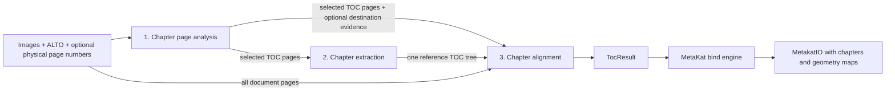
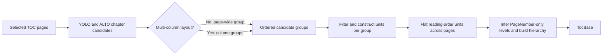

# Chapter processing

## Navigation

- [Purpose](#purpose)
- [Chapter core engine contract](#chapter-core-engine-contract)
- [Replaceable three-stage pipeline processing](#replaceable-three-stage-pipeline-processing)
  - [Shared pipeline types](#shared-pipeline-types)
  - [Stage 1 contract: Chapter page analysis](#stage-1-contract-chapter-page-analysis)
  - [Stage 2 contract: Chapter extraction](#stage-2-contract-chapter-extraction)
  - [Stage 3 contract: Chapter alignment](#stage-3-contract-chapter-alignment)
  - [Pipeline wrapper orchestration](#pipeline-wrapper-orchestration)
  - [Pipeline configuration and extension](#pipeline-configuration-and-extension)
- [Available stage implementations](#available-stage-implementations)
  - [Stage 1: Chapter page analysis](#stage-1-chapter-page-analysis)
  - [Stage 2: Chapter extraction](#stage-2-chapter-extraction)
  - [Stage 3: Chapter alignment](#stage-3-chapter-alignment)
- [TOC page-number parsers](#toc-page-number-parsers)
  - [Arabic and Roman TOC page-number parser](#arabic-and-roman-toc-page-number-parser)
- [Available bind implementation](#available-bind-implementation)
  - [Base](#engine-base-chapter_bind_engine_base)
- [Observability and revision](#observability-and-revision)

## Purpose

The `metakat.chapter` package extracts a table of contents (TOC), connects its
entries to destination pages, and writes a hierarchical set of
`MetakatChapter` elements into `MetakatIO`.

Chapter processing deliberately has two boundaries:

1. The **[core engine](#chapter-core-engine-contract)** performs all document analysis. It returns a chapter
   tree with detected text, geometry provenance, TOC-page provenance, and
   resolved destination page keys.
2. The **[bind engine](#available-bind-implementation)** projects that result into the existing `MetakatIO`. It
   groups pages by their lowest document container, converts page keys into
   `pageIndex` values, creates detection UUIDs, and fills missing chapter ends.

The core engine may implement chapter extraction in any way. The bind engine
depends only on the [core interface and result model](#chapter-core-engine-contract).

## Chapter core engine contract

Every chapter core engine subclasses `ChapterCoreEngine` and implements:

```python
process(
    images: Sequence[str],
    alto_files: Sequence[str],
    page_numbers: Sequence[PhysicalPageNumberEvidence] | None = None,
    image_dimensions: Sequence[PageDimensions | None] | None = None,
    alto_dimensions: Sequence[PageDimensions | None] | None = None,
) -> TocResult
```

The bind engine invokes the core independently for each lowest-level document
group, normally a monograph or periodical issue. Images, ALTO files, and
dimension sequences use the same physical page order. Physical-number
evidence is sparse and identifies pages by key.

| Argument | Contract |
|---|---|
| `images` | Ordered image paths. The image filename stem is the page key used by the result. |
| `alto_files` | Ordered ALTO paths corresponding position by position to `images`. |
| `page_numbers` | Optional externally supplied, already parsed, sparse physical page-number evidence. Each item identifies its source page through `page_key`; pages without external evidence are omitted. `None` means the caller supplied no external page-number source, while an empty sequence means it supplied a source containing no evidence. |
| `image_dimensions` | Optional image canvas dimensions corresponding position by position to `images`; individual values may be `None`. |
| `alto_dimensions` | Optional ALTO canvas dimensions corresponding position by position to `images`; individual values may be `None`. |

A core engine must accept all arguments in this signature even when its
implementation does not use every optional input.

The method returns:

```python
TocResult(
    chapters: tuple[ChapterResult, ...],
)
```

`chapters` contains the hierarchy roots. One core chapter is represented by:

```python
ChapterResult(
    toc_page_key: str,
    title: DetectionEvidence | None,
    subtitle: DetectionEvidence | None = None,
    part_number: DetectionEvidence | None = None,
    page_number: ChapterPageNumberEvidence | None = None,
    title_destination_page: DetectionEvidence | None = None,
    page_start_key: str | None = None,
    page_end_key: str | None = None,
    children: tuple[ChapterResult, ...] = (),
)
```

| Field | Core result contract |
|---|---|
| `toc_page_key` | Input image stem of the page containing the source TOC entry. |
| `title` | Title evidence from the TOC page, when available. |
| `subtitle` | Optional subtitle evidence associated with the title on the TOC page. |
| `part_number` | Optional chapter or section-number evidence from the TOC page. |
| `page_number` | Optional parsed destination-page reference from the TOC page. It retains the original OCR evidence as well as the normalized values supplied by the TOC-producing engine. It is not the physical number detected on the destination page. |
| `title_destination_page` | Optional title evidence found on the resolved destination page. |
| `page_start_key` | Input image stem of the resolved first page, or `None` when unresolved. |
| `page_end_key` | Input image stem of an explicitly resolved last page, or `None` to delegate end inference to the binder. |
| `children` | Nested chapter hierarchy of arbitrary depth. |

An unresolved chapter may still be returned with TOC evidence and children;
its `title_destination_page`, `page_start_key`, and `page_end_key` remain
`None`.

The bind engine converts every retained evidence object into a MetaKat tuple
and detection UUID. Every `toc_page_key`, evidence `page_key`,
`page_start_key`, and `page_end_key` must refer to an input image stem.

### Implementing another chapter core engine

Every engine follows the
[engine directory convention](#engine-directory-convention): a directory
containing `metakat_engine_config.json` and any implementation resources. The
config must contain the registered engine name:

```json
{
  "name": "chapter_core_engine_custom"
}
```

To add a core engine:

1. subclass `ChapterCoreEngine` and call its constructor with the engine
   directory;
2. implement the complete [`process()` contract](#chapter-core-engine-contract);
3. return `TocResult` with valid page-key provenance;
4. register the config `name` in `chapter_core_engines` in core
   `definitions.py`;
5. test loading, optional inputs, unresolved chapters, hierarchy, and page-key
   output.

[`ChapterBindEngineBase`](#engine-base-chapter_bind_engine_base) can bind any
implementation satisfying this contract.
An implementation that returns a different result model requires its own
`ChapterBindEngine` and bind-engine registration.

## Replaceable three-stage pipeline processing

`chapter_core_engine_pipeline` is one implementation of the chapter core
contract. It composes three independently replaceable stages, allowing a
different model or algorithm to replace one stage without changing the other
stages or the [MetaKat binder](#available-bind-implementation).



The pipeline processes one document as follows:

1. **[Chapter page analysis](#stage-1-contract-chapter-page-analysis)** examines all
   document pages, selects the pages that
   form the reference TOC, and may also produce title and physical-page-number
   evidence for possible destination pages.
2. **[Chapter extraction](#stage-2-contract-chapter-extraction)** processes the
   selected TOC pages together and produces
   one hierarchical `TocBase` containing the entries read from the TOC.
3. **[Chapter alignment](#stage-3-contract-chapter-alignment)** combines that hierarchy
   with the complete ordered page
   sequence and the available destination evidence. It resolves TOC entries
   to destination pages where possible and returns `TocResult`.

The resulting `TocResult` is passed to the
[MetaKat bind engine](#available-bind-implementation). Validation,
evidence-source precedence, early termination, and the exact stage handoffs
are described in
[Pipeline wrapper orchestration](#pipeline-wrapper-orchestration).

The models in this section form the stable boundaries between the three
stages. A replacement stage may use any implementation mechanism as long as
it honors the corresponding interface and field meanings.

| Stage | Reads | Produces |
|---|---|---|
| [Chapter page analysis](#stage-1-contract-chapter-page-analysis) | `Sequence[ChapterPageInput]` | `ChapterPageAnalysisResult` |
| [Chapter extraction](#stage-2-contract-chapter-extraction) | `Sequence[ChapterPageInput]` | `TocBase` |
| [Chapter alignment](#stage-3-contract-chapter-alignment) | All document `ChapterPageInput` pages, selected TOC pages, `TocBase`, and optional destination-title and physical-number evidence | `TocResult` |

### Shared pipeline types

The general geometry, dimensions, and evidence models in this section are
defined by `metakat.common.models`. They are MetaKat-owned models; objects
received from lower-level image or alignment libraries are explicitly copied
into these representations at the processing boundary.

#### `BoundingBox`

`BoundingBox` represents an axis-aligned MetaKat rectangle using top-left
coordinates:

```python
BoundingBox(
    x: float,
    y: float,
    width: float,
    height: float,
)
```

It exposes the calculated right and bottom edges as `x_max` and `y_max`.

#### `PageDimensions`

`PageDimensions` represents the dimensions of an image or ALTO canvas:

```python
PageDimensions(
    width: float,
    height: float,
)
```

Both values must be finite and positive; construction raises `ValueError`
otherwise.

#### `ChapterPageInput`

`ChapterPageInput` is defined in `metakat.chapter.engines.core.models`. It is
the shared page input for all three stages and does not belong to any one
stage. It identifies one physical page throughout the pipeline:

```python
ChapterPageInput(
    page_key: str,
    position: int,
    image_path: Path,
    alto_path: Path,
    image_dimensions: PageDimensions | None = None,
    alto_dimensions: PageDimensions | None = None,
)
```

| Field | Meaning |
|---|---|
| `page_key` | Stable page identifier, unique within one pipeline invocation. All later evidence and resolutions refer back to this key. |
| `position` | Zero-based physical order within the processed document. |
| `image_path` | Path to the page image. |
| `alto_path` | Path to the ALTO OCR corresponding to the image. |
| `image_dimensions` | Optional positive width and height of the image canvas. |
| `alto_dimensions` | Optional positive width and height of the ALTO canvas. |

#### `DetectionEvidence`

`DetectionEvidence` retains detected text together with its source geometry
and page provenance:

```python
DetectionEvidence(
    text: str,
    confidence: float,
    bbox: BoundingBox,
    page_key: str,
)
```

| Field | Meaning |
|---|---|
| `text` | Text retained for the detected value. |
| `confidence` | Confidence of the source geometry detection, not necessarily OCR confidence. |
| `bbox` | Source bounding box. |
| `page_key` | Stable key of the page containing the evidence. |

Pipeline stages use `DetectionEvidence` wherever detected text must retain
confidence and source geometry.

#### `PhysicalPageNumberEvidence`

`PhysicalPageNumberEvidence` represents a number printed on a possible
destination page. It is defined in the page-number core package and is shared
by the [chapter core input](#chapter-core-engine-contract),
[stage 1](#stage-1-contract-chapter-page-analysis), and
[stage 3](#stage-3-contract-chapter-alignment):

```python
PhysicalPageNumberEvidence(DetectionEvidence):
    normalized: str | None
    value: int | None
    numeral_system: PageNumberNumeralSystem | None
```

| Field | Meaning |
|---|---|
| `normalized` | Parsed Arabic or Roman token with decoration removed, or `None` when parsing failed. Unicode digits and Roman-numeral glyphs are represented with ASCII characters. |
| `value` | Integer value used for number comparison, or `None` when parsing failed. |
| `numeral_system` | `arabic`, `roman`, or `None` when parsing failed. |

The physical-number model inherits `text`, `confidence`, `bbox`, and
`page_key` from `DetectionEvidence`.

`normalized_text(case=None)` returns `normalized` and optionally changes its
letter case with `case="lowercase"` or `case="uppercase"`. It returns `None`
when parsing failed. `output_text(case=None)` returns the same normalized
value when available and otherwise falls back to the original `text`.

### Stage 1 contract: Chapter page analysis

#### Input

```python
process(
    pages: Sequence[ChapterPageInput],
) -> ChapterPageAnalysisResult
```

The input is the complete ordered document, not just suspected TOC pages.
Every item supplies the image and ALTO pair needed for analysis.

#### Output

```python
ChapterPageAnalysisResult(
    toc_pages: tuple[ChapterPageInput, ...],
    destination_chapters:
        tuple[DestinationChapterEvidence, ...] | None = None,
    destination_page_numbers: tuple[
        PhysicalPageNumberEvidence, ...
    ] | None = None,
)
```

| Field | Produced information |
|---|---|
| `toc_pages` | Ordered pages identified as the source of the reference TOC, represented by the original `ChapterPageInput` objects. |
| `destination_chapters` | Candidate title evidence located on pages outside `toc_pages`. `None` means destination-title detection is not implemented; `()` means it is implemented but found nothing. |
| `destination_page_numbers` | Physical page-number evidence located on pages outside `toc_pages`. `None` means physical-number detection is not implemented; `()` means it is implemented but found nothing. |

Every `toc_pages` item must have a `page_key` present in the stage input, and
each page key may occur at most once. The pipeline raises `ValueError` when
stage 1 returns an unknown or duplicate TOC page key.

Each item in `destination_chapters` is represented as:

```python
DestinationChapterEvidence(
    title: DetectionEvidence,
)
```

The nested `title.page_key` identifies the possible destination page. Multiple
title detections may belong to the same page; they remain separate candidates
for alignment.

Each item in `destination_page_numbers` is the fully parsed
[`PhysicalPageNumberEvidence`](#physicalpagenumberevidence) model.
Stage 1, rather than [stage 3](#stage-3-contract-chapter-alignment), is responsible
for choosing and parsing at most one physical number per destination page. If
stage 1 returns more than one
item with the same `page_key`, the pipeline raises `ValueError`.

For use in the three-stage pipeline, stage 1 must implement at least one of
`destination_chapters` or `destination_page_numbers`, unless physical page
numbers are supplied externally through the chapter core input. If neither
stage-1 capability is implemented and no external page-number sequence is
provided, the [pipeline wrapper](#pipeline-wrapper-orchestration) raises
`ValueError` before [stage 2](#stage-2-contract-chapter-extraction).

The registered stage-1 implementation is documented under
[Stage 1: Chapter page analysis](#stage-1-chapter-page-analysis).

### Stage 2 contract: Chapter extraction

#### Input

```python
process(
    toc_pages: Sequence[ChapterPageInput],
) -> TocBase
```

The input is exactly
[`ChapterPageAnalysisResult.toc_pages`](#stage-1-contract-chapter-page-analysis).

#### Output

```python
TocBase(
    chapters: tuple[ChapterBase, ...],
)
```

`chapters` contains the top-level entries of one logical TOC. The result
represents all selected TOC pages together. It is not one tree per physical
TOC page. Each extracted TOC entry is represented as:

```python
ChapterBase(
    toc_page_key: str,
    title: DetectionEvidence | None,
    subtitle: DetectionEvidence | None = None,
    part_number: DetectionEvidence | None = None,
    page_number: ChapterPageNumberEvidence | None = None,
    children: tuple[ChapterBase, ...] = (),
)
```

| Field | Meaning |
|---|---|
| `toc_page_key` | Physical TOC page containing the entry. It is present even when the entry has no title evidence. |
| `title` | Chapter title detected on the TOC page. This remains distinct from a title later found on the destination page. |
| `subtitle` | Optional subtitle detected below and geometrically associated with the entry's title on the TOC page. A subtitle never creates an entry by itself. |
| `part_number` | Optional chapter/section number printed as part of the TOC entry, such as `2.3`. It is not the destination page number. |
| `page_number` | Optional parsed `PageNumber` printed in the TOC entry. It denotes the destination page number and retains the complete source evidence together with normalized semantic values for alignment. |
| `children` | Nested TOC entries. The model supports arbitrary hierarchy depth. |

The `ChapterPageNumberEvidence` model extends `DetectionEvidence`:

```python
ChapterPageNumberEvidence(DetectionEvidence):
    kind: ChapterPageNumberKind | None
    normalized_items: tuple[
        tuple[str, int, PageNumberNumeralSystem], ...
    ]
```

The inherited `text` retains the complete source evidence supplied by the
extraction engine rather than only the numeric token recognized by the
parser. `kind` is `single`, `range`, or `list` for a successfully parsed page
number and `None` when parsing failed. Each `normalized_items` tuple
contains normalized token text, its integer value, and its `arabic` or
`roman` numeral system. The tuple is empty when parsing failed.

`normalized_text(case=None)` joins normalized items with `-` for a range and
`,` for a list. `normalized_start(case=None)` returns the first normalized
item, while `normalized_end(case=None)` returns the second item only for a
range. The optional case is `"lowercase"` or `"uppercase"`; `None` preserves
the normalized token case. `output_text(case=None)` returns normalized text
when available and otherwise falls back to the complete original OCR text.

`title`, `subtitle`, `part_number`, and `page_number` each retain independent text,
confidence, geometry, and source-page provenance. For every non-null field,
its `DetectionEvidence.page_key` is expected to equal `toc_page_key`, and its
bounding box is expected to belong to that TOC page. These expectations are
not explicitly validated, so the pipeline does not raise an error solely
because they are violated. The explicit `toc_page_key` identifies the
physical location of the complete TOC entry.

The registered stage-2 implementation is documented under
[Stage 2: Chapter extraction](#stage-2-chapter-extraction).

### Stage 3 contract: Chapter alignment

#### Inputs

```python
process(
    *,
    pages: Sequence[ChapterPageInput],
    toc_pages: Sequence[ChapterPageInput],
    reference_toc: TocBase,
    destination_chapters:
        Sequence[DestinationChapterEvidence] | None,
    destination_page_numbers:
        Sequence[PhysicalPageNumberEvidence] | None,
) -> TocResult
```

| Argument | Information supplied |
|---|---|
| `pages` | Complete ordered document. `position` preserves physical document order, and selected TOC pages remain available to alignment implementations that need them. |
| `toc_pages` | From [stage 1](#stage-1-contract-chapter-page-analysis): `ChapterPageAnalysisResult.toc_pages`, the ordered subset of `pages` selected as the source of the reference TOC. |
| `reference_toc` | From [stage 2](#stage-2-contract-chapter-extraction): the extracted `TocBase` hierarchy, including TOC text and geometry provenance. |
| `destination_chapters` | From [stage 1](#stage-1-contract-chapter-page-analysis): `ChapterPageAnalysisResult.destination_chapters`, containing candidate destination-title evidence whose page keys identify possible chapter starts. `None` means the capability is not implemented; an empty sequence means it ran but found nothing. |
| `destination_page_numbers` | Physical page-number evidence originating either from the external core `page_numbers` input or from [stage 1](#stage-1-contract-chapter-page-analysis) as `ChapterPageAnalysisResult.destination_page_numbers`. Source resolution and precedence are described under [Pipeline wrapper orchestration](#pipeline-wrapper-orchestration). `None` means the capability is not implemented; an empty sequence means it ran but found nothing. Each page may occur at most once. |


#### Output

```python
TocResult(
    chapters: tuple[ChapterResult, ...],
)
```

`chapters` contains the top-level aligned entries of the logical TOC. Each
aligned TOC entry is represented as:

```python
ChapterResult(ChapterBase):
    title_destination_page: DetectionEvidence | None = None
    page_start_key: str | None = None
    page_end_key: str | None = None
    children: tuple[ChapterResult, ...] = ()
```

| Additional or overridden field | Meaning |
|---|---|
| `title_destination_page` | Optional title evidence detected on the resolved destination page. This remains distinct from the TOC-page `title` inherited from `ChapterBase`. |
| `page_start_key` | `ChapterPageInput.page_key` of the resolved first destination page, or `None` when the chapter was not aligned. |
| `page_end_key` | `ChapterPageInput.page_key` of an explicitly resolved final destination page, or `None` when no explicit end was resolved. |
| `children` | Nested aligned chapter results. This overrides `ChapterBase.children` so the recursive elements are `ChapterResult` objects. |

The fields inherited by `ChapterResult`, including `page_number`, retain the
values and meanings documented for `ChapterBase` in the
[stage-2 contract](#stage-2-contract-chapter-extraction). An
alignment engine adds destination bindings without reparsing, normalizing, or
otherwise replacing the TOC entry.

Chapters that cannot be connected to a destination may be returned with
`title_destination_page=None`, `page_start_key=None`, and
`page_end_key=None`.

The registered stage-3 implementation is documented under
[Stage 3: Chapter alignment](#stage-3-chapter-alignment).

### Pipeline wrapper orchestration

`ChapterPipelineCoreEngine` connects the three contracts as follows:

1. It creates one `ChapterPageInput` per paired image and ALTO file. The image
   filename stem becomes `page_key`, stems must be unique, and `position`
   follows input order.
2. It passes the complete page sequence to
   [stage 1](#stage-1-contract-chapter-page-analysis).
3. After [stage 1](#stage-1-contract-chapter-page-analysis) finishes, it determines
   the effective destination-title and
   destination-page-number capabilities:

   - Destination titles always come from
     `ChapterPageAnalysisResult.destination_chapters`.
   - When the core `page_numbers` argument is a sequence, its
     `PhysicalPageNumberEvidence` items are used as the complete external
     destination-page-number source. The sequence is sparse: an absent page
     key means that no external evidence is available for that page. Stage-1
     results do not supplement it, including when the sequence is empty.
   - When the core `page_numbers` argument is `None`, destination page numbers
     come from `ChapterPageAnalysisResult.destination_page_numbers`.
   - For either capability, `None` means it is unavailable, while `()` means
     it is implemented or externally supplied but contains no evidence.
   - If both effective capabilities are `None`, the wrapper raises
     `ValueError` at this point and does not invoke stages 2 or 3. If at least
     one capability is an empty or non-empty tuple, processing continues and
     the alignment implementation decides which available evidence to use.
   - Physical page numbers detected by stage 1 are pipeline inputs only and
     are not included in `TocResult`.
4. If [stage 1](#stage-1-contract-chapter-page-analysis) returns no `toc_pages`, it
   logs a warning and returns an empty `TocResult` without invoking
   [stage 2](#stage-2-contract-chapter-extraction) or
   [stage 3](#stage-3-contract-chapter-alignment).
5. It passes `ChapterPageAnalysisResult.toc_pages` to
   [stage 2](#stage-2-contract-chapter-extraction).
6. It passes the complete page sequence, the explicit selected TOC-page
   subset, stage 2's `TocBase`, and destination evidence to
   [stage 3](#stage-3-contract-chapter-alignment).
   Beforehand it removes destination evidence located on selected TOC pages.
   It raises `ValueError` when a
   `DestinationChapterEvidence.title.page_key` or
   `PhysicalPageNumberEvidence.page_key` is not present in the complete
   `ChapterPageInput` sequence created from the core input in step 1. It also
   raises `ValueError` when more than one destination-page-number evidence
   item refers to the same page key. Multiple destination-title evidence
   items for one page remain allowed.
7. It recursively prunes titleless entries from the stage-3 `TocResult`.
   An entry is retained when either its TOC-page `title` or its
   `title_destination_page` is present. When an entry has neither title, the
   wrapper removes it and promotes its retained children into the removed
   entry's parent level. The pruned result is returned to
   `ChapterBindEngineBase`.

### Pipeline configuration and extension

#### Engine directory convention

Every engine is represented by a directory containing
`metakat_engine_config.json` and any resources required by that engine. A
typical pipeline directory is arranged as follows:

```text
chapter_core_engine/
├── metakat_engine_config.json
├── chapter_page_analysis/
│   ├── metakat_engine_config.json
│   └── model.pt
├── chapter_extraction/
│   ├── metakat_engine_config.json
│   └── model.pt
└── chapter_alignment/
    └── metakat_engine_config.json
```

The pipeline configuration points to its three stage directories:

```json
{
  "name": "chapter_core_engine_pipeline",
  "stages": {
    "chapter_page_analysis": "chapter_page_analysis",
    "chapter_extraction": "chapter_extraction",
    "chapter_alignment": "chapter_alignment"
  }
}
```

Stage paths may be absolute. Relative paths are resolved from the core-engine
directory. The top-level keys `chapter_page_analysis_engine`,
`chapter_extraction_engine`, and `chapter_alignment_engine` are also accepted
as a fallback, but `stages` is the preferred form. Pre-rename stage keys,
registered engine names, and Python package paths are not supported.

#### Adding a stage implementation

The three stage interfaces are structural `Protocol` types. Their signatures
are defined by the [stage-1](#stage-1-contract-chapter-page-analysis),
[stage-2](#stage-2-contract-chapter-extraction), and
[stage-3](#stage-3-contract-chapter-alignment) contracts. A new class must:

1. accept its engine directory in the constructor;
2. implement the appropriate linked `process()` contract;
3. use a unique `name` in its `metakat_engine_config.json`;
4. be added to the appropriate registry in
   `ChapterPipelineCoreEngine._load_stage()`;
5. have tests for its contract and registration.

Registration is explicit; placing a class in a package does not
make it discoverable automatically. A stage is free to use YOLO, a VLM, rules,
or an external service as long as it honors the same input/output models.

When a new implementation needs additional configuration or files, keep them
inside its stage directory. Do not add stage-specific settings to the pipeline
wrapper unless they affect orchestration itself.

## Available stage implementations

This section documents the stage engines registered for
`chapter_core_engine_pipeline`. Their models and interfaces are defined by the
[three-stage contracts](#replaceable-three-stage-pipeline-processing); the
algorithms described here are properties of the available engines, not
requirements of the pipeline.

| Stage | Config `name` | Implementation |
|---|---|---|
| [Chapter page analysis](#stage-1-chapter-page-analysis) | `chapter_page_analysis_engine_yolo_alto` | YOLO geometry aligned with ALTO text |
| [Chapter extraction](#stage-2-chapter-extraction) | `chapter_extraction_engine_yolo_alto` | YOLO geometry aligned with ALTO text |
| [Chapter alignment](#stage-3-chapter-alignment) | `chapter_alignment_engine_fuzzy` | Physical-number anchors and fuzzy title matching |

### Stage 1: Chapter page analysis

The following engine implements the
[stage-1 contract](#stage-1-contract-chapter-page-analysis).

#### Engine: YOLO + ALTO (`chapter_page_analysis_engine_yolo_alto`)

This engine detects page-layout regions with YOLO, fills their text from ALTO,
selects one consecutive TOC-page block, and returns destination-title
and physical-page-number evidence from pages outside that block.

##### Configuration

```json
{
  "name": "chapter_page_analysis_engine_yolo_alto",
  "labels": {
    "Level1Title": "kapitola",
    "Level2Title": "jiny nadpis",
    "PageNumber": "cislo strany",
    "DestinationTitle": "nadpis v textu"
  },
  "label_deduplication_groups": [
    {
      "labels": ["kapitola", "jiny nadpis"],
      "minimum_coverage": 0.8
    }
  ],
  "toc_search_fraction": 0.25,
  "toc_candidate_min_title_count": 2,
  "toc_candidate_min_page_number_count": 2,
  "toc_candidate_window_height_multiplier": 10.0,
  "toc_candidate_min_window_height_fraction": 0.2,
  "toc_candidate_max_window_height_fraction": 0.5,
  "page_number_edge_band_ratio": 0.15,
  "page_number_edge_score_weight": 0.65,
  "toc_keywords": [
    "obsah",
    "content",
    "contents",
    "table of contents",
    "содержание",
    "зміст",
    "inhalt",
    "sommaire"
  ]
}
```

`toc_search_fraction` must be in `(0, 0.5]`. The two candidate-count
thresholds must be positive integers and both default to `2` when omitted.
`toc_candidate_window_height_multiplier` must be positive and defaults to
`10.0`. `toc_candidate_min_window_height_fraction` must be in `(0, 1]` and
defaults to `0.2`. `toc_candidate_max_window_height_fraction` must be in
`(0, 1]`, defaults to `0.5`, and must not be smaller than the minimum
fraction.

##### Geometry and text loading

The engine directory must contain one `.pt` model. If several are present,
the first directory entry ending in `.pt` is used, so the directory should
contain exactly one model.

For every input page, the engine:

1. runs YOLO on the image;
2. reads the corresponding ALTO document;
3. aligns ALTO words to detected geometry using bidirectional containment and
   greatest-coverage word assignment;
4. exposes the resulting aligned regions to its page-analysis decisions.

Optional settings are `yolo_batch_size` (default `32`),
`yolo_confidence_threshold` (`0.25`), `yolo_image_size` (`640`),
`yolo_device` (`0`), and `minimum_overlap_coverage` (`0.65`).

The `labels` keys must be the supported `ChapterType` values `Level1Title`,
`Level2Title`, `PageNumber`, and `DestinationTitle`; their values must match
the YOLO model labels. Omitted keys retain the engine defaults. Unknown keys,
non-string values, and empty values are rejected.

A region becomes `DetectionEvidence` only if it has non-empty aligned ALTO
text, geometry, and input-geometry confidence. Its text is stripped ALTO text,
and its confidence is the YOLO geometry confidence.

`label_deduplication_groups` is passed by the shared `EngineYOLOALTO` to the
text-geometry-aligner `YOLOReader`. Its labels are raw YOLO model class names,
not `ChapterType` keys. Before ALTO word assignment, the reader compares
detections with different labels in the same group. The lower-confidence
detection is removed when the intersection covers at least
`minimum_coverage` of both boxes; confidence ties retain the detection produced
first by YOLO. Same-class detections and labels outside configured groups are
not affected. Each label may belong to only one group. Omitting the setting or
supplying an empty list disables deduplication.

##### Page-candidate decision

Pages are sorted by `position`. Before examining detection geometry, the engine
restricts candidate analysis to the beginning and ending search areas:

```python
distance_from_start = position
distance_from_end = page_count - position - 1

distance_from_start < page_count * toc_search_fraction
or distance_from_end < page_count * toc_search_fraction
```

| Parameter | Default | Meaning |
|---|---:|---|
| `toc_search_fraction` | `0.25` | Fraction of the document considered from each physical edge. |

`position` and both distances are zero-based, and both comparisons are strict.
Pages outside these search areas skip all candidate-region counting and window
analysis. They remain available as possible destination pages, and their
destination-title and physical-page-number evidence is still collected.

For pages inside the search areas, candidate selection considers regions with
the configured `Level1Title`, `Level2Title`, and `PageNumber` labels and non-null
input geometry. These are the regions remaining after configured cross-class
deduplication. Successfully aligned ALTO text is not required for this visual
decision.

For each relevant region, the engine takes the height of
`region.input_geometry.bounds`. Every
relevant region contributes one value regardless of its label, confidence, or
ALTO text match. The values are sorted and their statistical median is used:
the middle value for an odd count, or the arithmetic mean of the two middle
values for an even count.

The engine then calculates the vertical scanning-window height as:

```text
min(
    max(
        median relevant-region height
            * toc_candidate_window_height_multiplier,
        resolved page height
            * toc_candidate_min_window_height_fraction,
    ),
    resolved page height
        * toc_candidate_max_window_height_fraction,
)
```

| Parameter | Default | Meaning |
|---|---:|---|
| `toc_candidate_window_height_multiplier` | `10.0` | Multiplier applied to the median relevant-region height. |
| `toc_candidate_min_window_height_fraction` | `0.2` | Minimum window height as a fraction of the resolved page height. |
| `toc_candidate_max_window_height_fraction` | `0.5` | Maximum window height as a fraction of the resolved page height. |

The engine obtains the resolved page height in this order:

1. `ChapterPageInput.image_dimensions.height`, supplied from
   `MetakatPage.imageDim`;
2. `ChapterPageInput.alto_dimensions.height`, supplied from
   `MetakatPage.altoDim`;
3. the height read directly from `ChapterPageInput.image_path` with Pillow.

Failure to read the image in the third case raises `ValueError`; candidate
analysis does not estimate the height from OCR content or detection extent.

Regions are represented by their vertical bounding-box centers and sorted from
top to bottom. Each scanning window is a full-page-width horizontal band. Its
upper edge is placed at the vertical center (`y` coordinate) of a relevant
region, and its lower edge is that coordinate plus the calculated window
height. Horizontal coordinates do not affect window membership. A page
satisfies the visual predicate only when one such window contains:

```text
(Level1Title + Level2Title) >= toc_candidate_min_title_count
and
PageNumber >= toc_candidate_min_page_number_count
```

| Parameter | Default | Meaning |
|---|---:|---|
| `toc_candidate_min_title_count` | `2` | Minimum combined number of `Level1Title` and `Level2Title` detections in a window. |
| `toc_candidate_min_page_number_count` | `2` | Minimum number of `PageNumber` detections in the same window. |

With the defaults, at least two detected TOC titles of either level and at
least two detected page numbers must therefore occur inside the same related
vertical area. Detections elsewhere on the page do not contribute to that
window.

All qualifying windows contribute to the page score. The engine takes the
union of their title and page-number detections and counts each detection only
once, even when it occurs in several overlapping windows. The number of unique
detections in that union becomes the page's cumulative visual score for the
later consecutive-block decision.

The geometry of this same detection union defines the TOC area:

```text
toc_area_top = minimum detection bbox y
toc_area_bottom = maximum detection bbox y_max
```

These two bounds are diagnostic. `toc_area_top` is also the reference used to
report each keyword occurrence's absolute vertical distance from the detected
TOC area; neither bound is itself a keyword-acceptance boundary. Keyword
acceptance uses the uppermost participating detection's bottom edge as
described in
[Keyword and consecutive-block decision](#keyword-and-consecutive-block-decision).

##### Keyword and consecutive-block decision

For each accepted candidate, ALTO words are grouped by text line. Lines are
normalized by lowercasing, removing accents and punctuation, and collapsing
whitespace. Grouping supports multi-word keywords such as `table of contents`
while preventing a phrase from being assembled from unrelated words on
different lines. Consequently, a multi-word keyword split across ALTO lines
does not match. A configured normalized keyword is valid when it occurs within
a line whose top coordinate satisfies:

```text
keyword line top <= uppermost TOC detection bbox bottom
```

The uppermost TOC detection is the detection with the smallest bounding-box
`y` among the detection union that defines the TOC area in the page-candidate
decision. The right-hand side of the equation is that detection's bottom edge,
calculated as `y + height`. If several detections have the same smallest `y`,
the one with the smallest bottom edge supplies the boundary. The complete ALTO
page is searched, and the boundary accepts keyword lines above the TOC area as
well as keyword text inside or overlapping its uppermost detection.

Every valid occurrence is logged with its normalized keyword, ALTO line
bounding box, and vertical distance from `toc_area_top`. Keyword validity
remains a page-level boolean for consecutive-block selection, while diagnostic
logging retains every occurrence separately.

Accepted candidates are split into groups of consecutive page positions. For
each group:

- if it contains a keyword page, all pages before the first keyword page are
  removed from that group;
- otherwise the complete group is retained;
- its visual score is the sum of its page visual scores.

The selected group follows these priorities from the first row to the last:

| Rank | TOC candidate group |
|---:|---|
| 1 | Contains a TOC keyword |
| 2 | Greatest total visual score |
| 3 | Fewest pages |
| 4 | Earliest physical start position |

Therefore any keyword-containing group beats every group without a keyword,
regardless of visual score. For equal keyword presence and total evidence,
the shorter group represents the greater visual-evidence density. If length
also ties, the group beginning earlier in the document is selected. Exactly
this one final consecutive group becomes `toc_pages`.

If no page satisfies the visual predicate, no group is selected and the
engine returns `toc_pages=()`. The
[three-stage pipeline wrapper](#pipeline-wrapper-orchestration) then logs a
warning and ends processing without invoking stages 2 and 3.

##### Other outputs

Every page outside the selected group—including rejected TOC candidates—is a
possible destination page. Every usable `DestinationTitle` detection on
those pages becomes destination-title evidence. Collection applies no further
deduplication; any configured YOLO-reader deduplication has already happened
before alignment. This engine implements destination-title detection, so it
returns an empty tuple rather than `None` when no title evidence is found.

After the final TOC group is selected, stage 1 processes `PageNumber`
detections only on pages outside that group. It uses the YOLO + ALTO alignments
already produced during page analysis, parses each retained detection with
[`DecoratedPageNumberParser`](../page_number/README.md#decorated-page-number-parser),
and passes the successfully parsed `PhysicalPageNumberEvidence` candidates to
[`PhysicalPageNumberResolver`](../page_number/README.md#physical-page-number-resolver)
in `STANDARD` mode. The selected result, when present, is returned as
destination-page-number evidence for chapter alignment.

Stage 1 exposes these resolver parameters:

| Parameter | Default | Meaning |
|---|---:|---|
| `page_number_edge_band_ratio` | `0.15` | Resolver edge-band ratio. |
| `page_number_edge_score_weight` | `0.65` | Resolver edge-score weight. |

`page_number_edge_band_ratio` must be greater than `0` and smaller than `0.5`.
`page_number_edge_score_weight` must be in `[0, 1]`.

Successful physical-number results are returned as
fully parsed `PhysicalPageNumberEvidence` objects in
`ChapterPageAnalysisResult.destination_page_numbers`. Their precedence relative
to external evidence is defined by
[Pipeline wrapper orchestration](#pipeline-wrapper-orchestration). This
engine implements physical-number detection, so it returns an empty tuple
rather than `None` when no page-number evidence is found.

### Stage 2: Chapter extraction

The following engine implements the
[stage-2 contract](#stage-2-contract-chapter-extraction).

#### Engine: YOLO + ALTO (`chapter_extraction_engine_yolo_alto`)

This engine detects TOC components with YOLO, assigns ALTO text to them,
constructs title-associated TOC entries, and combines entries from all
selected pages into one hierarchy.



Each recognized aligned region with geometry becomes one flat internal
chapter candidate containing its `ChapterType`, source page key, bounding
box, optional stripped ALTO text, and optional YOLO confidence. Column
analysis and partitioning operate on these candidates before any TOC unit is
created. Both layout outcomes then produce the same representation: a
left-to-right sequence of candidate groups. An unsplit page is represented by
a sequence containing one page-wide group.

One shared loop processes every group. It removes candidates without complete
construction evidence, constructs units without knowing whether the group
represents a column or a complete page, and appends the group result to the
page result.
Page results are appended by ascending input-page position, producing one flat
reading-order unit sequence. The engine infers levels for its
`PageNumber`-only units and then constructs the hierarchy from that sequence.
TOC page-number parsing is documented separately under
[TOC page-number parsing](#toc-page-number-parsing).

##### Configuration

```json
{
  "name": "chapter_extraction_engine_yolo_alto",
  "labels": {
    "Level1Title": "kapitola",
    "Level2Title": "jiny nadpis",
    "Subtitle": "podnadpis",
    "PageNumber": "cislo strany",
    "PartNumber": "jine cislo"
  },
  "label_deduplication_groups": [
    {
      "labels": ["kapitola", "jiny nadpis"],
      "minimum_coverage": 0.8
    }
  ],
  "multicolumn_axis_min_count": 2,
  "multicolumn_axis_min_page_number_detection_count": 3,
  "multicolumn_axis_min_provisional_title_count": 1,
  "multicolumn_axis_spread_median_page_number_bbox_width_multiplier": 0.5,
  "multicolumn_axis_min_spread_page_width_fraction": 0.005,
  "multicolumn_axis_max_spread_page_width_fraction": 0.02,
  "multicolumn_axis_min_separation_page_width_fraction": 0.20,
  "multicolumn_axis_min_explained_page_number_fraction": 0.75,
  "multicolumn_axis_max_title_overlap_page_width_fraction": 0.03,
  "subtitle_max_vertical_gap_height_multiplier": 1.5,
  "subtitle_max_vertical_overlap_height_fraction": 0.25,
  "subtitle_min_horizontal_overlap_fraction": 0.25
}
```

The multi-column parameters are described with the corresponding
[page-number-axis and column-decision rules](#page-number-alignment-axes-and-the-column-decision).
The subtitle parameters are described with the corresponding
[TOC-unit construction rules](#title-bands-and-toc-unit-construction).

##### Geometry and text loading

The engine directory must contain one `.pt` model. If several are present,
the first directory entry ending in `.pt` is used, so the directory should
contain exactly one model.

An empty `toc_pages` sequence returns `TocBase(())` without running YOLO or
reading ALTO. For non-empty input, every requested page must occur in the
resulting aligned document; if any page is missing, the extraction engine
raises `ValueError`.

For every selected TOC page, the engine:

1. runs YOLO on the image;
2. reads the corresponding ALTO document;
3. aligns ALTO words to detected geometry using bidirectional containment and
   greatest-coverage word assignment;
4. exposes the resulting `AlignmentRegion` objects, including unmatched YOLO
   regions, to its column and title-band decisions.

Optional settings are `yolo_batch_size` (default `32`),
`yolo_confidence_threshold` (`0.25`), `yolo_image_size` (`640`),
`yolo_device` (`0`), and `minimum_overlap_coverage` (`0.65`).

This engine also supports `label_deduplication_groups`. Each group contains at
least two raw YOLO model labels and a `minimum_coverage` in `(0, 1]`. For
differently labelled detections in the same group, the lower-confidence box is
removed when the intersection covers at least that fraction of both boxes;
confidence ties retain the detection produced first by YOLO. Same-class
detections are unaffected, each label may occur in only one group, and an
omitted or empty setting disables this deduplication. It runs in the YOLO
reader before ALTO assignment. The extraction engine performs no additional
geometry deduplication after alignment.

The `labels` keys must be the supported `ChapterType` values `Level1Title`,
`Level2Title`, `Subtitle`, `PageNumber`, and `PartNumber`; their values must
match the YOLO model labels. Omitted keys retain the engine defaults. Unknown
keys, non-string values, and empty values are rejected.

##### Page-number alignment axes and the column decision

Each selected TOC page is processed independently before its units are added
to the cross-page sequence. Every aligned region with a recognized configured
type and input geometry becomes a chapter candidate. Aligned ALTO text and
input-geometry confidence are optional at this point. Consequently, a
geometrically valid `PageNumber` candidate participates in alignment
clustering and provisional title-area validation even when OCR did not read
its text.

Before associating any number with a title, the engine estimates possible
columns directly from all raw `PageNumber` candidates. This ordering is
important: a title cannot consume a page number from a neighbouring column
before the column boundaries are known.

The engine resolves page width from `ChapterPageInput.image_dimensions`, then
`ChapterPageInput.alto_dimensions`, and finally by reading the input image. If
the image cannot be read or reports a non-positive width, the extraction stage
raises `ValueError`; it does not continue with a single-column fallback.

The right edge (`bbox.x_max`) represents a page-number detection because
numbers and ranges of different widths can still share the same vertical
alignment axis. The permissible complete spread around an axis is:

```text
axis_spread_tolerance = min(
    page_width * multicolumn_axis_max_spread_page_width_fraction,
    max(
        median_page_number_bbox_width
            * multicolumn_axis_spread_median_page_number_bbox_width_multiplier,
        page_width * multicolumn_axis_min_spread_page_width_fraction,
    ),
)
```

The defaults used to establish a supported page-number alignment axis are:

| Parameter | Default |
|---|---:|
| `multicolumn_axis_min_page_number_detection_count` | `3` |
| `multicolumn_axis_spread_median_page_number_bbox_width_multiplier` | `0.5` |
| `multicolumn_axis_min_spread_page_width_fraction` | `0.005` |
| `multicolumn_axis_max_spread_page_width_fraction` | `0.02` |

Using the median makes isolated wide ranges less influential. The minimum
page fraction prevents narrow one-digit boxes from producing an excessively
tight tolerance, while the maximum prevents wide detections from merging
distinct alignment clusters.

The engine sorts every page-number detection by `bbox.x_max`. It starts a
cluster at the leftmost remaining detection and adds subsequent detections
while the complete cluster span satisfies:

```text
cluster maximum x_max - cluster minimum x_max
    <= axis_spread_tolerance
```

The comparison is against the cluster minimum, not merely the previously
added detection, so a chain of locally close detections cannot grow past the
permitted complete spread. A cluster establishes a supported page-number
alignment axis when:

```text
cluster page-number detection count
    >= multicolumn_axis_min_page_number_detection_count
```

The median member `x_max` is the axis position. Clusters below the support
threshold do not establish alignment axes or columns.

For layout validation only, each `PageNumber` candidate supporting an axis
provisionally selects one `Level1Title` or `Level2Title` candidate. A title is
eligible when the page number's vertical centre lies within the title's full
vertical extent and the page number's horizontal centre lies to the right of
the title's horizontal centre. Eligible titles are ranked by the horizontal
gap between the title's right edge and the page number's left edge, clamped to
`0` for overlapping boxes. Ties prefer higher title confidence, then smaller
title `bbox.y`, and finally smaller title `bbox.x`. Missing confidence ranks
below any numeric confidence.

This provisional relationship does not consume either candidate and is not a
TOC-unit assignment. It is used only to determine whether the supported axes
have distinct, plausible title areas rather than representing ragged page
numbers in one column.

Multi-column processing is accepted only when all of these conditions hold:

1. At least `multicolumn_axis_min_count` supported page-number alignment axes
   exist.

   The default affecting this condition is:

   | Parameter | Default |
   |---|---:|
   | `multicolumn_axis_min_count` | `2` |

2. Every adjacent pair of supported axes satisfies:

   ```text
   right axis x - left axis x
       >= page_width * multicolumn_axis_min_separation_page_width_fraction
   ```

   The default affecting this equation is:

   | Parameter | Default |
   |---|---:|
   | `multicolumn_axis_min_separation_page_width_fraction` | `0.20` |

3. The supported axes explain enough raw page-number detections:

   ```text
   explained_detection_count = number of page-number detections whose x_max
       is within axis_spread_tolerance of the nearest supported axis

   explained_fraction =
       explained_detection_count / total_page_number_detection_count

   explained_fraction
       >= multicolumn_axis_min_explained_page_number_fraction
   ```

   The default affecting this equation is:

   | Parameter | Default |
   |---|---:|
   | `multicolumn_axis_min_explained_page_number_fraction` | `0.75` |

4. Every supported axis has at least
   `multicolumn_axis_min_provisional_title_count` distinct vertically
   compatible provisional titles. Multiple page-number detections that
   provisionally select the same title count as one title.

   The default affecting this condition is:

   | Parameter | Default |
   |---|---:|
   | `multicolumn_axis_min_provisional_title_count` | `1` |

5. For every adjacent pair of axes, provisional titles associated with the
   right axis form a distinct title area:

   ```text
   median right-axis title bbox x
       >= left page-number axis x
          - page_width * multicolumn_axis_max_title_overlap_page_width_fraction
   ```

   The default affecting this equation is:

   | Parameter | Default |
   |---|---:|
   | `multicolumn_axis_max_title_overlap_page_width_fraction` | `0.03` |

   A single-column TOC can contain two or more apparent page-number axes
   because its numbers are ragged or skewed. In that case, the titles
   provisionally associated with the right-hand axis still begin in the title
   area left of the preceding axis, so column processing is rejected.

Both `multicolumn_axis_min_page_number_detection_count` and
`multicolumn_axis_min_count` must be integers of at least `2`.
`multicolumn_axis_min_provisional_title_count` must be an integer of at least
`1`.
`multicolumn_axis_spread_median_page_number_bbox_width_multiplier` must be
finite and greater than zero. Minimum axis spread and maximum axis-title
overlap fractions must be in `[0, 1]`; maximum axis spread and minimum axis
separation fractions must be in `(0, 1]`. The minimum axis-spread fraction
cannot exceed the maximum.

If any condition fails, the engine does not split the page. It applies
page-wide title association and ordinary top-to-bottom unit order. Diagnostic
logging records whether column processing was accepted or rejected, the
adaptive spread tolerance, supported axis positions, support counts and
spreads, provisional title counts, or the rejection reason.

Supported layouts and known limitations:

- Multi-column processing is designed for one vertical group of columns. The
  expected reading order is the complete leftmost column from top to bottom,
  followed by each subsequent column from left to right.
- Grid-like TOCs containing multiple horizontal groups of columns are not
  supported. For example, a layout whose intended order is all columns in the
  upper row followed by all columns in the lower row requires both horizontal
  group detection and column detection within each group. This engine does
  not estimate those horizontal groups and would instead traverse the entire
  leftmost alignment-axis column before moving right, producing an incorrect
  reading order.
- Each column must provide enough geometrically aligned page-number
  detections to establish its axis. A column with fewer than
  `multicolumn_axis_min_page_number_detection_count` detections cannot be
  recognized, even when its titles are otherwise clear.
- Strongly ragged, curved, or skewed page-number alignment can prevent an
  axis from satisfying the spread checks. The page then uses the unsplit
  top-to-bottom fallback.
- Titles spanning multiple columns, decorative page-number-like detections,
  or unusually overlapping title areas can invalidate the distinct-title-area
  check or associate a title with the wrong axis.

##### Column partition

When multi-column processing is accepted, candidates are partitioned before
TOC-unit construction:

- A `Level1Title`, `Level2Title`, or `Subtitle` detection belongs to the closest
  axis at or to the right of its bounding-box right edge. If no axis lies to
  its right, it belongs to the axis nearest its right edge.
- A `PartNumber` belongs to the first axis at or to the right of its
  horizontal centre. If no such axis exists, the detection is discarded
  because its column cannot be determined reliably.
- A `PageNumber` belongs to the column of its nearest axis when the distance
  between its right edge and that axis is at most `axis_spread_tolerance`. If
  the distance is greater, the detection is discarded because its column
  cannot be determined reliably.

This step only partitions chapter candidates into columns; it does not
associate numbers with titles or construct TOC units. Its complete output is
one candidate group per accepted axis, ordered from the leftmost axis to the
rightmost. Each group can contain `Level1Title`, `Level2Title`, `Subtitle`,
`PartNumber`, and `PageNumber` candidates. Only after this partition is
complete does TOC-unit construction receive those column-local groups.
Subtitle assignment therefore operates only on the candidates already
assigned to its group and needs no multi-column awareness.

##### Title bands and TOC-unit construction

Both layout outcomes are represented as a sequence of candidate groups. An
accepted multi-column layout supplies one group per column in left-to-right
order. A rejected layout supplies a sequence containing one group with all
page candidates.

Before [constructing units](#title-bands-and-toc-unit-construction), one shared filtering step removes every candidate
that lacks non-empty aligned ALTO text or input-geometry confidence. This is
the only readiness filter used by either layout outcome. A geometry-only
candidate can therefore contribute to the preceding
[column decision](#page-number-alignment-axes-and-the-column-decision) but
cannot populate a TOC unit.

The same unit-construction method processes each remaining group and receives
no layout, column-axis, or processing-mode information. Every `Level1Title` or
`Level2Title` candidate received by this method starts one TOC unit. Candidates
are processed by ascending bounding-box `y`, using ascending `x` to make
equal-height ordering deterministic. The complete vertical extent of the
title box defines its horizontal association band within that candidate
group.

`PageNumber` association is decided as follows:

1. Its vertical centre must lie within the complete vertical extent of the
   title box:

   ```text
   title bbox y
       <= PageNumber bbox vertical centre
       <= title bbox y_max
   ```

2. Its horizontal centre must lie to the right of the title's horizontal
   centre:

   ```text
   PageNumber bbox horizontal centre
       > title bbox horizontal centre
   ```

3. Eligible candidates whose boxes are horizontally outside the title are
   separated from candidates whose boxes overlap it:

   ```text
   PageNumber is outside when:
       PageNumber bbox x >= title bbox x_max
   ```

   When at least one outside candidate exists, only outside candidates remain
   eligible for selection. Overlapping candidates are considered only when
   no outside candidate exists.

4. Within the selected candidate group, distance is measured between the
   right edge of the title box and the left edge of the `PageNumber` box:

   ```text
   page_number_distance = abs(
       PageNumber bbox x - title bbox x_max,
   )
   ```

   Candidate selection follows the
   [assignment ranking summary](#assignment-ranking-summary).

`PartNumber` association is the horizontal mirror of this process. It uses
the same vertical-centre eligibility rule, but its horizontal centre must lie
to the left of the title's centre. A `PartNumber` is outside when its right
edge is at or to the left of the title's left edge, and its distance is
measured between those two facing edges. Its complete selection priority is
shown in the [assignment ranking summary](#assignment-ranking-summary).

An assigned number is removed immediately and cannot be assigned to another
title. Consequently, an earlier title in top-to-bottom processing order owns
a number that would also be eligible for a later overlapping title band. With
accepted column processing, candidates from other columns are never
considered by either selection.

Every title produces a unit even when neither number can be assigned.
Unassigned page numbers produce separate titleless TOC units so that an
alignment engine can use them as number evidence. Unassigned part numbers are
discarded because they cannot independently identify a TOC entry.

At this point, basic unit construction is complete. Every unit has its title,
part number, and page number assignments, and the group-local unit list is in
top-to-bottom reading order. All units still have `subtitle=None`.

###### Subtitle assignment to constructed units

The unit-construction method now assigns the remaining `Subtitle` candidates
to the completed units. A subtitle never creates a standalone unit. Only
titled units in the same candidate group are considered. The title must start
no lower than the subtitle, and the signed vertical gap is:

```text
subtitle_vertical_gap = Subtitle bbox y - title bbox y_max
```

The gap may be slightly negative to accommodate overlapping detections, but
must satisfy both configured limits:

```text
subtitle_vertical_gap
    >= -min(title bbox height, Subtitle bbox height)
        * subtitle_max_vertical_overlap_height_fraction

subtitle_vertical_gap
    <= max(title bbox height, Subtitle bbox height)
        * subtitle_max_vertical_gap_height_multiplier
```

The boxes must also overlap horizontally. Their overlap is normalized by the
width of the smaller box:

```text
subtitle_horizontal_overlap_fraction =
    horizontal intersection width
    / min(title bbox width, Subtitle bbox width)
```

It must be at least `subtitle_min_horizontal_overlap_fraction`. Zero-width
boxes are ineligible. The defaults are:

| Parameter | Default |
|---|---:|
| `subtitle_max_vertical_gap_height_multiplier` | `1.5` |
| `subtitle_max_vertical_overlap_height_fraction` | `0.25` |
| `subtitle_min_horizontal_overlap_fraction` | `0.25` |

The maximum-gap multiplier must be finite and greater than zero. Both fraction
parameters must be finite values in `[0, 1]`.

The completed units are processed in group reading order. Titleless units are
skipped. For each titled unit, the best still-unassigned eligible subtitle is
selected according to the
[assignment ranking summary](#assignment-ranking-summary).

The selected subtitle is assigned to that unit and immediately removed from
the available pool, so it cannot be reassigned to a later unit. Each unit can
therefore receive at most one subtitle. Subtitle detections still available
after the final unit remain unassigned.

###### Assignment ranking summary

For number candidates, the outside/overlapping choice establishes the
selection pool before ranking. The remaining priorities are applied from the
first row to the last:

| Rank | `PartNumber` | `PageNumber` | `Subtitle` |
|---:|---|---|---|
| 1 | Smallest left-facing horizontal edge distance | Smallest right-facing horizontal edge distance | Smallest absolute vertical gap |
| 2 | Highest confidence | Highest confidence | Highest confidence |
| 3 | Greatest bounding-box area | Greatest bounding-box area | Greatest horizontal overlap |
| 4 | Greatest bounding-box width | Greatest bounding-box width | Greatest bounding-box area |
| 5 | — | — | Greatest bounding-box width |

For an accepted multi-column layout, columns are traversed from left to right
and units inside each column from top to bottom. For an unsplit page, all units
are traversed from top to bottom. The resulting page sequences are appended in
page order, creating the flat sequence used for
[hierarchy construction](#hierarchy-construction).

##### Hierarchy construction

Units created from `Level1Title` candidates have level 1, and units created
from `Level2Title` candidates have level 2. `PageNumber`-only units created from
unassigned page-number candidates have no model-derived level. Such a unit
uses the level of the most recent preceding unit with a title. If no preceding
titled unit exists, it uses level 1. Following units do not affect this
decision.

The selected TOC pages are traversed by ascending `ChapterPageInput.position`.
Within each page, units follow the reading order established by
[TOC-unit construction](#title-bands-and-toc-unit-construction): either
top-to-bottom order or accepted column-wise order. Units from all TOC pages
are therefore processed as one sequence ordered first by page position and
then by the per-page reading order. Level inference for `PageNumber`-only
units operates on this complete sequence rather than restarting for each page.
Consequently, a `PageNumber`-only unit at the beginning of a TOC page can
inherit its level from the last titled unit on the preceding TOC page.

For an entry at level `N`, the parent is the most recent active entry at the
nearest lower level. If none exists, the entry becomes a root. The new entry
then becomes the active entry for its own level, and entries at deeper levels
are removed from the temporary active-parent stack. This only controls where
subsequent entries are attached; it does not remove or modify entries already
added to the hierarchy.

For example, this level sequence:

```text
1 Chapter A
2 Section B
2 Section C
1 Chapter D
2 Section E
```

produces:

```text
Chapter A
├── Section B
└── Section C
Chapter D
└── Section E
```

`Section C` replaces `Section B` as the active level-2 entry. `Chapter D` then
replaces `Chapter A` as the active level-1 entry and clears the temporary
level-2 parent choice, so `Section E` is attached to `Chapter D`. Because
units from all TOC pages share this active-parent stack, the hierarchy can
continue across TOC page boundaries.

After its level is inferred, a `PageNumber`-only unit participates in the same
parent and active-level rules as a titled unit. It can therefore replace the
active entry at its inferred level and can become the parent of a later,
deeper-level entry.

This engine's model mapping produces two levels, but `TocBase` itself can
represent arbitrary depth and a future extraction engine may return more.

When materializing the hierarchy, this implementation converts every retained
`PageNumber` candidate into `ChapterPageNumberEvidence` with the reusable
[`ArabicRomanChapterPageNumberParser`](#arabic-and-roman-toc-page-number-parser).
### Stage 3: Chapter alignment

The following engine implements the
[stage-3 contract](#stage-3-contract-chapter-alignment).

#### Engine: fuzzy alignment (`chapter_alignment_engine_fuzzy`)

This engine combines exact matches between parsed page-number values, fuzzy
title matches, and positional constraints to resolve TOC entries to physical
destination pages. Number matching compares the numeral system and integer
value of the first normalized TOC item with the corresponding parsed physical
page number. For a range this is its start; for a list it is its first item.
The engine can align unambiguous numbers without destination titles and can
use title matching without physical page numbers.

The two optional destination-evidence inputs describe independent sources of
information:

- `destination_chapters` supplies titles detected on possible destination
  pages;
- `destination_page_numbers` supplies physical page numbers detected on
  possible destination pages.

For either input, `None` means that its source is not implemented, an empty
sequence means that the source is implemented but found no evidence, and a
non-empty sequence supplies evidence for alignment. The fuzzy engine can run
with either source alone or with both sources.

For every input TOC entry, the engine preserves the original `ChapterBase`
fields and hierarchy from `TocBase` unchanged. It produces the corresponding
`ChapterResult` by adding only `title_destination_page`, `page_start_key`, and
`page_end_key`.

When this engine directly receives `None` for both inputs, it still runs but
has no destination evidence from which to create anchors or title matches. It
therefore leaves all three added fields as `None` for every entry.

##### Configuration

```json
{
  "name": "chapter_alignment_engine_fuzzy",
  "minimum_title_substring_similarity": 0.7,
  "maximum_destination_page_position_offset_from_expected": 2
}
```

`minimum_title_substring_similarity` must be in `[0, 1]`;
`maximum_destination_page_position_offset_from_expected` must be a
non-negative integer.

Alignment flattens the reference hierarchy in pre-order, performs all matching
on that flat sequence, and reconstructs the original hierarchy afterward.
Hierarchy levels do not constrain destination matching.

The complete document is available through `pages`, but this engine removes
the explicit `toc_pages` subset from its destination position map. Selected
TOC pages therefore cannot become number anchors, title destinations, or
range-end candidates.

##### Number evidence used for alignment

The engine does not parse either number source. It indexes the `value` and
`numeral_system` already present in each destination
`PhysicalPageNumberEvidence`, and consumes each TOC entry's
`ChapterPageNumberEvidence.normalized_items` produced by
[stage 2](#stage-2-contract-chapter-extraction). The first item supplies
the TOC start value; a valid range's second item supplies its end. A physical
or TOC number without normalized semantic values cannot create a number
anchor, although the TOC entry's title can still be matched. The alignment
engine passes the original `ChapterPageNumberEvidence` object through to the
corresponding `ChapterResult` unchanged.

##### Title similarity

Titles are lowercased, Unicode-decomposed, stripped of combining accents,
punctuation-normalized, and whitespace-collapsed. Similarity is
`1 - distance / shorter_length`, where distance is the minimum Levenshtein
distance between the shorter normalized title and any substring of the longer
one. Extra text at the beginning or end of the longer title is therefore not
penalized like a full-string comparison.

##### Anchor candidates

An anchor begins with an exact match between a parsed TOC start value and a
physical page value in the same numeral system. The following subsections
separate the four possible cardinalities of that number match.

###### One TOC entry and one destination page

This is an unambiguous number match and is processed first:

- If the candidate page has no destination-title detections, the entry is
  retained as a number-only anchor.
- If the candidate page has destination-title detections, exactly one of them
  must match the TOC title at or above
  `minimum_title_substring_similarity`. That detection is attached to the
  anchor. Zero or multiple matches reject the anchor. Consequently, a
  titleless TOC entry cannot anchor when destination-title detections exist on
  the page.

An attached destination-title detection is claimed immediately and cannot be
used by any later anchor assignment.

###### One TOC entry and multiple destination pages

The engine gathers title matches from every destination page bearing the
physical number. Exactly one destination-title detection across all those
pages must match at or above `minimum_title_substring_similarity`. That match
determines the anchor's destination page. Zero or multiple matches produce no
anchor.

###### Multiple TOC entries and one destination page

The engine assigns the page's destination-title detections to the repeated TOC
entries in reading order. TOC entries use flattened TOC order; destination
detections use ascending bounding-box `y`, then `x`, then original destination
index. Only title pairs at or above `minimum_title_substring_similarity` are
eligible. Each TOC entry and each destination detection can participate at
most once, and assigned detection positions cannot move upward as TOC entry
order advances.

The following table is the complete tie-breaking order. A lower rank is
considered only when every higher-ranked value ties:

| Rank | Many-to-one title assignment |
|---:|---|
| 1 | Greatest number of assigned entries |
| 2 | Greatest total title similarity |
| 3 | Greatest total TOC-title and destination-title confidence |
| 4 | Lexicographically earliest sequence of assigned destination detections in destination reading order |

For rank 4, assignments are compared in TOC-entry order. Destination reading
order is ascending bounding-box `y`, then `x`, then original destination
index. At the first differing assigned destination, the assignment using the
earlier detection wins. This final comparison is encoded explicitly and does
not depend on the assignment-search traversal order.

Only assigned entries become anchors.

###### Multiple TOC entries and multiple destination pages

The engine creates no anchors for this numeral-system and number pair. The
many-to-many relation is treated as too ambiguous to establish reliable anchor
bounds. Its entries remain available for
[non-anchor title matching](#resolving-entries-between-anchors).

###### Document-wide anchor-chain selection

The anchors retained by
[one-to-one](#one-toc-entry-and-one-destination-page),
[one-to-many](#one-toc-entry-and-multiple-destination-pages), and
[many-to-one](#multiple-toc-entries-and-one-destination-page) matching are
candidates for the document-wide chain. Dynamic programming compares the
possible monotonic chains and selects the best-scoring one. Within a chain,
entry indices must increase and physical positions must not decrease, so
multiple chapters may share one page.

The following table is the complete tie-breaking order. A lower rank is
considered only when every higher-ranked value ties:

| Rank | Document-wide anchor chain |
|---:|---|
| 1 | Greatest number of anchors |
| 2 | Greatest total title similarity |
| 3 | Greatest total confidence of all evidence used by the anchors |
| 4 | Chain containing the earliest differing entry in flattened TOC order |

For rank 3, every anchor contributes its TOC page-number confidence and its
physical-page-number confidence. An anchor supported by title matching also
contributes its TOC-title and destination-title confidence.

For rank 4, each chain is represented by its increasing sequence of flattened
TOC entry indices. At the first differing index, the chain containing the
earlier entry wins. Only anchors in the selected chain are subsequently used
to define alignment bounds and offsets; all other anchor candidates are
ignored.

##### Resolving entries between anchors

Every non-anchor entry needs a TOC title. Its inclusive physical bounds are the
positions of the closest preceding and following selected anchors in flat TOC
order. Either bound may be absent; with no anchors the search covers the whole
document.

Unused destination-title detections are filtered to those bounds and then by:

```text
title_similarity >= minimum_title_substring_similarity
```

| Parameter | Default | Meaning |
|---|---:|---|
| `minimum_title_substring_similarity` | `0.7` | Minimum normalized substring similarity accepted as a destination-title match. |
| `maximum_destination_page_position_offset_from_expected` | `2` | Maximum permitted absolute difference, in physical page positions, between a destination candidate and its expected position. |

For an entry with a parsed TOC number, each surrounding anchor in the same
numeral system proposes this offset:

```text
physical anchor position - printed TOC number
```

The physical position here is zero-based `ChapterPageInput.position` inside
the independently processed document. It is not `MetakatPage.pageIndex` and it
is not the printed page number.

An ideal destination position is available when all applicable surrounding
anchors produce one distinct offset. One compatible anchor is sufficient. In
that case, candidates must lie within
`maximum_destination_page_position_offset_from_expected` of the expected
position.

When there is no compatible anchor, or compatible anchors disagree about the
offset, no ideal position is used. Candidates only have to remain inside the
available anchor bounds.

For an entry whose TOC number could not be parsed or is missing, matching also
checks any physical number detected on the candidate page. A same-system
physical value may not precede the preceding anchor's TOC value or exceed the
following anchor's TOC value. A candidate without a physical number, or with a
different numeral system, passes this consistency check.

After these mode-specific eligibility checks, the following table is the
complete tie-breaking order. A lower rank is considered only when every
higher-ranked value ties:

| Rank | Non-anchor destination-title candidate |
|---:|---|
| 1 | Smallest absolute difference between candidate physical position and ideal physical position. This rank applies only when the TOC number is parsed and an ideal position is available. |
| 2 | Greatest destination-title bbox height |
| 3 | Highest title similarity |
| 4 | Highest destination-title confidence |
| 5 | Earliest physical page position (`ChapterPageInput.position`) |
| 6 | First destination-title detection in input order |

Physical position means zero-based `ChapterPageInput.position`. Input order in
the final rank is the order of equally positioned detections in the supplied
`destination_chapters` sequence; sorting by physical position is stable.

A non-anchor entry is resolved only when an unused destination-title match
passes every applicable bound, similarity, offset, and physical-number check.
Otherwise it remains in the result with `page_start_key=None` and
`title_destination_page=None`.

##### Explicit range ends

An explicit end is attempted only for a successfully parsed range whose start
page was resolved. The expected end position uses the start resolution's
offset. The search cannot go before the start or after the next selected
anchor.

1. If one or more bounded pages have the exact physical end number in the same
   numeral system, they form the candidate pool.
2. Otherwise, every non-TOC destination page inside the same bounds forms the
   positional-fallback candidate pool. Its winner is accepted only when its
   distance from the expected end position is within
   `maximum_destination_page_position_offset_from_expected`.
3. If the selected pool is empty or the fallback winner exceeds that maximum
   distance, `page_end_key` remains `None` for the binder's
   [generic end-page inference](#generic-end-page-inference).

When there is no following anchor, only the resolved start position provides
a bound. The following table is the complete tie-breaking order within the
selected candidate pool. A lower rank is considered only when every
higher-ranked value ties:

| Rank | Range-end candidate |
|---:|---|
| 1 | Smallest absolute difference between candidate physical page position and expected end position |
| 2 | Earliest physical page position (`ChapterPageInput.position`) |

This ranking applies identically to the exact-number and positional-fallback
candidate pools. It does not depend on physical-page-number evidence input
order.

##### Reconstructing the result tree

The original reference hierarchy is reconstructed after flat alignment.
Every input entry is retained, including unresolved and titleless entries,
because the alignment engine preserves the input TOC and only adds destination
fields when it resolves them. When a destination title was assigned, it is
exposed as `title_destination_page`.

After [stage 3](#stage-3-contract-chapter-alignment) returns, the
[pipeline wrapper](#pipeline-wrapper-orchestration) performs the final
pruning. A
chapter entry with both `title=None` and `title_destination_page=None` is
removed there, and its retained children are spliced into its parent level.

The alignment engine does not copy `title_destination_page` into `title`: TOC
title and destination-page title remain separate optional evidence fields.

## TOC page-number parsers

TOC page-number parsers interpret the destination-page reference printed in a
TOC entry. They do not detect entries, associate layout elements, construct a
hierarchy, or align an entry with a physical document page. A parser is a
reusable core supporting mechanism rather than an independently loaded stage.

The available parser is:

| Parser | Responsibility |
|---|---|
| `ArabicRomanChapterPageNumberParser` | Parse a single Arabic or Roman TOC page number, a range, or a comma-separated list. |

### Arabic and Roman TOC page-number parser

`ArabicRomanChapterPageNumberParser` subclasses the general
`ChapterPageNumberParser`. Its main input and output are:

```python
parse(
    text: str,
) -> tuple[
    ChapterPageNumberKind,
    tuple[
        tuple[str, int, PageNumberNumeralSystem],
        ...,
    ],
] | None
```

`text` is the complete OCR text associated with a TOC page-number detection.
On success, `parse()` returns the reference kind and its ordered normalized
items. Each item contains the normalized token, integer value, and numeral
system. It returns `None` when the text does not represent one accepted,
unambiguous TOC page reference.

| Input form | Parse result |
|---|---|
| One non-zero Arabic or valid Roman number | `SINGLE` with one normalized item. Surrounding non-numeric decoration is ignored. |
| Two non-descending numbers of the same numeral system separated by `-`, `–`, `—`, or `−` | `RANGE` with the start and end items. |
| Two or more numbers separated by commas | `LIST` with every item. Arabic and Roman items may be mixed. |
| A descending same-system range | `SINGLE` containing only its start item. |
| No number, zero, a leading sign, a mixed-system or chained range, or another ambiguous multiple-number form | `None`. |

Unicode text is normalized before parsing. Arabic digits are normalized to
ASCII and leading zeros are removed. Roman letter case is retained in the
normalized token. Examples of the semantic output are:

| Input | Kind | Normalized items |
|---|---|---|
| `str. 004` | `SINGLE` | `(("4", 4, ARABIC),)` |
| `xiv–xvi` | `RANGE` | `(("xiv", 14, ROMAN), ("xvi", 16, ROMAN))` |
| `23, 27, 31` | `LIST` | `(("23", 23, ARABIC), ("27", 27, ARABIC), ("31", 31, ARABIC))` |
| `45-` | `SINGLE` | `(("45", 45, ARABIC),)` |
| `24-23` | `SINGLE` | `(("24", 24, ARABIC),)` |

Forms such as `-45`, `XIV-15`, `1-2-3`, `3. 45`, `12/45`, and `12 45`
return `None`.

#### Evidence creation helper

`ChapterPageNumberParser.create()` combines parsing with existing detection
provenance:

```python
create(
    evidence: DetectionEvidence,
) -> ChapterPageNumberEvidence
```

The helper copies `text`, `confidence`, `bbox`, and `page_key` from `evidence`.
On successful parsing it also fills `kind` and `normalized_items` with the
result of `parse()`. It always returns `ChapterPageNumberEvidence`; when
parsing fails, `kind` is `None` and `normalized_items` is empty.

`normalized_text(case=None)` renders the normalized items, joining ranges
with `-` and lists with `,`. `normalized_start()` returns the first normalized
token, and `normalized_end()` returns the second normalized token only for a
valid range. Roman case is preserved by default and may be changed with
`case="lowercase"` or `case="uppercase"`. When parsing failed,
`output_text()` falls back to the original OCR evidence.

## Available bind implementation

The registered bind implementation is:

| Config `name` | Implementation |
|---|---|
| `chapter_bind_engine_base` | Invoke any compatible chapter core engine and bind its `TocResult` into `MetakatIO`. |

### Engine: Base (`chapter_bind_engine_base`)

The Base bind engine deep-copies the supplied `MetakatIO`, processes each
eligible document group with its configured core engine, and returns the
modified copy.

#### Per-document processing

The binder deep-copies the input and invokes the core independently for each
lowest document group. Eligible containers are:

- every issue;
- every volume that is not an ancestor of an issue.

Only pages whose direct `parent_id` identifies an eligible container are added
to that container's group. Groups and pages are processed by `batch_index`.

Pages with `parent_id=None` are placed together under one synthetic monograph
volume. The synthetic volume is added to `MetakatIO`, and those pages are
reparented to it. A page with any other invalid or ineligible parent is ignored
because such a relation violates the MetaKat hierarchy. Empty input creates no
synthetic volume.

When at least one page in a group already has `MetakatPage.pageNumber`, the
binder converts each available MetaKat tuple into parsed
`PhysicalPageNumberEvidence` and passes the resulting sparse sequence to the
core. Pages without an existing number are omitted. If none exist, it passes
`page_numbers=None`, allowing the source precedence documented in
[Pipeline wrapper orchestration](#pipeline-wrapper-orchestration) to select
[stage 1's](#stage-1-contract-chapter-page-analysis)
`destination_page_numbers`.

Physical numbers detected internally by the chapter pipeline are not returned
in `TocResult` and are therefore not written to
`MetakatPage.pageNumber`; that output is owned by the separate page-number
engine.

The binder also passes available `MetakatPage.imageDim` and
`MetakatPage.altoDim` values as ordered `PageDimensions` sequences. Missing
values remain `None` at their page position.

#### Field mapping

For every `ChapterResult`, the binder creates one `MetakatChapter`:

| MetaKat field | Source and decision |
|---|---|
| `id` | New chapter UUID; it is not a detection UUID. |
| `parent_id` | Parent chapter UUID, or the enclosing issue/volume UUID for a root. |
| `pageIndexToc` | `pageIndex` of `toc_page_key`; may be `None`. |
| `pageIndexStart` | `pageIndex` of `page_start_key`; `None` when unresolved or unavailable. |
| `pageIndexEnd` | Explicit range end when resolved, otherwise [generic binder inference](#generic-end-page-inference). |
| `title` | Title evidence detected on the TOC page. |
| `title_destination_page` | Independently stored title evidence from the destination page. It is not copied into `title`. |
| `partNumber` | Part-number evidence detected on the TOC page. |
| `pageNumber` | Normalized valid TOC reference, or unchanged original evidence when parsing failed. It is not the physical page number. |
| `subTitle` | Subtitle evidence detected on the TOC page and associated with the entry's title during stage 2. |

Page keys are translated through the image-stem mapping for the processed
document. An unknown TOC or evidence page key is an error. Unknown start/end
keys and pages without `pageIndex` are logged. A missing start index remains
unset. A missing end index starts unset but may subsequently be filled by
[generic end-page inference](#generic-end-page-inference) when the start index
is known; a valid explicit end
can remain present even when the start is missing.

Each non-null evidence field becomes `(text, confidence, detection_uuid)`.
The binder creates a new detection UUID, writes its `(x, y, width, height)` to
`detection_to_bbox`, and writes the source MetaKat page UUID to
`detection_to_page_mapping`. The same chapter can therefore retain separate
TOC-title, destination-title, part-number, and page-number geometries.

#### Generic end-page inference

After binding the returned tree in pre-order, the binder fills a missing
`pageIndexEnd` only when `pageIndexStart` is known:

1. find the next chapter later in pre-order binding traversal whose depth is
   less than or equal to the chapter's depth and whose start is known;
2. set the end to `max(chapter start, next start - 1)`;
3. if no such chapter exists, set the end to
   `max(chapter start, largest pageIndex in the complete document group)`.

Children do not terminate their parent because they have greater depth.
Multiple chapters starting on the same page receive an end no earlier than
their start. An explicit range end from the core is never overwritten. A chapter without a resolved start remains in `MetakatIO` with both start and
end unset.

For each processed document group, the new chapter elements are inserted
immediately after their enclosing issue, leaf volume, or synthetic orphan
container in `MetakatIO.elements`. Each returned chapter tree remains a
contiguous pre-order block: a parent chapter is followed by its descendants
before the next root chapter. Other pre-existing elements retain their
relative order.

## Observability and revision

The available implementations log high-level stage inputs, timings, selected TOC
blocks, selected anchors, non-anchor bounds and expected offsets, chosen title
matches, unresolved reasons, range-end decisions, document grouping, and final
binding counts at `INFO` or `WARNING`. Candidate pages, extraction units,
anchor options, individual title candidates, and bound fields are available at
`DEBUG`.

These logs are intended to make the decision rules under
[Available stage implementations](#available-stage-implementations) auditable
before changing thresholds or replacing a stage.
