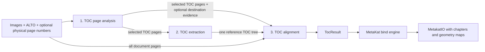

# Chapter processing

## Purpose

The `metakat.chapter` package extracts a table of contents (TOC), connects its
entries to destination pages, and writes a hierarchical set of
`MetakatChapter` elements into `MetakatIO`.

Chapter processing deliberately has two boundaries:

1. The **core engine** performs all document analysis. It returns a chapter
   tree with detected text, geometry provenance, TOC-page provenance, and
   resolved destination page keys.
2. The **bind engine** projects that result into the existing `MetakatIO`. It
   groups pages by their lowest document container, converts page keys into
   `pageIndex` values, creates detection UUIDs, and fills missing chapter ends.

The core engine may implement chapter extraction in any way. The bind engine
depends only on the core interface and result model described below.

## Chapter core engine contract

Every chapter core engine subclasses `ChapterCoreEngine` and implements:

```python
process(
    images: Sequence[str],
    alto_files: Sequence[str],
    page_numbers: Sequence[PhysicalPageNumberEvidence] | None = None,
    image_dimensions: Sequence[PageDimensions | None] | None = None,
    alto_dimensions: Sequence[PageDimensions | None] | None = None,
) -> TocResult
```

The bind engine invokes the core independently for each lowest-level document
group, normally a monograph or periodical issue. Images, ALTO files, and
dimension sequences use the same physical page order. Physical-number
evidence is sparse and identifies pages by key.

| Argument | Contract |
|---|---|
| `images` | Ordered image paths. The image filename stem is the page key used by the result. |
| `alto_files` | Ordered ALTO paths corresponding position by position to `images`. |
| `page_numbers` | Optional externally supplied, already parsed, sparse physical page-number evidence. Each item identifies its source page through `page_key`; pages without external evidence are omitted. `None` means the caller supplied no external page-number source, while an empty sequence means it supplied a source containing no evidence. |
| `image_dimensions` | Optional image canvas dimensions corresponding position by position to `images`; individual values may be `None`. |
| `alto_dimensions` | Optional ALTO canvas dimensions corresponding position by position to `images`; individual values may be `None`. |

A core engine must accept all arguments in this signature even when its
implementation does not use every optional input.

The method returns:

```python
TocResult(
    chapters: tuple[ChapterResult, ...],
)
```

`chapters` contains the hierarchy roots. One core chapter is represented by:

```python
ChapterResult(
    toc_page_key: str,
    title: DetectionEvidence | None,
    part_number: DetectionEvidence | None = None,
    page_number: TocPageNumber | None = None,
    title_destination_page: DetectionEvidence | None = None,
    page_start_key: str | None = None,
    page_end_key: str | None = None,
    children: tuple[ChapterResult, ...] = (),
)
```

| Field | Core result contract |
|---|---|
| `toc_page_key` | Input image stem of the page containing the source TOC entry. |
| `title` | Title evidence from the TOC page, when available. |
| `part_number` | Optional chapter or section-number evidence from the TOC page. |
| `page_number` | Optional parsed destination-page reference from the TOC page. It retains the original OCR evidence as well as the normalized values supplied by the TOC-producing engine. It is not the physical number detected on the destination page. |
| `title_destination_page` | Optional title evidence found on the resolved destination page. |
| `page_start_key` | Input image stem of the resolved first page, or `None` when unresolved. |
| `page_end_key` | Input image stem of an explicitly resolved last page, or `None` to delegate end inference to the binder. |
| `children` | Nested chapter hierarchy of arbitrary depth. |

An unresolved chapter may still be returned with TOC evidence and children;
its `title_destination_page`, `page_start_key`, and `page_end_key` remain
`None`.

The bind engine converts every retained evidence object into a MetaKat tuple
and detection UUID. Every `toc_page_key`, evidence `page_key`,
`page_start_key`, and `page_end_key` must refer to an input image stem.

### Implementing another chapter core engine

Every engine is represented by a directory containing
`metakat_engine_config.json` and any implementation resources. The config must
contain the registered engine name:

```json
{
  "name": "chapter_core_engine_custom"
}
```

To add a core engine:

1. subclass `ChapterCoreEngine` and call its constructor with the engine
   directory;
2. implement the complete `process()` contract above;
3. return `TocResult` with valid page-key provenance;
4. register the config `name` in `chapter_core_engines` in core
   `definitions.py`;
5. test loading, optional inputs, unresolved chapters, hierarchy, and page-key
   output.

`ChapterBindEngineBase` can bind any implementation satisfying this contract.
An implementation that returns a different result model requires its own
`ChapterBindEngine` and bind-engine registration.

## Replaceable three-stage pipeline processing

`chapter_core_engine_pipeline` is one implementation of the chapter core
contract. It composes three independently replaceable stages, allowing a
different model or algorithm to replace one stage without changing the other
stages or the MetaKat binder.



The pipeline processes one document as follows:

1. **TOC page analysis** examines all document pages, selects the pages that
   form the reference TOC, and may also produce title and physical-page-number
   evidence for possible destination pages.
2. **TOC extraction** processes the selected TOC pages together and produces
   one hierarchical `TocBase` containing the entries read from the TOC.
3. **TOC alignment** combines that hierarchy with the complete ordered page
   sequence and the available destination evidence. It resolves TOC entries
   to destination pages where possible and returns `TocResult`.

The resulting `TocResult` is passed to the MetaKat bind engine. Validation,
evidence-source precedence, early termination, and the exact stage handoffs
are described in [Pipeline wrapper orchestration](#pipeline-wrapper-orchestration)
below.

The models in this section form the stable boundaries between the three
stages. A replacement stage may use any implementation mechanism as long as
it honors the corresponding interface and field meanings.

| Stage | Reads | Produces |
|---|---|---|
| TOC page analysis | `Sequence[ChapterPageInput]` | `TocPageAnalysisResult` |
| TOC extraction | `Sequence[ChapterPageInput]` | `TocBase` |
| TOC alignment | All document `ChapterPageInput` pages, selected TOC pages, `TocBase`, and optional destination-title and physical-number evidence | `TocResult` |

### Shared pipeline types

The general geometry, dimensions, and evidence models in this section are
defined by `metakat.common.models`. They are MetaKat-owned models; objects
received from lower-level image or alignment libraries are explicitly copied
into these representations at the processing boundary.

#### `BoundingBox`

`BoundingBox` represents an axis-aligned MetaKat rectangle using top-left
coordinates:

```python
BoundingBox(
    x: float,
    y: float,
    width: float,
    height: float,
)
```

It exposes the calculated right and bottom edges as `x_max` and `y_max`.

#### `PageDimensions`

`PageDimensions` represents the dimensions of an image or ALTO canvas:

```python
PageDimensions(
    width: float,
    height: float,
)
```

Both values must be finite and positive; construction raises `ValueError`
otherwise.

#### `ChapterPageInput`

`ChapterPageInput` is defined in `metakat.chapter.engines.core.models`. It is
the shared page input for all three stages and does not belong to any one
stage. It identifies one physical page throughout the pipeline:

```python
ChapterPageInput(
    page_key: str,
    position: int,
    image_path: Path,
    alto_path: Path,
    image_dimensions: PageDimensions | None = None,
    alto_dimensions: PageDimensions | None = None,
)
```

| Field | Meaning |
|---|---|
| `page_key` | Stable page identifier, unique within one pipeline invocation. All later evidence and resolutions refer back to this key. |
| `position` | Zero-based physical order within the processed document. |
| `image_path` | Path to the page image. |
| `alto_path` | Path to the ALTO OCR corresponding to the image. |
| `image_dimensions` | Optional positive width and height of the image canvas. |
| `alto_dimensions` | Optional positive width and height of the ALTO canvas. |

#### `DetectionEvidence`

`DetectionEvidence` retains detected text together with its source geometry
and page provenance:

```python
DetectionEvidence(
    text: str,
    confidence: float,
    bbox: BoundingBox,
    page_key: str,
)
```

| Field | Meaning |
|---|---|
| `text` | Text retained for the detected value. |
| `confidence` | Confidence of the source geometry detection, not necessarily OCR confidence. |
| `bbox` | Source bounding box. |
| `page_key` | Stable key of the page containing the evidence. |

Pipeline stages use `DetectionEvidence` wherever detected text must retain
confidence and source geometry.

#### `PhysicalPageNumberEvidence`

`PhysicalPageNumberEvidence` represents a number printed on a possible
destination page. It is defined in the page-number core package and is shared
by the chapter core input, stage 1, and stage 3:

```python
PhysicalPageNumberEvidence(DetectionEvidence):
    normalized: str | None
    value: int | None
    numeral_system: PageNumberNumeralSystem | None
```

| Field | Meaning |
|---|---|
| `normalized` | Parsed Arabic or Roman token with decoration removed, or `None` when parsing failed. Unicode digits and Roman-numeral glyphs are represented with ASCII characters. |
| `value` | Integer value used for number comparison, or `None` when parsing failed. |
| `numeral_system` | `arabic`, `roman`, or `None` when parsing failed. |

The physical-number model inherits `text`, `confidence`, `bbox`, and
`page_key` from `DetectionEvidence`.

`normalized_text(case=None)` returns `normalized` and optionally changes its
letter case with `case="lowercase"` or `case="uppercase"`. It returns `None`
when parsing failed. `output_text(case=None)` returns the same normalized
value when available and otherwise falls back to the original `text`.

### Stage 1 contract: TOC page analysis

#### Input

```python
process(
    pages: Sequence[ChapterPageInput],
) -> TocPageAnalysisResult
```

The input is the complete ordered document, not just suspected TOC pages.
Every item supplies the image and ALTO pair needed for analysis.

#### Output

```python
TocPageAnalysisResult(
    toc_pages: tuple[ChapterPageInput, ...],
    destination_chapters:
        tuple[DestinationChapterEvidence, ...] | None = None,
    destination_page_numbers: tuple[
        PhysicalPageNumberEvidence, ...
    ] | None = None,
)
```

| Field | Produced information |
|---|---|
| `toc_pages` | Ordered pages identified as the source of the reference TOC, represented by the original `ChapterPageInput` objects. |
| `destination_chapters` | Candidate title evidence located on pages outside `toc_pages`. `None` means destination-title detection is not implemented; `()` means it is implemented but found nothing. |
| `destination_page_numbers` | Physical page-number evidence located on pages outside `toc_pages`. `None` means physical-number detection is not implemented; `()` means it is implemented but found nothing. |

Every `toc_pages` item must have a `page_key` present in the stage input, and
each page key may occur at most once. The pipeline raises `ValueError` when
stage 1 returns an unknown or duplicate TOC page key.

Each item in `destination_chapters` is represented as:

```python
DestinationChapterEvidence(
    title: DetectionEvidence,
)
```

The nested `title.page_key` identifies the possible destination page. Multiple
title detections may belong to the same page; they remain separate candidates
for alignment.

Each item in `destination_page_numbers` is the fully parsed
`PhysicalPageNumberEvidence` model described under shared pipeline types.
Stage 1, rather than stage 3, is responsible for choosing and parsing at most
one physical number per destination page. If stage 1 returns more than one
item with the same `page_key`, the pipeline raises `ValueError`.

For use in the three-stage pipeline, stage 1 must implement at least one of
`destination_chapters` or `destination_page_numbers`, unless physical page
numbers are supplied externally through the chapter core input. If neither
stage-1 capability is implemented and no external page-number sequence is
provided, the pipeline raises `ValueError` before stage 2.

### Stage 2 contract: TOC extraction

#### Input

```python
process(
    toc_pages: Sequence[ChapterPageInput],
) -> TocBase
```

The input is exactly `TocPageAnalysisResult.toc_pages`.

#### Output

```python
TocBase(
    chapters: tuple[ChapterBase, ...],
)
```

`chapters` contains the top-level entries of one logical TOC. The result
represents all selected TOC pages together. It is not one tree per physical
TOC page. Each extracted TOC entry is represented as:

```python
ChapterBase(
    toc_page_key: str,
    title: DetectionEvidence | None,
    part_number: DetectionEvidence | None = None,
    page_number: TocPageNumber | None = None,
    children: tuple[ChapterBase, ...] = (),
)
```

| Field | Meaning |
|---|---|
| `toc_page_key` | Physical TOC page containing the entry. It is present even when the entry has no title evidence. |
| `title` | Chapter title detected on the TOC page. This remains distinct from a title later found on the destination page. |
| `part_number` | Optional chapter/section number printed as part of the TOC entry, such as `2.3`. It is not the destination page number. |
| `page_number` | Optional parsed destination reference printed in the TOC entry. The model retains the complete original OCR evidence and exposes normalized semantic values for alignment. |
| `children` | Nested TOC entries. The model supports arbitrary hierarchy depth. |

The TOC number model extends `DetectionEvidence`:

```python
TocPageNumber(DetectionEvidence):
    kind: TocPageNumberKind | None
    normalized_items: tuple[
        tuple[str, int, PageNumberNumeralSystem], ...
    ]
```

The inherited `text` is always the complete original OCR evidence. `kind` is
`single`, `range`, or `list` for a successfully parsed reference and `None`
when parsing failed. Each `normalized_items` tuple contains normalized token
text, its integer value, and its `arabic` or `roman` numeral system. The tuple
is empty when parsing failed.

`normalized_text(case=None)` joins normalized items with `-` for a range and
`,` for a list. `normalized_start(case=None)` returns the first normalized
item, while `normalized_end(case=None)` returns the second item only for a
range. The optional case is `"lowercase"` or `"uppercase"`; `None` preserves
the normalized token case. `output_text(case=None)` returns normalized text
when available and otherwise falls back to the complete original OCR text.

`title`, `part_number`, and `page_number` each retain independent text,
confidence, geometry, and source-page provenance. For every non-null field,
its `DetectionEvidence.page_key` is expected to equal `toc_page_key`, and its
bounding box is expected to belong to that TOC page. These expectations are
not explicitly validated, so the pipeline does not raise an error solely
because they are violated. The explicit `toc_page_key` identifies the
physical location of the complete TOC entry.

### Stage 3 contract: TOC alignment

#### Inputs

```python
process(
    *,
    pages: Sequence[ChapterPageInput],
    toc_pages: Sequence[ChapterPageInput],
    reference_toc: TocBase,
    destination_chapters:
        Sequence[DestinationChapterEvidence] | None,
    destination_page_numbers:
        Sequence[PhysicalPageNumberEvidence] | None,
) -> TocResult
```

| Argument | Information supplied |
|---|---|
| `pages` | Complete ordered document. `position` preserves physical document order, and selected TOC pages remain available to alignment implementations that need them. |
| `toc_pages` | From stage 1: `TocPageAnalysisResult.toc_pages`, the ordered subset of `pages` selected as the source of the reference TOC. |
| `reference_toc` | From stage 2: the extracted `TocBase` hierarchy, including TOC text and geometry provenance. |
| `destination_chapters` | From stage 1: `TocPageAnalysisResult.destination_chapters`, containing candidate destination-title evidence whose page keys identify possible chapter starts. `None` means the capability is not implemented; an empty sequence means it ran but found nothing. |
| `destination_page_numbers` | Physical page-number evidence originating either from the external core `page_numbers` input or from stage 1 as `TocPageAnalysisResult.destination_page_numbers`. Source resolution and precedence are described under Pipeline wrapper orchestration. `None` means the capability is not implemented; an empty sequence means it ran but found nothing. Each page may occur at most once. |


#### Output

```python
TocResult(
    chapters: tuple[ChapterResult, ...],
)
```

`chapters` contains the top-level aligned entries of the logical TOC. Each
aligned TOC entry is represented as:

```python
ChapterResult(ChapterBase):
    title_destination_page: DetectionEvidence | None = None
    page_start_key: str | None = None
    page_end_key: str | None = None
    children: tuple[ChapterResult, ...] = ()
```

| Additional or overridden field | Meaning |
|---|---|
| `title_destination_page` | Optional title evidence detected on the resolved destination page. This remains distinct from the TOC-page `title` inherited from `ChapterBase`. |
| `page_start_key` | `ChapterPageInput.page_key` of the resolved first destination page, or `None` when the chapter was not aligned. |
| `page_end_key` | `ChapterPageInput.page_key` of an explicitly resolved final destination page, or `None` when no explicit end was resolved. |
| `children` | Nested aligned chapter results. This overrides `ChapterBase.children` so the recursive elements are `ChapterResult` objects. |

The fields inherited by `ChapterResult`, including `page_number`, retain the
values and meanings documented for `ChapterBase` in the stage-2 contract. An
alignment engine adds destination bindings without reparsing, normalizing, or
otherwise replacing the TOC entry.

Chapters that cannot be connected to a destination may be returned with
`title_destination_page=None`, `page_start_key=None`, and
`page_end_key=None`.

### Pipeline wrapper orchestration

`ChapterPipelineCoreEngine` connects the three contracts as follows:

1. It creates one `ChapterPageInput` per paired image and ALTO file. The image
   filename stem becomes `page_key`, stems must be unique, and `position`
   follows input order.
2. It passes the complete page sequence to stage 1.
3. After stage 1 finishes, it determines the effective destination-title and
   destination-page-number capabilities:

   - Destination titles always come from
     `TocPageAnalysisResult.destination_chapters`.
   - When the core `page_numbers` argument is a sequence, its
     `PhysicalPageNumberEvidence` items are used as the complete external
     destination-page-number source. The sequence is sparse: an absent page
     key means that no external evidence is available for that page. Stage-1
     results do not supplement it, including when the sequence is empty.
   - When the core `page_numbers` argument is `None`, destination page numbers
     come from `TocPageAnalysisResult.destination_page_numbers`.
   - For either capability, `None` means it is unavailable, while `()` means
     it is implemented or externally supplied but contains no evidence.
   - If both effective capabilities are `None`, the wrapper raises
     `ValueError` at this point and does not invoke stages 2 or 3. If at least
     one capability is an empty or non-empty tuple, processing continues and
     the alignment implementation decides which available evidence to use.
   - Physical page numbers detected by stage 1 are pipeline inputs only and
     are not included in `TocResult`.
4. If stage 1 returns no `toc_pages`, it logs a warning and returns an empty
   `TocResult` without invoking stages 2 or 3.
5. It passes `TocPageAnalysisResult.toc_pages` to stage 2.
6. It passes the complete page sequence, the explicit selected TOC-page
   subset, stage 2's `TocBase`, and destination evidence to stage 3.
   Beforehand it removes destination evidence located on selected TOC pages.
   It raises `ValueError` when a
   `DestinationChapterEvidence.title.page_key` or
   `PhysicalPageNumberEvidence.page_key` is not present in the complete
   `ChapterPageInput` sequence created from the core input in step 1. It also
   raises `ValueError` when more than one destination-page-number evidence
   item refers to the same page key. Multiple destination-title evidence
   items for one page remain allowed.
7. It recursively prunes titleless entries from the stage-3 `TocResult`.
   An entry is retained when either its TOC-page `title` or its
   `title_destination_page` is present. When an entry has neither title, the
   wrapper removes it and promotes its retained children into the removed
   entry's parent level. The pruned result is returned to
   `ChapterBindEngineBase`.

### Pipeline configuration and extension

#### Engine directory convention

Every engine is represented by a directory containing
`metakat_engine_config.json` and any resources required by that engine. A
typical pipeline directory is arranged as follows:

```text
chapter_core_engine/
├── metakat_engine_config.json
├── toc_page_analysis/
│   ├── metakat_engine_config.json
│   └── model.pt
├── toc_extraction/
│   ├── metakat_engine_config.json
│   └── model.pt
└── toc_alignment/
    └── metakat_engine_config.json
```

The pipeline configuration points to its three stage directories:

```json
{
  "name": "chapter_core_engine_pipeline",
  "stages": {
    "toc_page_analysis": "toc_page_analysis",
    "toc_extraction": "toc_extraction",
    "toc_alignment": "toc_alignment"
  }
}
```

Stage paths may be absolute. Relative paths are resolved from the core-engine
directory. The older top-level keys `toc_page_analysis_engine`,
`toc_extraction_engine`, and `toc_alignment_engine` are also accepted as a
fallback, but `stages` is the preferred form.

#### Adding a stage implementation

The three stage interfaces are structural `Protocol` types. A new class must:

1. accept its engine directory in the constructor;
2. implement the appropriate `process()` signature documented above;
3. use a unique `name` in its `metakat_engine_config.json`;
4. be added to the appropriate registry in
   `ChapterPipelineCoreEngine._load_stage()`;
5. have tests for its contract and registration.

Registration is explicit; placing a class in a package does not
make it discoverable automatically. A stage is free to use YOLO, a VLM, rules,
or an external service as long as it honors the same input/output models.

When a new implementation needs additional configuration or files, keep them
inside its stage directory. Do not add stage-specific settings to the pipeline
wrapper unless they affect orchestration itself.

## Available stage implementations

This section documents the stage engines registered for
`chapter_core_engine_pipeline`. Their models and interfaces are defined by the
contracts above; the algorithms described here are properties of the available
engines, not requirements of the pipeline.

| Stage | Config `name` | Implementation |
|---|---|---|
| TOC page analysis | `toc_page_analysis_engine_yolo_alto` | YOLO geometry aligned with ALTO text |
| TOC extraction | `toc_extraction_engine_yolo_alto` | YOLO geometry aligned with ALTO text |
| TOC alignment | `toc_alignment_engine_fuzzy` | Physical-number anchors and fuzzy title matching |

### Stage 1: TOC page analysis

The following engine is available for the stage-1 contract.

#### Engine: YOLO + ALTO (`toc_page_analysis_engine_yolo_alto`)

This engine detects page-layout regions with YOLO, fills their text from ALTO,
selects one consecutive TOC-page block, and returns destination-title
evidence from pages outside that block together with physical-page-number
evidence from every page where it can be resolved.

##### Configuration

```json
{
  "name": "toc_page_analysis_engine_yolo_alto",
  "labels": {
    "Chapter": "kapitola",
    "Subchapter": "jiny nadpis",
    "PageNumber": "cislo strany",
    "DestinationChapter": "nadpis v textu"
  },
  "label_deduplication_groups": [
    {
      "labels": ["kapitola", "jiny nadpis"],
      "minimum_coverage": 0.8
    }
  ],
  "toc_search_fraction": 0.25,
  "toc_candidate_min_title_count": 2,
  "toc_candidate_min_page_number_count": 2,
  "toc_candidate_window_height_multiplier": 10.0,
  "toc_candidate_min_window_height_fraction": 0.2,
  "toc_candidate_max_window_height_fraction": 0.5,
  "page_number_edge_band_ratio": 0.15,
  "page_number_edge_score_weight": 0.65,
  "toc_keywords": [
    "obsah",
    "content",
    "contents",
    "table of contents",
    "содержание",
    "зміст",
    "inhalt",
    "sommaire"
  ]
}
```

`toc_search_fraction` must be in `(0, 0.5]`. The two candidate-count
thresholds must be positive integers and both default to `2` when omitted.
`toc_candidate_window_height_multiplier` must be positive and defaults to
`10.0`. `toc_candidate_min_window_height_fraction` must be in `(0, 1]` and
defaults to `0.2`. `toc_candidate_max_window_height_fraction` must be in
`(0, 1]`, defaults to `0.5`, and must not be smaller than the minimum
fraction.

##### Geometry and text loading

The engine directory must contain one `.pt` model. If several are present,
the first directory entry ending in `.pt` is used, so the directory should
contain exactly one model.

For every input page, the engine:

1. runs YOLO on the image;
2. reads the corresponding ALTO document;
3. aligns ALTO words to detected geometry using bidirectional containment and
   greatest-coverage word assignment;
4. exposes the resulting aligned regions to its page-analysis decisions.

Optional settings are `yolo_batch_size` (default `32`),
`yolo_confidence_threshold` (`0.25`), `yolo_image_size` (`640`),
`yolo_device` (`0`), and `minimum_overlap_coverage` (`0.65`).

The `labels` keys must be the supported `ChapterType` values `Chapter`,
`Subchapter`, `PageNumber`, and `DestinationChapter`; their values must match
the YOLO model labels. Omitted keys retain the engine defaults. Unknown keys,
non-string values, and empty values are rejected.

A region becomes `DetectionEvidence` only if it has non-empty aligned ALTO
text, geometry, and input-geometry confidence. Its text is stripped ALTO text,
and its confidence is the YOLO geometry confidence.

`label_deduplication_groups` is passed by the shared `EngineYOLOALTO` to the
text-geometry-aligner `YOLOReader`. Its labels are raw YOLO model class names,
not `ChapterType` keys. Before ALTO word assignment, the reader compares
detections with different labels in the same group. The lower-confidence
detection is removed when the intersection covers at least
`minimum_coverage` of both boxes; confidence ties retain the detection produced
first by YOLO. Same-class detections and labels outside configured groups are
not affected. Each label may belong to only one group. Omitting the setting or
supplying an empty list disables deduplication.

##### Page-candidate decision

Pages are sorted by `position`. Before examining detection geometry, the engine
restricts candidate analysis to the beginning and ending search areas:

```python
distance_from_start = position
distance_from_end = page_count - position - 1

distance_from_start < page_count * toc_search_fraction
or distance_from_end < page_count * toc_search_fraction
```

| Parameter | Default | Meaning |
|---|---:|---|
| `toc_search_fraction` | `0.25` | Fraction of the document considered from each physical edge. |

`position` and both distances are zero-based, and both comparisons are strict.
Pages outside these search areas skip all candidate-region counting and window
analysis. They remain available as possible destination pages, and their
destination-title and physical-page-number evidence is still collected.

For pages inside the search areas, candidate selection considers regions with
the configured `Chapter`, `Subchapter`, and `PageNumber` labels and non-null
input geometry. These are the regions remaining after configured cross-class
deduplication. Successfully aligned ALTO text is not required for this visual
decision.

For each relevant region, the engine takes the height of
`region.input_geometry.bounds`. Every
relevant region contributes one value regardless of its label, confidence, or
ALTO text match. The values are sorted and their statistical median is used:
the middle value for an odd count, or the arithmetic mean of the two middle
values for an even count.

The engine then calculates the vertical scanning-window height as:

```text
min(
    max(
        median relevant-region height
            * toc_candidate_window_height_multiplier,
        resolved page height
            * toc_candidate_min_window_height_fraction,
    ),
    resolved page height
        * toc_candidate_max_window_height_fraction,
)
```

| Parameter | Default | Meaning |
|---|---:|---|
| `toc_candidate_window_height_multiplier` | `10.0` | Multiplier applied to the median relevant-region height. |
| `toc_candidate_min_window_height_fraction` | `0.2` | Minimum window height as a fraction of the resolved page height. |
| `toc_candidate_max_window_height_fraction` | `0.5` | Maximum window height as a fraction of the resolved page height. |

The engine obtains the resolved page height in this order:

1. `ChapterPageInput.image_dimensions.height`, supplied from
   `MetakatPage.imageDim`;
2. `ChapterPageInput.alto_dimensions.height`, supplied from
   `MetakatPage.altoDim`;
3. the height read directly from `ChapterPageInput.image_path` with Pillow.

Failure to read the image in the third case raises `ValueError`; candidate
analysis does not estimate the height from OCR content or detection extent.

Regions are represented by their vertical bounding-box centers and sorted from
top to bottom. Each scanning window is a full-page-width horizontal band. Its
upper edge is placed at the vertical center (`y` coordinate) of a relevant
region, and its lower edge is that coordinate plus the calculated window
height. Horizontal coordinates do not affect window membership. A page
satisfies the visual predicate only when one such window contains:

```text
(Chapter + Subchapter) >= toc_candidate_min_title_count
and
PageNumber >= toc_candidate_min_page_number_count
```

| Parameter | Default | Meaning |
|---|---:|---|
| `toc_candidate_min_title_count` | `2` | Minimum combined number of `Chapter` and `Subchapter` detections in a window. |
| `toc_candidate_min_page_number_count` | `2` | Minimum number of `PageNumber` detections in the same window. |

With the defaults, at least two detected TOC titles of either level and at
least two detected page numbers must therefore occur inside the same related
vertical area. Detections elsewhere on the page do not contribute to that
window.

All qualifying windows contribute to the page score. The engine takes the
union of their title and page-number detections and counts each detection only
once, even when it occurs in several overlapping windows. The number of unique
detections in that union becomes the page's cumulative visual score for the
later consecutive-block decision.

The geometry of this same detection union defines the TOC area:

```text
toc_area_top = minimum detection bbox y
toc_area_bottom = maximum detection bbox y_max
```

##### Keyword and consecutive-block decision

For each accepted candidate, ALTO words are grouped by text line. Lines are
normalized by lowercasing, removing accents and punctuation, and collapsing
whitespace. Grouping supports multi-word keywords such as `table of contents`
while preventing a phrase from being assembled from unrelated words on
different lines. Consequently, a multi-word keyword split across ALTO lines
does not match. A configured normalized keyword is valid when it occurs within
a line whose top coordinate satisfies:

```text
keyword line top <= uppermost TOC detection bbox bottom
```

The uppermost TOC detection is the detection with the smallest bounding-box
`y` among the detection union that defines the TOC area in the page-candidate
decision. The right-hand side of the equation is that detection's bottom edge,
calculated as `y + height`. The complete ALTO page is searched, and the
boundary accepts keyword lines above the TOC area as well as keyword text
inside or overlapping its uppermost detection.

Every valid occurrence is logged with its normalized keyword, ALTO line
bounding box, and vertical distance from `toc_area_top`. Keyword validity
remains a page-level boolean for consecutive-block selection, while diagnostic
logging retains every occurrence separately.

Accepted candidates are split into groups of consecutive page positions. For
each group:

- if it contains a keyword page, all pages before the first keyword page are
  removed from that group;
- otherwise the complete group is retained;
- its visual score is the sum of its page visual scores.

The selected group is the lexicographic maximum of:

1. whether the group contains a keyword;
2. total visual score.

Therefore any keyword-containing group beats every group without a keyword,
regardless of visual score. If scores tie, the first encountered group wins.
Exactly this one final consecutive group becomes `toc_pages`.

##### Other outputs

Every page outside the selected group—including rejected TOC candidates—is a
possible destination page. Every usable `DestinationChapter` detection on
those pages becomes destination-title evidence. There is no deduplication at
this stage. This engine implements destination-title detection, so it returns
an empty tuple rather than `None` when no title evidence is found.

Physical page numbers are resolved by the reusable resolver from the
`metakat.page_number` core package, using the YOLO + ALTO alignments already
produced by stage 1. Only pages outside the selected TOC group are resolved
and returned as destination-page-number evidence. Resolver behavior is
documented in the page-number package. Stage 1 exposes these resolver
parameters:

| Parameter | Default | Meaning |
|---|---:|---|
| `page_number_edge_band_ratio` | `0.15` | Resolver edge-band ratio. |
| `page_number_edge_score_weight` | `0.65` | Resolver edge-score weight. |

Successful physical-number results are returned as
fully parsed `PhysicalPageNumberEvidence` objects in
`TocPageAnalysisResult.destination_page_numbers`. They are used for stage 3
only when no external `page_numbers` sequence was supplied to the core. This
engine implements physical-number detection, so it returns an empty tuple
rather than `None` when no page-number evidence is found.

### Stage 2: TOC extraction

The following engine is available for the stage-2 contract.

#### Engine: YOLO + ALTO (`toc_extraction_engine_yolo_alto`)

This engine detects the components of TOC rows with YOLO, assigns ALTO text to
them, constructs TOC entries, and combines entries from all selected pages
into one hierarchy.

##### Configuration

```json
{
  "name": "toc_extraction_engine_yolo_alto",
  "labels": {
    "Chapter": "kapitola",
    "Subchapter": "jiny nadpis",
    "PageNumber": "cislo strany",
    "PartNumber": "jine cislo"
  },
  "row_tolerance": 20,
  "overlap_threshold": 0.5
}
```

`row_tolerance` must be non-negative. `overlap_threshold` must be in `[0, 1]`.

##### Geometry and text loading

The engine directory must contain one `.pt` model. If several are present,
the first directory entry ending in `.pt` is used, so the directory should
contain exactly one model.

For every selected TOC page, the engine:

1. runs YOLO on the image;
2. reads the corresponding ALTO document;
3. aligns ALTO words to detected geometry using bidirectional containment and
   greatest-coverage word assignment;
4. exposes the resulting aligned regions to its row-extraction decisions.

Optional settings are `yolo_batch_size` (default `32`),
`yolo_confidence_threshold` (`0.25`), `yolo_image_size` (`640`),
`yolo_device` (`0`), and `minimum_overlap_coverage` (`0.65`).

The `labels` keys must be the supported `ChapterType` values `Chapter`,
`Subchapter`, `PageNumber`, and `PartNumber`; their values must match the YOLO
model labels. Omitted keys retain the engine defaults. Unknown keys, non-string
values, and empty values are rejected.

A region becomes `DetectionEvidence` only if it has non-empty aligned ALTO
text, geometry, and input-geometry confidence. Its text is stripped ALTO text,
and its confidence is the YOLO geometry confidence.

##### Region filtering

Each selected TOC page is processed in page order. Regions without geometry
are discarded. Remaining regions are sorted by input confidence, highest
first. A region is retained only when its intersection-over-union with every
already retained region is less than or equal to `overlap_threshold`.

This is a greedy, class-independent suppression rule: a high-confidence
region can suppress an overlapping region of another class. Equal-to-threshold
overlaps are retained.

##### Rows and TOC units

Retained regions are sorted by their top `y` coordinate. A region joins the
active row when its `y` differs from the previously added region by strictly
less than `row_tolerance`; otherwise it starts a new row. This comparison with
the previous region means a row may grow through a chain of locally close
regions. Regions inside a row are sorted left to right.

One row produces at most one TOC unit. Walking left to right, the engine keeps
only the first usable detection for each of these roles:

- `PartNumber` → part-number evidence;
- `Chapter` or `Subchapter` → title evidence and hierarchy level 1 or 2;
- `PageNumber` → TOC page-number evidence.

Rows with neither a title nor a page number are discarded, including rows that
contain only a part number. A row with a title but no page number is retained.
A row with a page number but no title is retained as a titleless TOC entry so
that an alignment engine can use its number as anchor evidence.

##### TOC page-number parsing

The extraction engine parses each detected TOC page reference before returning
`TocBase`. A reference can be:

- a single Arabic or Roman number;
- a same-system non-descending range;
- a comma-separated list, including a mixed Arabic/Roman list.

The parser retains the complete OCR string in `TocPageNumber.text` and fills
`kind` and `normalized_items`. Its default normalized output is:

- `str. 004` → `4`;
- `xiv–xvi` → `xiv-xvi`;
- `23, 27, 31` → `23,27,31`;
- `45-` → `45`;
- descending `24-23` → the single start value `24`;
- descending `XIV-XII` → the single start value `XIV`.

The first normalized item is the start value. Only a valid range has an end
value. A list retains all normalized items, while its first item is the start
value available to alignment. Roman token case is preserved by default and
can be changed explicitly through the model's `case` argument.

Zero, leading signs or dashes such as `-45`, mixed-system ranges, chained
ranges, and ambiguous multiple-number forms such as `3. 45`, `12/45`, and
`12 45` are rejected. For rejected input, `kind` is `None`,
`normalized_items` is empty, and `output_text()` falls back to the original
OCR evidence. Confidence, bounding box, and TOC source page are unchanged.

##### Titleless levels and hierarchy

Titleless number units have no model-derived level. Their level is inferred as
follows:

1. if preceding and following titled levels exist and are equal, use that
   level;
2. otherwise, if a preceding titled level exists, use it;
3. otherwise use level 1, even when a following titled level exists.

Units from all TOC pages are then processed as one sequence. For an entry at
level `N`, the parent is the most recent active entry at the nearest lower
level. If none exists, the entry becomes a root. Encountering a level replaces
the active entry at that level and clears active deeper levels. The hierarchy
therefore continues across TOC page boundaries.

The present model mapping produces two levels, but `TocBase` itself can
represent arbitrary depth and a future extraction engine may return more.

### Stage 3: TOC alignment

The following engine is available for the stage-3 contract.

#### Engine: fuzzy alignment (`toc_alignment_engine_fuzzy`)

This engine combines exact printed-number matches, fuzzy title matches, and
positional constraints to resolve TOC entries to physical destination pages.
It can align unambiguous numbers without destination titles and can use title
matching without physical page numbers.

The engine distinguishes capability availability from detection results:

- `None` means the corresponding destination-evidence capability is not
  implemented;
- an empty sequence means the capability is implemented but found no evidence;
- a non-empty sequence supplies evidence for alignment.

If either capability is implemented, the engine runs alignment with whatever
evidence is available. This includes title-only and number-only alignment. The
three-stage wrapper prevents invocation with both capabilities unavailable.

##### Configuration

```json
{
  "name": "toc_alignment_engine_fuzzy",
  "title_match_threshold": 0.7,
  "offset_tolerance": 2
}
```

`title_match_threshold` must be in `[0, 1]`; `offset_tolerance` must be
non-negative.

Alignment flattens the reference hierarchy in pre-order, performs all matching
on that flat sequence, and reconstructs the original hierarchy afterward.
Hierarchy levels do not constrain destination matching.

The complete document is available through `pages`, but this engine removes
the explicit `toc_pages` subset from its destination position map. Selected
TOC pages therefore cannot become number anchors, title destinations, or
range-end candidates.

##### Number evidence used for alignment

The engine does not parse either number source. It indexes the `value` and
`numeral_system` already present in each destination
`PhysicalPageNumberEvidence`, and consumes each TOC entry's
`TocPageNumber.normalized_items` produced by stage 2. The first item supplies
the TOC start value; a valid range's second item supplies its end. A physical
or TOC number without normalized semantic values cannot create a number
anchor, although the TOC entry's title can still be matched. The alignment
engine passes the original `TocPageNumber` object through to the corresponding
`ChapterResult` unchanged.

##### Title similarity

Titles are lowercased, Unicode-decomposed, stripped of combining accents,
punctuation-normalized, and whitespace-collapsed. Similarity is
`1 - distance / shorter_length`, where distance is the minimum Levenshtein
distance between the shorter normalized title and any substring of the longer
one. Extra text at the beginning or end of the longer title is therefore not
penalized like a full-string comparison.

##### Anchor candidates

An anchor begins with an exact match between a parsed TOC start value and a
physical page value in the same numeral system.

- When that number occurs on exactly one physical page and in exactly one TOC
  entry, it is a hard number anchor. A title match is preferred but not
  required.
- When the physical number occurs on multiple pages, or the TOC start value is
  used by multiple entries, the entry must have a title and that title must
  match a destination-title detection on the candidate physical page at or
  above `title_match_threshold`.
- For a unique titleless number anchor, the destination-title detection with
  the largest height, then highest confidence, is tentatively attached if one
  exists.

All options are reduced to one monotonic chain by dynamic programming. Entry
indices must increase and physical positions must not decrease, so multiple
chapters may share one page. The chain score is a lexicographic sum of:

1. number of anchors;
2. number of title-supported anchors;
3. total title similarity;
4. total evidence confidence, consisting of TOC-number confidence plus
   destination-title confidence when title-supported.

This ordering means anchor count dominates every quality score. Offset
consistency is not part of anchor-chain selection; inconsistent offsets are
handled later while matching the entries between anchors.

Destination-title detections are single-use. If two selected anchors prefer
the same detection, a titled anchor is reassigned to another matching detection
on that page when possible. A duplicate-number anchor that required title
support is discarded when no unused title match remains. Titleless anchors are
assigned the largest remaining title detection on their destination page after titled
anchors claim their detections.

##### Resolving entries between anchors

Every non-anchor entry needs a TOC title. Its inclusive physical bounds are the
positions of the closest preceding and following selected anchors in flat TOC
order. Either bound may be absent; with no anchors the search covers the whole
document.

Unused destination-title detections are filtered to those bounds and then by:

```text
title_similarity >= title_match_threshold
```

| Parameter | Default | Meaning |
|---|---:|---|
| `title_match_threshold` | `0.7` | Minimum normalized title similarity accepted as a destination-title match. |

For an entry with a parsed TOC number, each surrounding anchor in the same
numeral system proposes this offset:

```text
physical anchor position - printed TOC number
```

The physical position here is zero-based `ChapterPageInput.position` inside
the independently processed document. It is not `MetakatPage.pageIndex` and it
is not the printed page number.

An ideal destination position is available when all applicable surrounding
anchors produce one distinct offset. One compatible anchor is sufficient. In
that case, candidates must lie within `offset_tolerance` of the expected
position and are ranked by:

1. smallest distance from expected position;
2. largest title-detection height;
3. highest title similarity;
4. highest confidence.

When there is no compatible anchor, or compatible anchors disagree about the
offset, no ideal position is used. Candidates only have to remain inside the
available anchor bounds and are ranked by:

1. largest title-detection height;
2. highest title similarity;
3. highest confidence;
4. earliest physical position.

For an entry whose TOC number could not be parsed or is missing, matching also
checks any physical number detected on the candidate page. A same-system
physical value may not precede the preceding anchor's TOC value or exceed the
following anchor's TOC value. A candidate without a physical number, or with a
different numeral system, passes this consistency check. Ranking then uses
height, similarity, confidence, and earliest position in that order.

An entry remains unresolved when it has no title, no unused destination
title detection, no title detection inside its bounds, no title above threshold, no candidate
within a usable expected-position tolerance, or no candidate passing the
physical-number consistency check. A titled unresolved entry remains in the
result with `page_start_key=None`.

##### Explicit range ends

An explicit end is attempted only for a successfully parsed range whose start
page was resolved. The expected end position uses the start resolution's
offset. The search cannot go before the start or after the next selected
anchor.

1. If one or more pages have the exact physical end number in the same numeral
   system, the page closest to the expected position is selected.
2. Otherwise, the physically closest eligible page is used only when it is
   within `offset_tolerance` of the expected position.
3. Otherwise `page_end_key` remains `None` for the binder to handle.

##### Reconstructing the result tree

The original reference hierarchy is reconstructed after flat alignment.
Titled entries are retained even when unresolved. Titleless entries are also
returned from the alignment stage because their page-number evidence may have
contributed to anchor selection. When a destination title was assigned, it is
exposed as `title_destination_page`.

After stage 3 returns, the pipeline wrapper performs the final pruning
described under
[Pipeline wrapper orchestration](#pipeline-wrapper-orchestration). A
titleless entry without `title_destination_page` is removed there and its
retained children are spliced into its parent level.

The core does not copy `title_destination_page` into `title`: TOC title and
destination-page title remain separate optional evidence fields.

## Binding `TocResult` into `MetakatIO`

### Per-document processing

The binder deep-copies the input and invokes the core independently for each
lowest document group. Eligible containers are:

- every issue;
- every volume that is not an ancestor of an issue.

Each page is assigned to the first eligible ancestor found while walking its
parent chain. Groups and pages are processed by `batch_index`. Pages may reach
a container through existing chapter parents.

Pages with no eligible ancestor, an unknown parent, or a parent cycle are
placed together under one synthetic monograph volume. The synthetic volume is
added to `MetakatIO`, and those pages are reparented to it. Empty input creates
no synthetic volume.

Only pages with both image and ALTO mappings are passed to the core. Skipped
pages remain part of the document and still affect generic end-page inference.
Image filename stems of pages sent to the core must be unique inside a group;
the same stem may be reused in another independently processed group.

When at least one page in a group already has `MetakatPage.pageNumber`, the
binder converts each available MetaKat tuple into parsed
`PhysicalPageNumberEvidence` and passes the resulting sparse sequence to the
core. Pages without an existing number are omitted. If none exist, it passes
`page_numbers=None`, which allows stage 1's `destination_page_numbers` to be
used.

Physical numbers detected internally by the chapter pipeline are not returned
in `TocResult` and are therefore not written to
`MetakatPage.pageNumber`; that output is owned by the separate page-number
engine.

The binder also passes available `MetakatPage.imageDim` and
`MetakatPage.altoDim` values as ordered `PageDimensions` sequences. Missing
values remain `None` at their page position. The pipeline wrapper stores these
values on the corresponding `ChapterPageInput`.

### Field mapping

For every `ChapterResult`, the binder creates one `MetakatChapter`:

| MetaKat field | Source and decision |
|---|---|
| `id` | New chapter UUID; it is not a detection UUID. |
| `parent_id` | Parent chapter UUID, or the enclosing issue/volume UUID for a root. |
| `pageIndexToc` | `pageIndex` of `toc_page_key`; may be `None`. |
| `pageIndexStart` | `pageIndex` of `page_start_key`; `None` when unresolved or unavailable. |
| `pageIndexEnd` | Explicit range end when resolved, otherwise generic binder inference below. |
| `title` | Title evidence detected on the TOC page. |
| `title_destination_page` | Independently stored title evidence from the destination page. It is not copied into `title`. |
| `partNumber` | Part-number evidence detected on the TOC page. |
| `pageNumber` | Normalized valid TOC reference, or unchanged original evidence when parsing failed. It is not the physical page number. |
| `subTitle` | Not populated by `chapter_core_engine_pipeline`. |

Page keys are translated through the image-stem mapping for the processed
document. An unknown TOC or evidence page key is an error. Unknown start/end
keys and pages without `pageIndex` are logged. A missing start index remains
unset. A missing end index starts unset but may subsequently be filled by the
generic inference below when the start index is known; a valid explicit end
can remain present even when the start is missing.

Each non-null evidence field becomes `(text, confidence, detection_uuid)`.
The binder creates a new detection UUID, writes its `(x, y, width, height)` to
`detection_to_bbox`, and writes the source MetaKat page UUID to
`detection_to_page_mapping`. The same chapter can therefore retain separate
TOC-title, destination-title, part-number, and page-number geometries.

### Generic end-page inference

After binding the returned tree in pre-order, the binder fills a missing
`pageIndexEnd` only when `pageIndexStart` is known:

1. find the next chapter later in pre-order binding traversal whose depth is
   less than or equal to the chapter's depth and whose start is known;
2. set the end to `max(chapter start, next start - 1)`;
3. if no such chapter exists, set the end to
   `max(chapter start, largest pageIndex in the complete document group)`.

Children do not terminate their parent because they have greater depth.
Multiple chapters starting on the same page receive an end no earlier than
their start. An explicit range end from the core is never overwritten.

Because all group pages—not only pages sent to the core—are used here, a final
page missing image or ALTO input can still define the document's inferred end.
A chapter without a resolved start remains in `MetakatIO` with both start and
end unset.

New chapter elements are inserted at the beginning of `MetakatIO.elements` in
document-group order, preserving each returned chapter tree's pre-order
hierarchy. Pre-existing elements follow the newly inserted chapters.

## Observability and revision

The available implementations log high-level stage inputs, timings, selected TOC
blocks, selected anchors, non-anchor bounds and expected offsets, chosen title
matches, unresolved reasons, range-end decisions, document grouping, and final
binding counts at `INFO` or `WARNING`. Candidate pages, extraction units,
anchor options, individual title candidates, and bound fields are available at
`DEBUG`.

These logs are intended to make the decision rules above auditable before
changing thresholds or replacing a stage.

## Experimental source

The unregistered `metakat.chapter.xshele02` package is retained as experimental
source material. Its command-line entry point is:

```bash
python -m metakat.chapter.xshele02.main INPUT_PATH
```

It is not loaded by `chapter_core_engines` and does not implement the standard
three-stage core contract without additional integration work.
