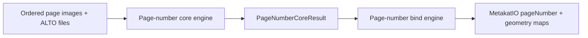

# Page-number processing

## Navigation

- [Purpose](#purpose)
- [Page-number core engine contract](#page-number-core-engine-contract)
  - [Implementing another core engine](#implementing-another-core-engine)
- [Core and bind orchestration](#core-and-bind-orchestration)
  - [Engine directory convention](#engine-directory-convention)
  - [Processing handoff](#processing-handoff)
- [Available core implementation](#available-core-implementation)
  - [YOLO + ALTO](#engine-yolo--alto-page_number_core_engine_yolo)
- [Page-number parsers](#page-number-parsers)
  - [Decorated page-number parser](#decorated-page-number-parser)
- [Page-number resolvers](#page-number-resolvers)
  - [Physical page-number resolver](#physical-page-number-resolver)
- [Available bind implementation](#available-bind-implementation)
  - [Base](#engine-base-page_number_bind_engine_base)
- [Observability and revision](#observability-and-revision)

## Purpose

The `metakat.page_number` package detects the physical page number printed on
each document page and writes it to `MetakatPage.pageNumber`.

Physical page numbers are distinct from the destination-page references read
from a table of contents. A physical number belongs to the page on which it is
printed. A TOC reference belongs to a chapter entry and is processed by the
[`metakat.chapter`](../chapter/README.md) package.

Page-number processing has two boundaries:

1. The **[core engine](#page-number-core-engine-contract)** analyzes ordered
   page images and ALTO files. It returns at most one parsed physical-number
   evidence object per page.
2. The **[bind engine](#available-bind-implementation)** selects processable
   MetaKat pages, invokes the core, applies confidence precedence, creates
   detection UUIDs, and writes the selected evidence and its provenance into
   `MetakatIO`.

The core owns detection, OCR alignment, parsing, candidate filtering, and
physical-candidate selection. The binder does not repeat or alter those
decisions.



## Page-number core engine contract

Every page-number core engine subclasses `PageNumberCoreEngine` and exposes:

```python
process(
    images: List[str],
    alto_files: List[str],
) -> PageNumberCoreResult
```

The two input sequences represent the same pages in the same physical order.
An image filename stem is the page key used in the result. Page keys returned
by the core must be unique and must identify one of the input pages.

| Argument | Contract |
|---|---|
| `images` | Ordered image paths. Each filename stem identifies the page in core output. |
| `alto_files` | Ordered ALTO paths corresponding position by position to `images`. |

The method returns:

```python
PageNumberCoreResult(
    page_numbers: Mapping[str, PhysicalPageNumberEvidence],
)
```

`page_numbers` is sparse. A missing page key means that the core did not
resolve a physical page number for that page. The mapping contains at most one
evidence object for each page key. Each value is a
`PhysicalPageNumberEvidence`:

```python
@dataclass(frozen=True)
class BoundingBox:
    x: float
    y: float
    width: float
    height: float


@dataclass(frozen=True)
class DetectionEvidence:
    text: str
    confidence: float
    bbox: BoundingBox
    page_key: str


@dataclass(frozen=True)
class PhysicalPageNumberEvidence(DetectionEvidence):
    normalized: str | None
    value: int | None
    numeral_system: PageNumberNumeralSystem | None
```

It extends the common `DetectionEvidence` provenance with a parsed
physical-number representation.

| Attribute | Core result contract |
|---|---|
| `text` | Complete OCR text covered by the selected detection. Decoration is retained. |
| `confidence` | Geometry-detection confidence used for selection and binding precedence. |
| `bbox` | Selected detection geometry in the aligned page coordinate system, represented by the top-left coordinates `x` and `y` plus `width` and `height`. |
| `page_key` | Image filename stem of the source page. |
| `normalized` | Parsed numeral token with decoration removed, or `None` when parsing failed. |
| `value` | Integer value of the parsed Arabic or Roman numeral, or `None`. |
| `numeral_system` | `PageNumberNumeralSystem.ARABIC`, `PageNumberNumeralSystem.ROMAN`, or `None`. |

`normalized_text(case=None)` returns the normalized token. `output_text()`
returns that token when available and otherwise returns the complete OCR text.
Both methods accept `case="lowercase"` or `case="uppercase"`; `None` preserves
the parsed Roman token's case. The available core implementation only returns
successfully parsed evidence, but the optional fields allow evidence to retain
an unsuccessful parse at other processing boundaries.

`PageNumberCoreResult` contains only the sparse `page_numbers` mapping. It has
no MetaKat detection UUIDs: UUID creation and schema mutation belong to the
[bind engine](#available-bind-implementation).

### Implementing another core engine

Every core engine follows the
[engine directory convention](#engine-directory-convention). To add one:

1. subclass `PageNumberCoreEngine` and call its constructor with the core
   engine directory;
2. implement `process()` while preserving the complete
   [core contract](#page-number-core-engine-contract); the base class does not
   prescribe detection, parsing, or resolution;
3. return only common `PhysicalPageNumberEvidence` objects with valid input
   page keys;
4. register the config `name` in `page_number_core_engines` in core
   `definitions.py`;
5. test engine loading, sparse results, parsing, candidate selection, and page
   key validation.

`PageNumberBindEngineBase` can bind any implementation satisfying this
contract. A core that returns a different result model requires a matching
bind engine and explicit bind-engine registration.

## Core and bind orchestration

### Engine directory convention

The core and bind engines are supplied as separate directories. Each contains
a `metakat_engine_config.json`; the core directory also contains resources
needed by its implementation. The available engines use this layout:

```text
page_number_core_engine/
├── metakat_engine_config.json
└── model.pt

page_number_bind_engine/
└── metakat_engine_config.json
```

A minimal pair of configurations is:

```json
{
  "name": "page_number_core_engine_yolo",
  "labels": {
    "PageNumber": "cislo strany"
  }
}
```

```json
{
  "name": "page_number_bind_engine_base"
}
```

Core and bind registration is explicit. `load_page_number_core_engine()` and
`load_page_number_bind_engine()` read the `name` value and resolve it through
their respective registries. An unknown name is an error; placing an
implementation in the package does not register it automatically.

### Processing handoff

When both page-number engine directories are configured,
`process_batch()` runs page-number processing before page-type,
bibliographic, and chapter processing. This order allows later processing,
including chapter destination alignment, to consume the physical numbers
written to `MetakatPage`.

The page-number bind engine owns the complete handoff:

1. select MetaKat pages that have both image and ALTO mappings;
2. resolve their paths relative to the batch directory;
3. invoke the core once with the ordered inputs;
4. map returned image-stem page keys back to `MetakatPage` objects;
5. bind each selected result according to
   [field precedence](#field-mapping-and-precedence).

## Available core implementation

The registered core implementation is:

| Config `name` | Implementation |
|---|---|
| `page_number_core_engine_yolo` | YOLO geometry aligned with ALTO text, followed by numeral parsing and physical-candidate selection. |

### Engine: YOLO + ALTO (`page_number_core_engine_yolo`)

The engine detects page-number geometry with YOLO, aligns each detection with
ALTO words, parses the covered text, and selects at most one physical page
number per page.

#### Configuration

```json
{
  "name": "page_number_core_engine_yolo",
  "labels": {
    "PageNumber": "cislo strany"
  },
  "page_number_edge_band_ratio": 0.15,
  "page_number_edge_score_weight": 0.65
}
```

`labels` maps the supported `PageNumberType` value `PageNumber` to the raw
YOLO model label. When omitted, `PageNumber` defaults to `cislo strany`.
Unknown keys, non-string values, and empty values are rejected. The two
`page_number_*` settings are passed to `PhysicalPageNumberResolver`; their
defaults and validation are documented with the
[physical page-number resolver](#physical-page-number-resolver).

#### Geometry and text loading

The engine directory must contain one `.pt` model. If several are present, the
first directory entry ending in `.pt` is used, so the directory should contain
exactly one model.

For every input page, the shared `EngineYOLOALTO`:

1. runs YOLO on the image;
2. reads the corresponding ALTO document;
3. aligns ALTO words to detected geometry using bidirectional containment and
   greatest-coverage word assignment;
4. exposes the resulting aligned regions to the page-number core engine.

Optional shared settings are `yolo_batch_size` (default `32`),
`yolo_confidence_threshold` (`0.25`), `yolo_image_size` (`640`),
`yolo_device` (`0`), and `minimum_overlap_coverage` (`0.65`). The YOLO batch
size and image size must be positive, and its confidence threshold must be in
`[0, 1]`. Configuration values override the corresponding constructor
defaults.

The page-number core then visits every aligned page. Duplicate page keys are
an error. A region is retained only when its exported label matches the raw
YOLO label configured for `PageNumber`.

The implementation parses each retained region's aligned OCR text with
`DecoratedPageNumberParser`. When a page has multiple valid parsed detections,
`PhysicalPageNumberResolver` resolves them to at most one physical page number
using `STANDARD` mode. The parser and resolver are documented independently
below.

After all pages are processed, `PageNumberCoreResult.page_numbers` contains
the selected evidence indexed by page key. Pages without selected evidence
are omitted.

## Page-number parsers

Parsers interpret OCR text and produce normalized page-number tokens. They do
not select between competing detections. Supporting helpers can combine a
parse result with detection provenance to create physical-number evidence. A
parser is a reusable supporting mechanism rather than an independently loaded
core engine, and the [core contract](#page-number-core-engine-contract) does
not require a particular parser.

The available parser is:

| Parser | Responsibility |
|---|---|
| `DecoratedPageNumberParser` | Extract one normalized Arabic or Roman page-number token from decorated OCR text. |

### Decorated page-number parser

`DecoratedPageNumberParser` extracts one unambiguous Arabic or Roman numeral
from OCR text. Its main input and output are:

```python
parse(page_number: str) -> str | bool
```

`page_number` is the complete OCR text associated with a page-number
detection. On success, `parse()` returns the normalized numeral token as a
string. It returns `False` when the text does not contain exactly one
unambiguous valid number.

| Input form | Result |
|---|---|
| One Arabic digit sequence | Digits are normalized to ASCII; surrounding decoration is ignored. |
| Arabic digit groups separated only by whitespace | Groups are joined into one number. |
| One valid Roman-numeral word | Unicode numeral glyphs are normalized to ASCII while letter case is preserved. |
| No numeral, an invalid Roman numeral, or multiple ambiguous numerals | `False`. |

Leading Arabic zeros and Roman letter case are preserved in the returned
token.

#### Evidence creation helpers

The parser inherits two helpers from `PhysicalPageNumberParser` for wrapping
its parsing result in `PhysicalPageNumberEvidence`. The direct evidence
factory has this input and output:

```python
create(
    *,
    page_key: str,
    text: str,
    confidence: float,
    bbox: BoundingBox,
) -> PhysicalPageNumberEvidence
```

`create()` parses `text` and combines the result with the explicitly supplied
detection provenance. It always returns evidence. A successful parse sets
`normalized`, the integer `value`, and `numeral_system`; leading Arabic zeros
are retained in `normalized` but not in `value`. If parsing fails, all three
fields are `None`. The complete unmodified input remains in `text`.

`parse_region()` adapts an aligned detection to `create()`:

```python
parse_region(
    *,
    page_key: str,
    region: AlignmentRegion,
) -> PhysicalPageNumberEvidence | None
```

`page_key` identifies the page that owns the detection. `region` must be
matched and must contain `alto_text`, `input_geometry`, and
`input_geometry_confidence`. The helper maps them to evidence as follows:

| Evidence attribute | Source |
|---|---|
| `page_key` | The `page_key` argument. |
| `text` | `region.alto_text`, unchanged. |
| `confidence` | `region.input_geometry_confidence`. |
| `bbox` | The bounds of `region.input_geometry`. |
| `normalized`, `value`, `numeral_system` | The parsed Arabic or Roman number. |

`parse_region()` returns `None` when the region is unmatched, required region
data is missing, or its OCR text cannot be parsed. Every non-`None` result is
therefore complete, successfully parsed evidence suitable for the resolver.

## Page-number resolvers

Resolvers choose between competing physical-number detections. They do not
define the page-number core contract and are not independently loaded core
engines. A core engine may use the available resolver, implement another
resolver, or perform selection internally.

The available resolver is:

| Resolver | Responsibility |
|---|---|
| `PhysicalPageNumberResolver` | Apply physical-position eligibility and select at most one item from parsed physical-number evidence. |

### Physical page-number resolver

`PhysicalPageNumberResolver` accepts a sequence of already parsed
`PhysicalPageNumberEvidence`, together with the page width and height.
Its complete input and output are:

```python
resolve(
    candidates: Iterable[PhysicalPageNumberEvidence],
    *,
    page_width: float | None,
    page_height: float | None,
    mode: PageNumberSelectionMode = PageNumberSelectionMode.STANDARD,
) -> PhysicalPageNumberEvidence | None
```

The resolver does not inspect aligned regions and does not invoke a parser.
The caller owns candidate parsing and passes only the evidence to be ranked.
The return value is the winning evidence, or `None` when there are no
candidates or none satisfies the selected mode's eligibility rules. The
resolver does not return the input candidates. When at least one candidate is
provided, `page_width` and `page_height` must both be finite positive values;
otherwise resolution raises `ValueError`.

All candidates in one call must have the same `page_key`. The resolver derives
the page key from the candidates for logging and validation errors. It raises
`ValueError` when candidates from different pages are supplied. An empty
candidate sequence returns `None` and requires no page key.

`PhysicalPageNumberResolver` supports two modes:

| Mode | Behavior |
|---|---|
| `STANDARD` | A single valid candidate is retained anywhere on the page. With multiple candidates, edge-based selection is applied. This is the mode used by the page-number core engine. |
| `EDGE_ONLY` | Edge-based selection is applied even to a single candidate. |

The resolver accepts these settings directly or through `from_config()`:

| Parameter | Default | Meaning |
|---|---:|---|
| `page_number_edge_band_ratio` | `0.15` | Maximum normalized vertical distance from a candidate bounding-box center to the nearest horizontal page edge. This defines equal-height bands next to the top and bottom edges. |
| `page_number_edge_score_weight` | `0.65` | Weight assigned to proximity between the candidate bounding-box center and the nearest horizontal page edge; the remaining weight is assigned to detection confidence. |

`page_number_edge_band_ratio` must be greater than `0` and smaller than `0.5`.
`page_number_edge_score_weight` must be in `[0, 1]`.

When at least one candidate is supplied, resolution requires finite positive
page width and height. Missing or invalid page dimensions are input errors.

Before applying either selection mode, the resolver requires the candidate's
entire bounding box to have finite coordinates, positive width and height, and
to be contained within the page:

```text
0 <= bbox.x
0 <= bbox.y
bbox.x + bbox.width <= page_width
bbox.y + bbox.height <= page_height
```

A candidate that crosses any page boundary is not eligible for selection.

All resolver distances are vertical distances measured from the center of the
candidate bounding box. They are not measured from a bounding-box edge, and
they are not distances between candidates. For a candidate with bounding box
`bbox` and a page with height `page_height`, the resolver calculates:

```text
center_y = bbox.y + bbox.height / 2
center_y_ratio = center_y / page_height

distance_to_top_edge = center_y_ratio
distance_to_bottom_edge = 1 - center_y_ratio
edge_distance = min(distance_to_top_edge, distance_to_bottom_edge)
```

A candidate is eligible when:

```text
0 <= edge_distance <= page_number_edge_band_ratio
```

With the default ratio `0.15`, this admits bounding-box centers in the top 15%
or bottom 15% of the page. If neither edge band contains a candidate, the
physical page number remains unresolved.

The following table is the complete tie-breaking order. A lower rank is
considered only when every higher-ranked value ties:

| Rank | Physical page-number candidate |
|---:|---|
| 1 | Greatest weighted score: `page_number_edge_score_weight * edge_proximity_score + (1 - page_number_edge_score_weight) * confidence` |
| 2 | Highest confidence |
| 3 | Smallest normalized vertical distance from its bounding-box center to the nearest horizontal page edge: top or bottom |
| 4 | First candidate in resolver input order |

For an eligible candidate, the resolver converts `edge_distance` into
`edge_proximity_score`:

```text
edge_proximity_score =
    1 - edge_distance / page_number_edge_band_ratio
```

The score decreases linearly while moving inward from the nearest page edge.
A bounding-box center exactly on the top or bottom edge has
`edge_proximity_score = 1`. A center on the inner boundary of either edge band
has `edge_proximity_score = 0`. The resolver prefers the greatest weighted
score, so—when confidence is unchanged—a center closer to the top or bottom
page edge is preferred.

## Available bind implementation

The registered bind implementation is:

| Config `name` | Implementation |
|---|---|
| `page_number_bind_engine_base` | Invoke any compatible page-number core engine and bind its result into `MetakatIO`. |

### Engine: Base (`page_number_bind_engine_base`)

The Base bind engine deep-copies the supplied `MetakatIO`, invokes its
configured core engine, and returns the modified copy. `ProarcIO` is accepted
by the bind contract but is not used by this implementation.

#### Page selection and core invocation

The binder sorts all `MetakatPage` elements by `batch_index`. Only pages with
both `page_to_image_mapping` and `page_to_alto_mapping` entries are passed to
the core; skipped pages are logged. Image and ALTO paths are resolved relative
to `batch_dir`.

The image filename stem is used as the page key. Image mappings must therefore
have unique stems. A duplicate stem is an error because it would make the core
result ambiguous. A result containing a page key that cannot be mapped back to
a MetaKat page is also an error.

#### Field mapping and precedence

For every returned evidence object, the binder compares its confidence with
the page's existing `pageNumber` value:

| Condition | Binding decision |
|---|---|
| No existing `MetakatPage.pageNumber` | Bind the core result. |
| Core confidence is greater than the existing confidence | Replace the existing value with the core result. |
| Core confidence is equal to or lower than the existing confidence | Retain the existing value. |

When a core result is bound, the binder writes:

| MetaKat destination | Source |
|---|---|
| `MetakatPage.pageNumber` | `(evidence.output_text(), evidence.confidence, detection_uuid)` |
| `MetakatIO.detection_to_bbox[detection_uuid]` | `(bbox.x, bbox.y, bbox.width, bbox.height)` |
| `MetakatIO.detection_to_page_mapping[detection_uuid]` | Source `MetakatPage.id` |

The detection UUID is created only for evidence that is actually written.
Candidate and selection metadata are not added to the MetaKat schema.

## Observability and revision

The available implementation logs engine loading, YOLO batch progress,
detection counts, skipped or invalid aligned regions, unresolved edge-band
selection, selected candidates, skipped MetaKat pages, and final core and bind
counts. Detailed YOLO detections and existing-number precedence decisions are
available at `DEBUG`.

Candidate-selection behavior is centralized in
`PhysicalPageNumberResolver`, and its complete priority order is documented in
[Physical page-number resolver](#physical-page-number-resolver).
Changes to the edge band, combined score, eligibility, or ties should update
that resolver, its focused tests, and the ranking table together.
